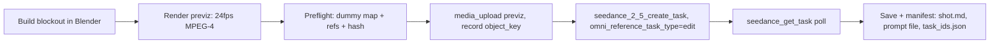

# Blender to Seedance

Turn a Blender blockout into a Seedance 2.5 video by making the **previz render
the motion master**. The model dresses the world; the 3D scene owns the camera,
cuts, blocking, and timing.

Core principle from the Higgsfield Blender workflow: **block it in 3D, lock the
camera, then make the AI execute your shot instead of rolling the dice.** The
blocking is reusable — swap the character, swap the location, keep the exact
same moves.



## When to use

- The shot needs **camera, cuts, or timing locked** before spending video
  credits — one-takes, multi-cut dialogue, complex camera paths, product
  re-skins.
- A scene where one previz should render in **multiple styles** (the car
  commercial pattern).
- A movement-heavy or blocking-heavy shot where text-only direction keeps
  drifting.

Do **not** use when:

- The gray *is* the final look → `seedance-graybox-world`.
- It's a plain T2V/I2V shot with no 3D preplan → `seedance-prompt-25`.
- The source is already finished footage needing a VFX edit → `seedance-vfx-pipeline`.

## Steps

### 1. Build the blockout (delegate to blender-* skills)

Build via the Blender MCP tools (`blender_execute_blender_code` etc.; see
`docs/blender-mcp-setup.md`). Conventions:

- **Primitives are subjects.** A cube = a person; a monolith = the hero; a
  cylinder = a can; spheres = fruit; boxes = props.
- **Color is identity, never texture.** Give every distinct subject a distinct
  flat color. Checkerboard or flat gray = "to replace".
- **Monolith facing rule.** For a character proxy, paint faces differently so
  facing direction survives: RED face = facing, BLACK = back, GREEN = sides/top.
- **Camera on splines.** Camera targets a null; cut changes happen strictly on
  frame boundaries; handheld = slow sway + micro-tremor, never fast jitter.
- **Leave black/empty gaps** where a later effect (liquid, etc.) will be
  generated separately.
- Save a backup `.blend` after every stage.

### 2. Render the previz

Follow `references/previz-render-recipe.md`: flat-gray EEVEE render → 1920x1080,
24fps, H.264 MPEG-4, frame range = duration x 24. Output
`previz_<shot>_v01.mp4` beside the shot.

### 3. Preflight

Before writing any prompt:

1. Hash the previz (`shasum -a 256`).
2. Write the **dummy map**: every blockout subject → its final subject
   (`red_box = hero`, `colored_proxies = seat identity`, `checkerboard = replace`).
3. Enumerate the references (previz + element sheets) and confirm the ordered
   array matches the `@Image N` / `@Video N` bindings 1:1.
4. Confirm the previz duration = target video duration.

### 4. Write the prompt

Delegate grammar to `seedance-prompt-25` blockout mode, then apply the
**video-lock contract** in `references/prompt-contract.md`. The prompt's job is
to dress the world, never to re-choreograph it.

### 5. Submit, poll, save

1. `media_upload` the previz; record `object_key` in `projects/<project>/ref_cache.json`.
2. `seedance_2_5_create_task` with:
   - `omni_reference_task_type=edit` (full-duration re-skin),
   - `@Video 1` = presigned previz URL,
   - `resolution` (default `720p` for iteration; `1080p` for finals),
   - `duration` = previz duration (4-30s),
   - `return_last_frame=true` when chaining.
3. Record the task in `task_ids.json`, poll `seedance_get_task` until terminal.
4. Save the output beside the shot and write `shot.md` (see below) + the
   immutable prompt file `prompt_<asset>.md`.

### 6. QA

- `ffprobe` + full decode check.
- `seed_understand` a contact sheet (opening, transitions, ending).
- `ffmpeg-side-by-side-comparison` previz vs output to verify the camera lock.
- Technical success = `review`; only explicit user approval = `approved`.

## Manifest (shot.md additions)

```yaml
mode: blockout-v2v
previz_path: scenes/scene-01/s01_sh010/previz_s01_sh010_v01.mp4
previz_sha256: "..."
video_lock: true
dummy_map:
  red_box: hero
  colored_proxies: seat_identity
  checkerboard: to_replace
omni_reference_task_type: edit
references: 4
```

## Guardrails

- **VIDEO LOCK first.** The previz is the sole authority for motion and
  placement, never for appearance. If text and video disagree about motion, the
  video wins.
- **Countable rules, not vibes.** "Exactly N", "never more than", "one attack
  at a time" — the model respects numbers it can count.
- **Dialogue never creates shots.** Lines play inside the previz's takes; no
  reverse shots, no cutaways, no new close-ups.
- **Ending lock.** The film ends on the previz's final frame.
- **Placement-only references.** Character/location sheets define identity and
  materials only; proxies give position, scale, and motion only.
- **Watermark false** by default. Right-size the duration; do not pad to 30s.
- **Prompt-review gate.** Run `prompt-review` on the blockout prompt before
  submitting.

## Self-check

1. The previz renders at 24fps, 1920x1080, H.264 MPEG-4, frame range = duration x 24.
2. Every blockout subject appears in the dummy map; color = identity, checkerboard = replace.
3. The prompt opens with ACTIVE REFERENCES, each stating what it defines and does NOT inherit.
4. VIDEO LOCK states frame 1:1 correspondence and "the video wins" on motion.
5. Rules are countable; action timing is timestamped; ending lock is stated.
6. Dialogue is timestamped and never adds coverage; off-screen stays off-screen.
7. The submitted reference array matches the prompt bindings 1:1, same order.
8. `previz_sha256`, `object_key`, `task_id`, and manifest fields are recorded.
