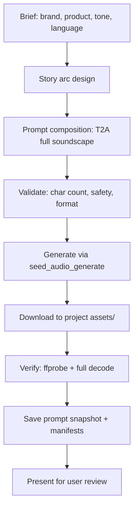

# Seed Audio Commercial

Produce dramatic, story-driven audio commercials using BytePlus Seed Audio 1.0
(`seed-audio-1.0`). This skill composes full-soundscape T2A (text-to-audio)
prompts that produce dialogue, background music, sound effects, and ambience in
a single generation pass — no separate mixing, scoring, or Foley required.

## What this skill produces

A finished audio commercial asset, saved locally, with:

- Full soundscape in one pass (dialogue + BGM + SFX + ambience)
- Multi-character voice profiles with distinct ages, accents, and emotions
- Dramatic story arc (setup → conflict → resolution → brand tagline)
- Music that shifts with the emotional beats of the story
- Chronologically interleaved SFX and ambience transitions
- Prompt snapshot, manifest, and verification metadata

## When to use this skill

- "Create an audio commercial for [brand/product]"
- "Make a dramatic radio spot for [product]"
- "Generate a story-based audio ad with dialogue and music"
- "Produce a Filipino/Taglish commercial using Seed Audio"
- "Write and generate a multi-character narrative audio spot"
- "Make a brand commercial with emotional arc and tagline"

## When NOT to use

- **Plain TTS or single-voice narration** — use `seed-audio-prompt` directly
  without the commercial story structure.
- **Video generation** — use Seedance skills (`seedance-prompt`).
- **Image generation** — use Seedream skills (`seedream-prompt`).
- **Voice cloning for consistent characters across multiple clips** — use
  `seed-audio-prompt` in TA2A mode with reference audio clips.

## Mandatory routing

This skill composes the prompt and manages the generation lifecycle. It depends
on:

- `seed-audio-prompt` — the authoritative reference for Seed Audio 1.0 prompt
  structure, voice profiles, and API limits. Load it for full prompt-writing
  rules when needed.
- `modelark-mcp` skill — the MCP tool surface. Use `seed_audio_generate` (or
  `seed_audio_generate_variations` for multiple takes) to invoke the model.
- `ffmpeg` skill — for post-generation verification (ffprobe, full decode
  check).

## Production workflow



### Step 1 — Gather the brief

Collect or propose:

| Field | Example | Required |
|---|---|---|
| Brand | Jollibee | Yes |
| Product | Chickenjoy (crispy fried chicken) | Yes |
| Tone | dramatic, emotional, nostalgic | Yes |
| Language | English, Taglish, Spanish, etc. | Yes |
| Target duration | ~60–120s (max 120s per call) | Yes |
| Cast | 2–4 characters with voice profiles | Yes |
| Story hook | homesick worker, family reunion, etc. | Yes |
| Tagline / CTA | "Home is just one bite away" | Yes |
| Cultural context | Filipino OFW experience, etc. | If relevant |

### Step 2 — Design the story arc

A dramatic commercial needs a **five-act micro-story**:


| Act | Purpose | Audio character |
|---|---|---|
| **1 — Setup** | Establish the emotional state and environment | Melancholic / tense music, sparse ambience |
| **2 — Conflict** | Introduce the tension or longing | Music intensifies or shifts, dialogue escalates |
| **3 — Journey** | Character moves toward the product | Ambience transitions, footsteps, door sounds |
| **4 — Turn / Reveal** | The product triggers an emotional shift | Music transforms (sad → warm), SFX (crunch, pour, sizzle) |
| **5 — Resolution + Tagline** | Emotional resolution, brand voiceover | Bright/uplifting music, announcer delivers CTA |

**Rules:**
- Each act must have a **distinct audio state** (music mood, ambience, intensity).
- Transitions between acts must be tied to **observable events** (a door opening,
  a bite, a phone ring), not arbitrary cuts.
- The product must be the **trigger for the emotional turn** in Act 4.
- The tagline in Act 5 must connect the emotional story to the brand promise.

### Step 3 — Compose the T2A prompt

Assemble the prompt following the `seed-audio-prompt` skill's five ingredients,
arranged as one chronological audio scene. Use this template:

```text
Scene and atmosphere
Environment: [location, time, weather, acoustic space, emotional tone]
Background music: [dramatic role, genre, instruments, tempo, mood, dynamic arc
  tied to story beats, mix relationship to dialogue, ending behavior]
Ambience: [foreground, midground, background layers and how they evolve]

Characters and dialogue
[SFX or ambience that opens the scene]

[Character A] ([age, gender, accent, voice timbre, emotional baseline, delivery
  style]) says [delivery note]: "[dialogue]"

[Music/SFX/ambience change triggered by the line or action.]

[Character B] ([contrasting voice profile]) replies [delivery]: "[dialogue]"

[Continue interleaving dialogue, actions, SFX, and score changes in
chronological order through all five acts.]

[Character A] (internal voice-over, [delivery]) says, voice [emotion]:
  "[emotional peak dialogue]"

[The brand tagline from the announcer.]

Announcer ([deep/warm/confident, gender, broadcaster tone]) says with [tone]:
  "[Brand]. [Product qualities]. [Tagline / CTA]."

[The brand jingle plays its final bright notes and resolves cleanly.]

Ending
[Describe the final sound: music resolution, ambience tail, fade to silence.]
```

### Step 4 — Validate before generating

Check these constraints before calling `seed_audio_generate`:

| Check | Limit | Action if exceeded |
|---|---|---|
| `text_prompt` length | 3,000 characters | Trim redundant descriptions, shorten stage directions |
| Target duration | 120 seconds max per call | Split into multiple calls and chain via TA2A |
| Output format | MP3 at 24000 Hz recommended | WAV at 44100 Hz can exceed the 10 MB artifact limit |
| Non-English dialogue | Content safety filter may reject | See [Multilingual and Taglish guidance](#multilingual-and-taglish-guidance) |
| Reference audio | Not needed for T2A | Omit `audio_references` and all `<<TGT_SPKN>>` tags |

**Format recommendation**: Always use `mp3` at `24000` Hz for commercials. A
100-second WAV at 44100 Hz is ~18 MB and exceeds the 10 MB artifact store limit;
the same clip as MP3 at 24000 Hz is ~800 KB.

### Step 5 — Generate

Call `seed_audio_generate` with the composed prompt:

```python
seed_audio_generate(
    text_prompt=<composed_prompt>,
    output={
        "format": "mp3",
        "sample_rate": 24000,
        "subtitle": true,          # request subtitles (may not be returned)
        "subtitle_type": "utterance"
    },
    persist=true                    # always persist to artifact store
)
```

For multiple takes, use `seed_audio_generate_variations` with
`variation_prompts` (up to 5 parallel variations). Each variation is an
independent generation — partial failures are captured per variation.

**Timeouts**: Audio generation can take 30–120+ seconds. The MCP tool may time
out even though the provider is still processing. If a timeout occurs:
- Do NOT retry blindly — the operation may have succeeded server-side.
- If no `task_id` or `request_id` was returned, retry the same prompt after a
  brief wait.
- If a `request_id` was returned, note it and attempt to reconcile before
  resubmitting.

**Content safety rejections**: The provider runs an audio risk audit on the
generated output. If a chunk is rejected (`decision_in_reject_list`), the
entire generation fails with `code=55001310`. See
[Multilingual and Taglish guidance](#multilingual-and-taglish-guidance) for
mitigation strategies.

### Step 6 — Download and verify

After generation succeeds:

1. **Download** the audio from the `source_url` to the project asset path.
2. **Verify with ffprobe** — record duration, format, sample rate, channels,
   bit rate, and file size.
3. **Full decode check** — run `ffmpeg -v error -i <file> -f null -` to confirm
   no decode errors.
4. **SHA-256** — compute and record the hash; verify it matches the artifact
   record.
5. **Save the prompt snapshot** — write the exact submitted prompt to a
   `.md` file beside the audio asset.

```bash
# Download
curl -sL -o <asset_path> "<source_url>"

# Verify
ffprobe -v quiet -print_format json -show_format -show_streams <asset_path>
ffmpeg -v error -i <asset_path> -f null -
shasum -a 256 <asset_path>
```

### Step 7 — Save manifests

Create or update these project files:

| File | Purpose |
|---|---|
| `projects/<project>/project.md` | Brief, cast, locations, model defaults, status |
| `projects/<project>/scenes/scene-01/scene.md` | Scene definition, story, assets table |
| `projects/<project>/scenes/scene-01/shots/s01_sh010/shot.md` | Generation details, output, cost, prompt ref, notes |
| `assets/audio/commercial/<name>_t<NN>_v<NN>_prompt.md` | Immutable prompt snapshot |

### Step 8 — Present for review

Present the result to the user with:
- The local file path
- Duration and format
- The story arc summary (one line per act)
- Key dialogue lines
- Any issues encountered (safety filter, format, etc.)
- Cost estimate

Set the manifest `status` to `review`. Only explicit user approval sets it to
`approved`.

## Multilingual and Taglish guidance

Seed Audio 1.0 supports cross-lingual synthesis, but the **content safety
filter** can reject non-English dialogue, especially in mixed-language scripts
(Taglish, Singlish, Spanglish). This is the most common failure mode for
dramatic commercials with cultural authenticity.

### Mitigation strategies (in order of preference)

1. **Mix languages at the sentence level, not within sentences.** Instead of
   "Dalawang taon na ako dito at hindi pa rin feels like home," use
   "Two years na ako dito... hindi pa rin feels like home." — the Tagalog and
   English are separated by ellipsis or natural pauses.

2. **Keep proper nouns and short cultural terms in the native language.**
   Words like `anak`, `po`, `salamat`, `nanay`, `langhap-sarap` are usually
   safe. Longer Tagalog sentences are higher risk.

3. **Avoid pure Tagalog monologues.** If a line is entirely in Tagalog and
   longer than 5 words, rephrase to mix in English. The filter appears to flag
   sustained non-English chunks.

4. **Iterate on rejections.** If the filter rejects a chunk, identify which
   section likely triggered it (usually a long non-English dialogue block),
   rephrase with more English, and retry. Each retry costs generation quota,
   so validate carefully before resubmitting.

5. **Fall back to English with accent description.** If Taglish is repeatedly
   rejected, generate an all-English version with Filipino accent descriptions
   in the voice profiles. This is less culturally authentic but always passes.

### Known working Taglish patterns

These patterns have been verified to pass the content safety filter as of
July 2026:

```text
# Short Tagalog phrases mixed with English — PASSES
"Two years na ako dito... hindi pa rin feels like home."
"Miss na miss kita, Ma."
"Anak, gising ka pa? Gabi na."
"Opo, Ma. Nandito lang... nag-iisip."
"Kumain ka na ba? Go get some Chickenjoy, anak. Parang nandito lang kami."
"Welcome po! One Chickenjoy meal, sir?"
"Oo, please. Salamat."
"Isang kagat... and I'm back at our table. Yung ngiti ni Papa. Yung tawa ni Nanay."
"Salamat, Ma. Okay na ako."
"Chickenjoy. Crispy. Juicy. Langhap-sarap. Because no matter how far you go — home is just one bite away."
```

```text
# Heavier Tagalog — REJECTED by content safety filter
"Dalawang taon na ako dito... hindi pa rin parang tahanan."
"Anak, gising ka pa? Gabi na, matulog ka na."
"Pumunta ka, bumili ka ng Chickenjoy. Parang nandito lang kami kasama ka."
"Isang kagat lang... and I'm back at our table. Yung ngiti ni Papa. Yung tawa ni Nanay. Parang kailan lang."
```

The threshold is not a character count — it appears to be a semantic
classification on each generated audio chunk. Lighter Taglish (short phrases
within English-dominant dialogue) passes; sustained Tagalog sentences trigger
rejection.

## Prompt best practices

### Do

- **Write as one chronological audio scene.** Interleave dialogue, actions,
  SFX, and music changes in the exact order the listener should hear them.
- **Give each character a full voice profile on first mention.** Include age,
  gender, accent, timbre, emotional baseline, and delivery style. Later lines
  can shorten to just the name and delivery note.
- **Make voices contrast.** Differentiate characters through pitch, timbre,
  accent, pacing, or emotional baseline so the listener can tell them apart.
- **Tie music changes to story events.** "The piano shifts warmer" should
  follow an observable action, not appear in isolation.
- **Describe SFX with acoustic character and position.** "A crisp golden
  crackle of fried chicken skin" is better than "crunching sound."
- **Use onomatopoeia in quotes** when it clarifies texture: `CRUNCH`, `CLANG`,
  `zzzip`. Do not use it as a substitute for describing the sound.
- **Specify the ending.** State what fades, sustains, stops abruptly, or
  carries into silence.
- **Keep the prompt under 3,000 characters.** Be concise — omit unused
  sections and trim redundant stage directions.
- **Use event-relative cues** by default: "as she opens the door," "under his
  line," "after the impact." Only use second-level timestamps when the user
  explicitly requests them.
- **Describe voices through devices or spaces** when relevant: "telephone
  compression," "public-address echo," "whispered proximity."

### Don't

- **Don't write unrelated inventories.** "Music: sad. Ambience: rain.
  SFX: crunch." is wrong — weave them into the chronological scene.
- **Don't use generic music descriptions.** "Cinematic music" tells the model
  nothing. Use "low somber strings with distant war drums" or "a melancholic
  solo piano, slow and measured."
- **Don't leave the ending unspecified.** The model will choose something;
  it may not match your intent.
- **Don't overload one generation with too many acts.** If the story has more
  than 5 distinct scene changes, consider splitting into multiple calls and
  chaining via TA2A.
- **Don't use `<<TGT_SPKN>>` tags in T2A mode.** Those are only for TA2A
  (reference-audio) mode.
- **Don't add per-line timestamps unless the user explicitly asks.** The
  `[start_time:end_time]` notation is a prompting-guide convention, not an
  API field, and should only be used on request.
- **Don't add `Max duration: 120 seconds` to the prompt.** Duration is a
  request parameter, not prompt content.

### Music direction patterns

Music is the emotional spine of a dramatic commercial. Describe it as a dynamic
arc, not a static label.

```text
# Good — dynamic arc tied to story beats
Background music: A melancholic solo piano, slow and measured, underscored by
a low ambient drone. It begins softly under dialogue, shifts to warmer strings
with acoustic guitar when the emotional turn arrives, then resolves into
bright uplifting guitar with light percussion for the tagline.

# Bad — static label
Background music: Sad cinematic music that becomes happy.
```

Common commercial music arcs:

| Story type | Opening | Turn | Resolution |
|---|---|---|---|
| Nostalgic / homesick | Melancholic solo piano | Warm strings + acoustic guitar | Bright guitar + light percussion |
| Tense / suspense | Low drone + sparse percussion | Swelling strings | Triumphant brass |
| Romantic / warm | Gentle acoustic guitar | Soft piano enters | Full warm ensemble |
| Energetic / fun | Upbeat percussion + synth | Bass drop + rhythm intensifies | Full bright pop mix |
| Sad / dramatic | Solo cello or violin | Music drops to silence | Single sustained note resolving |

### SFX patterns for food commercials

Food commercials live or die on their SFX. The product interaction sound is the
emotional trigger — describe it with sensory, acoustic detail.

```text
# Fried chicken
[CRUNCH — a crisp golden crackle of fried chicken skin.]

# Pouring coffee
[A rich, dark pour of coffee into a ceramic mug, with a warm gurgle and a
distant clink of the spoon.]

# Opening a soda
[A sharp metallic "tssss!" of a soda can opening, followed by a bright
effervescent fizz.]

# Sizzling food
[A lively sizzle on a hot plate, oil popping in sharp rapid snaps, steam
hissing softly in the background.]

# Breaking chocolate
[A clean, dry snap of dark chocolate breaking, with a faint crumble.]
```

Position SFX relative to actions: "as he takes the first bite," "immediately
after the pour," "under her gasp of delight."

### Ambience transition patterns

Commercials often move between locations. Describe the transition as an
audible state change, not two independent palettes.

```text
# Good — transition tied to an event
[Footsteps on wet pavement. A door opens — rain muffles. A distant storefront
jingle plays ahead.]
[A door chime. Warm chatter replaces rain. A busy store hum.]

# Bad — two unrelated ambience descriptions
Ambience: Rain on a window.
Ambience: Busy store.
```

Pattern:

```text
Audio state A: [music, ambience, intensity]
Transition trigger: [observable action — door, footsteps, phone answer]
Transition behavior: [muffle, crossfade, cut]
Audio state B: [new ambience, new music mood, new intensity]
```

## Cost management

| Parameter | Value |
|---|---|
| Model | `seed-audio-1.0` |
| Pricing | $0.15/min ($0.0025/second) |
| Billing basis | `original_duration` (pre-processed) |
| Max duration per call | 120 seconds |
| Typical 100s commercial | ~$0.25 |
| Typical 120s commercial | ~$0.30 |
| 3-take iteration | ~$0.75 |

**Cost-saving tips:**
- Prototype with shorter prompts first (60–80s) to validate the story arc
  before generating the full-length version.
- Use `seed_audio_generate_variations` for parallel takes — it's the same
  total cost as sequential calls but faster.
- Each content-safety rejection still bills for the generation attempt (the
  audio is generated before the audit rejects it). Validate multilingual
  prompts carefully before submitting.
- Set `DAILY_BUDGET_USD` on the MCP server to enforce a hard daily limit.

## Project structure

Follow the ai-director workspace conventions for all generated assets:

```
projects/
  <project-name>/
    project.md
    scenes/
      scene-01/
        scene.md
        shots/
          s01_sh010/
            shot.md
    assets/
      audio/
        commercial/
          <project-name>_t<NN>_v<NN>.mp3
          <project-name>_t<NN>_v<NN>_prompt.md
```

### Asset file naming

| Asset | Pattern | Example |
|---|---|---|
| Commercial audio | `<project-name>_t<NN>_v<NN>.mp3` | `jollibee-chickenjoy_t01_v01.mp3` |
| Prompt snapshot | `<project-name>_t<NN>_v<NN>_prompt.md` | `jollibee-chickenjoy_t01_v01_prompt.md` |

- Takes: 2-digit, `t01`, `t02`, `t03` (one take = one generation attempt).
- Versions: 2-digit, `v01`, `v02` (revisions of the same take's prompt).
- Approved/final suffix: `final`.

### Manifest lifecycle states

`draft → ready → submitted → queued/running → review → approved/rejected`

- `review` — generation succeeded and technical QA passed; awaiting creative
  approval.
- `approved` — only set by explicit user choice.
- `rejected` — user rejected the take.

## Full example: Jollibee Chickenjoy (Taglish)

This is the verified, production-grade prompt that generated a 110.6-second
dramatic commercial in T2A mode. Use it as a reference for structure, length,
and density.

```text
Scene and atmosphere
Environment: A cold rainy night in a small apartment in Singapore. Rain taps the window. Distant traffic hums through thin walls. The room feels lonely and still.

Background music: A melancholic solo piano, slow and measured, underscored by a low ambient drone. It begins softly under dialogue, shifts to warmer strings with acoustic guitar when the emotional turn arrives, then resolves into bright uplifting guitar with light percussion for the tagline.

Ambience: Foreground rain on glass, midground distant traffic, background low room tone.

Characters and dialogue
[A phone buzzes. A notification chime.]

Marco (late 20s, male, Filipino English with subtle Filipino accent, warm but tired, slightly hoarse, quiet) says softly: "Two years na ako dito... hindi pa rin feels like home."

[The rain intensifies. The piano holds a suspended note.]

Marco says, voice cracking: "Miss na miss kita, Ma."

[A phone rings — warm familiar ringtone. He answers.]

Nanay (late 50s, female, warm gentle Filipino accent, nurturing, slightly raspy with age, calm motherly warmth) says through the phone with telephone compression: "Anak, gising ka pa? Gabi na."

Marco, forcing cheer: "Opo, Ma. Nandito lang... nag-iisip."

Nanay, knowing and tender: "Kumain ka na ba? Go get some Chickenjoy, anak. Parang nandito lang kami."

[The piano shifts warmer. The drone softens.]

Marco whispers, voice tightening: "Chickenjoy..."

[Footsteps on wet pavement. A door opens — rain muffles. A distant storefront jingle plays ahead.]

[A door chime. Warm chatter replaces rain. A busy store hum.]

Crew member (young female, cheerful Filipino English, bright energetic, warm service tone) says brightly: "Welcome po! One Chickenjoy meal, sir?"

Marco, steadier: "Oo, please. Salamat."

[A tray set down. The crinkle of a red-and-white box opening.]

[CRUNCH — a crisp golden crackle of fried chicken skin.]

[The piano transforms — warm strings swell, acoustic guitar joins. The soundscape shifts to a joyful memory: a Filipino family dinner, laughter, a child's giggle, utensils clinking.]

Marco (internal voice-over, soft, emotional, near whisper) says, voice full: "Isang kagat... and I'm back at our table. Yung ngiti ni Papa. Yung tawa ni Nanay."

[Joyful memory — laughter, clinking glasses — fades back to store ambience.]

Marco, smiling, warm and steady: "Salamat, Ma. Okay na ako."

[The guitar brightens. Light rhythmic percussion enters — uplifting.]

Announcer (deep, warm, confident male, professional comforting broadcaster) says with warm authority: "Chickenjoy. Crispy. Juicy. Langhap-sarap. Because no matter how far you go — home is just one bite away."

[The jingle plays its final bright notes and resolves cleanly.]

Ending
The guitar and percussion hold a warm sustained chord. Store ambience fades. A final soft rain — gentler now — and silence.
```

**Result**: 110.64 seconds, MP3, 24kHz stereo, 64 kbps, 885 KB. Full decode
check passed. SHA-256 verified.

## Full example: Lola Maria's Ube Halaya (Taglish, 30s spot)

A shorter, warmer commercial spot for reference on concise prompt structure.

```text
Scene and atmosphere
Environment: A warm Filipino home kitchen in the late afternoon. An electric fan hums softly. A kawa (wide copper pan) sits on a kalan (clay stove). Distant street sounds and children playing outside. The room smells of sweet coconut and ube. Warm, golden light.

Background music: A gentle acoustic guitar playing a Filipino folk melody, warm and nostalgic. It begins softly under dialogue, stays subtle, then swells gently for the brand tagline.

Ambience: Foreground electric fan hum and occasional spoon scraping the kawa. Midground distant children playing. Background gentle afternoon room tone.

Characters and dialogue
[A spoon scrapes the kawa — thick, satisfying stirring of ube halaya.]

Bianca (7-year-old girl, bright curious voice, Filipino child accent, energetic and innocent) says excitedly: "Lola! Ang bango naman! Ano 'yan?"

Lola Maria (65-year-old grandmother, warm soft voice, provincial Filipino lola accent, gentle and loving, slightly raspy) says with a warm chuckle: "Ube halaya, anak. Luto ko ngayon para sa merienda mo. Paborito mo 'yan since bata ka pa, 'di ba?"

Bianca, amazed: "Lola, bakit purple na purple siya? Parang mas creamy pa kaysa dati!"

Lola Maria, proud and tender: "Kasi, anak, gawa ito sa totoong ube — walang artificial, lahat natural. 'Yan ang secret ng lola mo."

Bianca, delighted: "Sarap! Lola, pwede ba akong kumuha ng isa pa? Please naman?"

Lola Maria, teasing but firm: "Sige, isa pa. Pero huwag masyado, ha? Baka masiraan ka ng tiyan."

[A warm brand transition chime — bright and clean.]

Announcer (middle-aged female, warm professional Filipino commercial announcer, confident and comforting) says with warm authority: "Sarap ng ube, lalo na gawa sa totoong ube. Walang artificial, lahat natural — kaya pala paborito ng pamilya. Lola Maria's Ube Halaya — dahil ang paborito mo, deserves the best."

[The guitar resolves on a warm sustained chord. The fan hum fades gently.]

Ending
The kitchen ambience settles into a warm silence with a final distant child's laugh.
```

**Result**: ~28 seconds, full soundscape in one pass.

## Quick reference card

### Model identity
- Model ID: `seed-audio-1.0`
- Endpoint: `POST https://voice.ap-southeast-1.bytepluses.com/api/v3/tts/create`
- Auth: `X-Api-Key` header (`BYTEPLUS_SEED_AUDIO_API_KEY`)
- Mode: T2A (text-only, no reference audio)

### Hard limits
| Parameter | Limit |
|---|---|
| `text_prompt` max characters | 3,000 |
| Max generated audio duration | 120 seconds (2 minutes) |
| Max reference audio clips | 3 (TA2A mode only) |
| Artifact store max size | 10 MB (use MP3, not WAV) |

### Recommended output config
| Parameter | Value | Reason |
|---|---|---|
| `format` | `mp3` | WAV at 44.1kHz exceeds 10 MB artifact limit |
| `sample_rate` | `24000` | Sufficient quality for voice + music; keeps file small |
| `subtitle` | `true` | Request subtitles (provider may not return them) |
| `subtitle_type` | `utterance` | Sentence-level timestamps |
| `persist` | `true` | Always persist to artifact store |

### Pricing
- **$0.15/min** ($0.0025/second), billed per second on `original_duration`.
- 60-minute free trial on service activation.
- Content safety rejections still bill for the generation attempt.

### MCP tool calls

```python
# Single generation
seed_audio_generate(
    input={
        "text_prompt": <prompt>,
        "output": {"format": "mp3", "sample_rate": 24000,
                   "subtitle": True, "subtitle_type": "utterance"},
        "persist": True
    }
)

# Multiple parallel takes
seed_audio_generate_variations(
    input={
        "variation_prompts": [<prompt_v1>, <prompt_v2>, <prompt_v3>],
        "variations": 3,
        "output": {"format": "mp3", "sample_rate": 24000},
        "persist": True
    }
)
```

### Verification commands

```bash
# Probe audio properties
ffprobe -v quiet -print_format json -show_format -show_streams <file>

# Full decode integrity check (no output = no errors)
ffmpeg -v error -i <file> -f null -

# SHA-256 hash
shasum -a 256 <file>
```

### Story arc template (5 acts)

```
Act 1 — Setup:        [emotional state] + [environment] + [melancholic/tense music]
Act 2 — Conflict:     [tension/longing] + [dialogue escalation] + [music intensifies]
Act 3 — Journey:      [character moves toward product] + [ambience transition]
Act 4 — Turn/Reveal:   [product trigger] + [SFX: crunch/pour/sizzle] + [music transforms]
Act 5 — Resolution:    [emotional resolution] + [announcer tagline] + [bright music]
```

### Sources
- [Seed Audio 1.0 API Reference](https://docs.byteplus.com/en/docs/byteplusvoice/seedaudio-01)
- [Seed Audio 1.0 Prompting Guide](https://bytedance.larkoffice.com/wiki/WgU4wFVQ8iZgvjkHHdbcDmhCnug)
- [Seed Audio 1.0 Pricing](https://docs.byteplus.com/en/docs/byteplusvoice/audiopricing)
