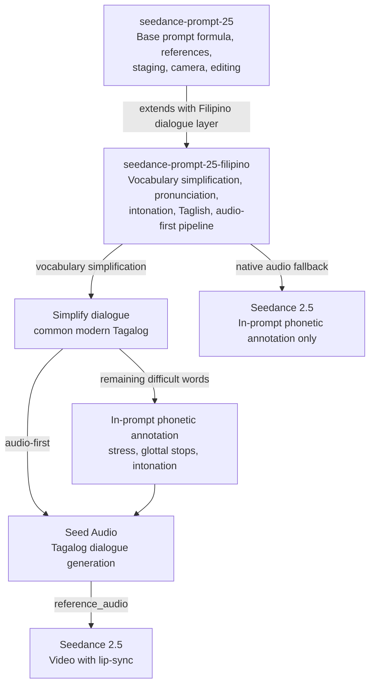
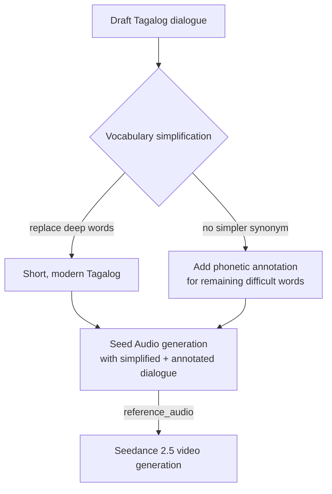

# Seedance Prompt 2.5 — Filipino/Tagalog Partner

Write production-grade Seedance 2.5 prompts for scenes containing **Tagalog**,
**Filipino**, or **Taglish** dialogue. This skill is a **partner** to the
`seedance-prompt-25` skill — it extends the base prompt formula with
language-specific pronunciation, intonation, and code-switching guidance that
the base skill does not cover.

## Why this skill exists

Seedance 2.5 natively supports **10+ languages**: Chinese, English, Spanish,
Indonesian, Malay, Thai, Arabic, Portuguese, Vietnamese, Japanese, and Korean.
**Tagalog/Filipino is not on this list.** When the model attempts Tagalog
dialogue in its native audio mode, it frequently:

- misplaces stress (defaulting to English stress patterns instead of Tagalog's
  penultimate stress)
- drops or ignores glottal stops (which are phonemic in Tagalog — their presence
  or absence changes meaning)
- applies English intonation contours instead of Tagalog's relatively flat,
  low-rise-to-high-fall pattern
- cannot distinguish minimal pairs that differ only by stress (e.g., `baba`
  "father" vs `babá` "piggy back" vs `babà` "chin" vs `babâ` "descend")
- mishandles Taglish code-switching, pronouncing English words with either full
  English or full Tagalog phonology instead of the natural mixed register

This skill provides three complementary strategies, applied in order:

1. **Vocabulary simplification** — rewrite dialogue using common, modern,
   easy-to-pronounce Tagalog words before generation. This reduces the
   pronunciation burden on the model by eliminating deep, literary, or
   archaic words that are likely to be mispronounced. It is the simplest and
   most effective first step, and it benefits both the Seed Audio generation
   and the Seedance lip-sync. Apply this **before** phonetic annotation — it
   is better to remove a difficult word than to annotate it.
2. **Audio-first pipeline** — generate the Tagalog dialogue with Seed Audio
   first (which supports cross-lingual synthesis), then pass it as
   `reference_audio` to Seedance. The audio drives lip-sync, timing, and
   pronunciation, not the text prompt alone.
3. **In-prompt phonetic annotation** — for words that remain difficult after
   simplification, embed pronunciation guides, stress markers, glottal-stop
   notation, and intonation contours directly in the prompt to steer the model.
   This is the last resort, not the first.

## When to use this skill

This skill applies **in addition to** `seedance-prompt-25` whenever any of these
apply:

- The scene contains **Tagalog or Filipino dialogue** (in `{curly braces}`)
- The scene contains **Taglish** (mixed Tagalog and English dialogue)
- The character speaks with a **Filipino accent** even when speaking English
- The user asks for **Philippine-language content**, **Filipino video**, or
  **Tagalog pronunciation/intonation** guidance

This skill extends the `seedance-prompt-25` six-part formula (Subject + Action +
Scene + Style + Camera + Audio) with the Filipino-specific audio and dialogue
layer; compose with the base skill when the scene contains Filipino dialogue. It
can also be used standalone for pronunciation and intonation guidance. The base
skill provides the visual, reference, staging, and camera layers.

## Relationship to seedance-prompt-25



## Source authority

- [Seedance 2.5 Prompt Guide (Lark)](https://bytedance.larkoffice.com/docx/A88jd0B47oAd8zxWp5ycZFMfnxh)
- [Seedance 2.5 Launch Blog](https://seed.bytedance.com/en/blog/one-take-creation-flexible-referencing-introducing-seedance-2-5)
- [Seed Audio 1.0 API Reference](https://docs.byteplus.com/en/docs/byteplusvoice/seedaudio-01)
- [Tagalog phonology (Wikipedia)](https://en.wikipedia.org/wiki/Tagalog_phonology)
- [Accentual phrases in Tagalog intonation (PLSA)](https://journals.linguisticsociety.org/proceedings/index.php/PLSA/article/view/5966)
- [Intonation, Adjunction, and Verb-Initial Word Order in Tagalog](https://bpb-us-e1.wpmucdn.com/websites.uta.edu/dist/9/5049/files/2021/06/Tagalog_Prosody1.pdf)
- [Incorporating Duration and Intonation Models in Filipino Speech Synthesis](https://eprints.lib.hokudai.ac.jp/repo/huscap/all/39641/MA-L2-3.pdf)

When the official Seedance guide is updated, prefer the live page over this
skill where they conflict.

## Strategy overview: the three-layer approach

Apply the three strategies in order — vocabulary simplification first, then
audio-first (when the user requests lip-synced audio), then in-prompt
annotation for any remaining difficult words.

| Strategy | When to use | How it works |
|---|---|---|
| **Vocabulary simplification (first)** | Always, before any generation | Rewrite dialogue using common, modern Tagalog. Replace deep/literary words with everyday equivalents. Shorten sentences. This reduces the pronunciation burden before the model ever sees the text. |
| **Audio-first (when user requests lip-sync)** | Dialogue-heavy scenes where pronunciation accuracy matters and the user has explicitly requested lip-synced audio | Generate Tagalog dialogue via Seed Audio (cross-lingual), verify it, then pass as `reference_audio` to Seedance |
| **In-prompt annotation (last resort)** | Words that remain difficult after simplification, or native audio mode when Seed Audio is unavailable | Embed stress marks, glottal-stop notation, intonation contours, and pronunciation guides directly in the `{dialogue}` |

**Always start with vocabulary simplification.** It is better to remove a
difficult word than to annotate it. Simplified dialogue improves results from
both Seed Audio (cleaner generation) and Seedance (better lip-sync matching).
The model's lip-sync and audio co-generation are far more accurate when driven
by an actual audio reference than by text annotation alone, but the audio
itself is more accurate when the vocabulary is simple.

## Vocabulary simplification

**This is the first and most effective strategy.** Before reaching for phonetic
annotation, rewrite the dialogue using common, modern, easy-to-pronounce
Tagalog words. This reduces the pronunciation burden on both Seed Audio and
Seedance, and it often eliminates the need for annotation entirely.

### Why it works

The model struggles most with:
- **Deep/literary Tagalog** (`marangal`, `liwanag`, `kinabukasan`) — rare in
  modern speech, stress patterns unfamiliar to the model
- **Long polysyllabic words** (`naiintindihan`, `pinag-aaralan`) — more
  syllables = more places for stress to go wrong
- **Archaic affixes** (`mag-`, `magpa-`, `ipangangalaga`) — complex morphology
  the model cannot parse
- **Words with non-default stress** — any word whose stress is not on the
  penultimate syllable is a risk

By rewriting dialogue into short, modern, common Tagalog — the kind of
everyday Manila Filipino that real people actually speak — you reduce all four
risk factors at once.

### Vocabulary difficulty tiers

| Tier | Description | Examples | Model risk |
|---|---|---|---|
| **Tier 1 — Easy** | 1-3 syllables, penultimate stress, common in everyday speech | `sino`, `ano`, `ito`, `naman`, `lang`, `na`, `ba`, `po`, `hindi`, `oo`, `tara`, `salamat` | Low — model usually handles these well |
| **Tier 2 — Moderate** | 3-4 syllables, penultimate stress, common but slightly longer | `kamusta`, `maynila`, `gumawa`, `kumain`, `inom`, `tulog`, `trabaho`, `tawag` | Medium — verify pronunciation but usually OK |
| **Tier 3 — Difficult** | 4+ syllables, non-default stress, literary, or archaic | `naiintindihan`, `pinag-aaralan`, `magpaginhawa`, `kinangangangailangan`, `ipangangalaga` | High — model will likely mispronounce; simplify or annotate |
| **Tier 4 — Very difficult** | Rare, formal, or deep Filipino words rarely used in modern Manila speech | `marangal`, `liwanag` (literary), `kapakanan`, `kaligayahan`, `pagbabalik-loob` | Very high — always simplify; rarely worth annotating |

### Simplification rules

1. **Prefer Tier 1-2 words** — rewrite dialogue using the simplest, most
   common Tagalog words that still convey the meaning.
2. **Shorten sentences** — break long sentences into 2-3 short ones. Shorter
   sentences are easier for the model to pace and pronounce.
3. **Use contractions** — `di` (from `hindi`), `pwede` (from `maaari`),
   `ganun` (from `ganoon`), `ayos` (from `maayos`) are natural in casual
   speech and easier for the model.
4. **Avoid literary Filipino** — words like `marangal` (honorable),
   `liwanag` (light, literary), `kinabukasan` (future, literary) should be
   replaced with `respetado`, `ilaw`/`liwanag` (common), `bukas`/`future`.
5. **Prefer modern Manila Taglish** for urban/contemporary settings — code-
   switching to English for complex ideas is natural and the English words
   are often easier for the model to pronounce correctly.
6. **Keep it natural** — the goal is not dumbed-down Tagalog, but the kind of
   everyday Manila Filipino that real people actually speak. If a word sounds
   stilted or formal to a Manila speaker, replace it.
7. **Limit per-sentence word count** — aim for 5-8 words per sentence. If a
   sentence exceeds 10 words, split it.

### Simplification examples

| Original (deep/long) | Simplified (common/modern) | Tier reduction |
|---|---|---|
| "May tao ba diyan? Sino yan?" | "Sino ka? Anong ginagawa mo dito?" | Restructured to direct, simple question |
| "Matagal na kitang hinihintay." | "Hinihintay kita." | 4 words → 2 words; removed "matagal na" |
| "Hindi mo na kailangang malaman." | "Nandito na ako." | Replaced entire line with shorter, simpler statement |
| "Naiintindihan ba ninyo?" | "Naintindihan niyo ba?" | Tier 3 → Tier 2; shorter word, same meaning |
| "Pinag-aaralan ko pa kung paano." | "Iniisip ko pa." | Tier 3 → Tier 2; simpler word for "thinking" |
| "Magpaginhawa ka na lang." | "Pahinga ka na." | Tier 4 → Tier 1; "pahinga" is everyday |
| "Gumagawa ako ng mga bagay para sa kinabukasan." | "Nagtatrabaho ako para sa bukas." | Tier 3-4 → Tier 1-2; modern everyday speech |
| "Ipinagmamalaki ko ang aking pamana." | "Proud ako sa pinanggalingan ko." | Tier 4 → Taglish; natural Manila speech |

### When to simplify vs. annotate

| Situation | Strategy |
|---|---|
| Word is Tier 3-4 and has a simple Tier 1-2 synonym | **Simplify** — replace the word |
| Word is Tier 1-2 but has non-default stress | **Annotate** — add stress marker |
| Word is Tier 3 but has no simpler synonym | **Annotate** — add pronunciation guide |
| Word is a proper noun (name, place) | **Annotate** — cannot be simplified |
| Sentence has 10+ words | **Simplify** — split into shorter sentences |
| Word is archaic/literary with modern equivalent | **Simplify** — always prefer modern |
| Scene is period/historical requiring formal Filipino | **Annotate** — simplification may break the register |

### Simplification in the audio-first pipeline

Vocabulary simplification benefits the audio-first pipeline too:

1. **Simpler Seed Audio prompts** → cleaner T2A generation with fewer
   mispronunciations
2. **Shorter audio duration** → easier to fit within video duration budget
3. **Better Seedance lip-sync** → the model can match simpler syllable
   patterns more accurately
4. **Fewer annotation blocks needed** → cleaner, more focused prompts



### Real-world example: White Lady encounter

**Before simplification (deep Tagalog, Tier 3-4):**
```
Rico: "May tao ba diyan? Sino yan?"
White Lady: "Rico... matagal na kitang hinihintay."
Rico: "H-how mo nalaman ang pangalan ko?!"
White Lady: "Hindi mo na kailangang malaman. Nandito na ako."
```

**After simplification (common modern Tagalog, Tier 1-2):**
```
Rico: "Sino ka? Anong ginagawa mo dito?"
White Lady: "Rico... hinihintay kita."
Rico: "Paano mo nalaman ang pangalan ko?"
White Lady: "Nandito na ako."
```

**Result:** Shorter sentences, simpler words, same dramatic impact. The model
pronounced the simplified dialogue correctly on the first generation attempt
with Seed Audio, and the trimmed audio fit within the 30-second Seedance
video budget.

## Phonetic annotation system

Tagalog has several phonological features that are phonemic (meaning-changing)
but not visible in standard orthography. The annotation system below provides
explicit in-prompt markers the model can follow.

### Stress markers

Stress is **phonemic** in Tagalog. The default stress is **penultimate**
(malumay) and is left unwritten. Non-default stress must be marked.

| Stress type | Mark | Example | Meaning |
|---|---|---|---|
| Penultimate (default) | *(none)* | `baba` | "father" |
| Final syllable stressed | **bold** the stressed syllable | `ba·**ba**` | "piggy back" |
| Penultimate stress + final glottal stop | trailing **'** | `**ba**·ba'` | "chin" |
| Final stressed + glottal stop | trailing **'** + **bold** | `ba·**ba'**` | "descend (imperative)" |

In the prompt, annotate non-default stress on any word where misplacement would
change meaning or sound unnatural:

```
The vendor says in Manila Tagalog: {Tara na, mag-**bá**bay tayo ng **ba**·gong kape.}
```

### Glottal stops

Tagalog has two glottal-stop behaviors:

1. **Word-final glottal stop** — phonemic, often unwritten. Mark with a
   trailing apostrophe: `gala'` (roaming), `dugo'` (blood), `susi'` (key).
2. **Morpheme-boundary glottal stop** — occurs at the boundary between a
   consonant-ending prefix and a vowel-initial root, e.g. `mag-uwî` (to return
   home). Mark with a hyphen: `mag-uwî`. Glottal stops between two vowels within
   a word (e.g. `oo`, `paano`) are implied by the orthography and typically
   unwritten.

In the prompt, add a pronunciation note when glottal stops are critical:

```
Pronunciation note: The word "gala'" ends with a glottal stop — do not drop it.
The word "bata'" has a final glottal stop on the last vowel.
```

### Vowel lengthening

Vowel lengthening accompanies primary or secondary stress (except at
word-final position). When a word is stressed on the penultimate syllable, the
stressed vowel is lengthened slightly. Mark this only when it matters for
naturalness:

```
Pronunciation note: In "**ta**·yo" (we/us), lengthen the "ta" slightly — it is the
stressed penultimate syllable, not a diphthong.
```

### Syllable-by-syllable pronunciation guide

For words the model is likely to mispronounce, provide a syllable breakdown
with stress marks. Use the middle dot `·` to separate syllables and **bold**
for the stressed syllable:

```
Pronunciation guide:
- "Mabuhay" → ma·**bu**·hay (stress on second syllable, not the English-style first)
- "Salamat" → sa·**la**·mat (stress on second syllable)
- "Kamusta" → ka·**mus**·ta (stress on second syllable)
- "Pilipinas" → pi·li·**pi**·nas (stress on third syllable)
- "Magandang" → ma·**gan**·dang (stress on second syllable)
- "Gabi" → ga·**bi** (stress on second syllable, meaning "evening/night")
  — note: "gabi" also means "taro"; both meanings share the same spelling and pronunciation
```

### Full phonetic annotation block

When a scene has multiple critical Tagalog words, gather all pronunciation
guides into a single block before the dialogue.

> **Notation note:** Pronunciation guide blocks use **uppercase letters** for
> the stressed syllable and **hyphens** as the syllable separator (e.g.,
> `ma-BU-hay`). This is an alternative to the inline **bold + middle-dot**
> notation defined in the Stress markers section (e.g., `ma·**bu**·hay`).
> Use the uppercase+hyphen format in standalone pronunciation blocks and
> Seed Audio prompts (which are plain text); use the bold+middle-dot format
> for inline annotations within Seedance prompts (which support markdown).

```text
Pronunciation guide (Manila Tagalog):
- Stress is penultimate by default. Uppercase syllables receive primary stress.
- Trailing apostrophe (') = final glottal stop. Do not elide it.
- "Mabuhay" → ma-BU-hay (penultimate stress)
- "Salamat po" → sa-LA-mat po (penultimate stress on "salamat")
- "Hindi" → hin-DE (final stress + glottal stop; in Manila dialect the final
  glottal stop is often elided in connected speech)
- "Bababa" → ba-BA-ba (penultimate stress on second "ba"; means "going down")
- "Oo" → O-o (stress on first syllable; each "o" is a separate syllable with a
  glottal stop between them)

Dialogue language: Manila Tagalog. The character says in natural, conversational
Manila Tagalog with a flat intonation and slight rise on stressed syllables:
{Mabuhay! Kumusta po kayo? Ako si Maria. Taga-Maynila ako.}
```

## Intonation direction

Tagalog intonation differs significantly from English. Without explicit
direction, the model will default to English intonation contours, making the
Tagalog sound unnatural.

### Baseline intonation pattern

Tagalog sentences have **very slight pitch variation** compared to English. The
default contour is:


- Sentences start at **normal pitch (level 2)**
- **Slight rise** over stressed syllables (reaching level 3 at most)
- Return to **level 2** after each phrase
- End at **level 2 or level 1** (slight fall) for statements

### Sentence-type contours

| Sentence type | Contour | Direction |
|---|---|---|
| **Declarative statement** | Level → slight rises on stress → **fall** at end | Falling/level |
| **Yes/no question** | Level → slight rises → **rise** at end | Rising |
| **Tag question** (*hindi ba?*, *diba?*) | Level → **rise** on the tag | Rising |
| **Command/imperative** | **Level**, slight stress emphasis, **flat** at end | Level (not falling like English commands) |
| **Non-final phrase** (series, before pause) | Level → slight **rise** at the end (suspended) | Slightly rising (suspended) |

### L-H and H-L phrase accents

Tagalog has systematic **Low-High (L-H)** and **High-Low (H-L)** phrase
accents that shape the overall melody:

| Accent | Where it occurs | Effect |
|---|---|---|
| **L-H (rise)** | Sentence-initial verb | Pitch rises on the stressed syllable of the first word |
| **L-H (rise)** | First content word of immediately post-verbal phrase | Slight rise |
| **H-L (fall)** | Right edge of each prosodic phrase | Pitch falls to a low point by end of the last content word |
| **No rise** | Clause-final phrases | No L-H on the first content word of a clause-final phrase |

In the prompt, describe the intonation arc in plain language:

```text
Intonation: Manila Tagalog flat contour. The sentence opens with a slight pitch rise
on the verb "Nagbigay," then settles to a level baseline. Each phrase ends with a
slight fall. The sentence-final word "kotse" drops to a low pitch. Avoid English-style
rising-falling intonation — keep the overall melody flat with only minor stress rises.
```

### Intonation direction in the dialogue block

Combine intonation direction with the dialogue using the base skill's dialogue
language reinforcement formula:

```text
Dialogue language: Manila Tagalog. Intonation: flat baseline with slight rises on
stressed syllables, falling at phrase ends, rising at sentence end for questions.
The vendor says in natural, conversational Manila Tagalog:
{Boss, paki-abot na lang ng suki. Salamat po!}
```

For questions:

```text
Dialogue language: Manila Tagalog. Intonation: flat baseline, rising at the end
for this yes/no question. The girl asks curiously in Manila Tagalog:
{Uwi ka na ba talaga?}
```

For commands:

```text
Dialogue language: Manila Tagalog. Intonation: level and firm, no falling contour
like English commands. The mother says firmly in Manila Tagalog:
{Tapusin mo na ang pagkain mo.}
```

## Taglish code-switching

**Taglish** (Tagalog-English code-switching) is the most common register in
urban Philippine settings. In Taglish, English words are inserted into Tagalog
grammatical structures, and the pronunciation shifts — English words are
often spoken with Filipino phonology (flattened vowels, penultimate stress
applied to English words, no reduced vowels).

### Taglish pronunciation rules

| Feature | English | Taglish | Example |
|---|---|---|---|
| Vowel reduction | Schwa in unstressed syllables | No schwa — all vowels fully pronounced | "computer" → com-**pu**-ter (no schwa) |
| Stress | Variable | Filipino penultimate default applied | "actually" → ac-**tu**-al-ly |
| Final consonants | Released | Unreleased or with glottal stop | "just" → "jus'" (glottal stop) |
| "F" and "V" | Labiodental | Often bilabial "p" and "b" | "very" → "beri" (informal) |
| "TH" sounds | Dental fricative | Often "d" or "t" | "the" → "da", "three" → "tree" |

### Taglish in the prompt

Mark Taglish dialogue and provide pronunciation guidance for the English
words spoken in Filipino register:

```text
Dialogue language: Taglish (Manila Tagalog-English code-switching). English words
within the Tagalog structure are pronounced with Filipino phonology: no schwa,
full vowel articulation, penultimate stress default. The colleague says casually:
{Actually, I need to finish this report by Friday eh. Pero pwede naman next week
kung hindi rush. Just let me know, ha?}

Pronunciation note: "Actually" → ac-TU-al-ly (penultimate stress, no schwa).
"Friday" → FRIday (penultimate stress). "Just" → jus' (glottal stop at end).
The particle "eh" and "ha?" are Tagalog discourse markers — rising intonation on "ha?".
```

### Taglish discourse markers

These particles shape the naturalness of Filipino speech. Include them in
dialogue and explain their intonation:

| Marker | Meaning | Intonation |
|---|---|---|
| `po` | Politeness particle (formal register) | Low, level, appended after the word it modifies |
| `opo` | Polite "yes" (replaces casual `oo`) | Level, with final glottal stop |
| `ba` | Question marker | Rising, attached to the end of the question |
| `eh` | Contrastive/filler | Level or slight fall |
| `na` | "Already" / "now" | Level, unstressed |
| `na lang` | "Just" / "instead" | Level, slight stress on "lang" |
| `ha?` | Confirmation seeker | Rising at end |
| `naman` | Softener / "also" | Level, slight stress on first syllable |
| `kasi` | "Because" | Level, slight stress on first syllable |
| `daw` / `raw` | Hearsay marker | Level, unstressed |

```text
The teenager says in casual Taglish with typical discourse markers:
{Ang init naman today, ha? Can we na lang stay sa loob? Para malamig, eh.}
```

## Speech registers and politeness hierarchy

Tagalog has a robust politeness system centered on the particles **po** and
**opo**. Choosing the correct register is essential for natural-sounding
dialogue — the wrong register makes a character sound disrespectful or
unnaturally stiff.

### Formal vs casual registers

| Register | When to use | Key markers | Example |
|---|---|---|---|
| **Formal (marangal)** | Speaking to elders, superiors, strangers, in official settings | `po`, `opo`, full words (no contractions) | {Salamat po sa inyo.} |
| **Casual (pang-araw-araw)** | Friends, family of same generation, peers, informal settings | No `po`/`opo`, contractions allowed | {Salamat ha.} |
| **Taglish (informal)** | Urban professionals, younger speakers, workplace casual | English words with Filipino phonology, optional `po` | {Thanks po. Actually, ok lang.} |

### The po / opo system

| Particle | Usage | Intonation |
|---|---|---|
| **po** | Politeness particle inserted after the word it modifies. Used in statements and questions. Turns casual speech formal without changing the sentence structure. | Low, level, appended after the modified word |
| **opo** | Polite "yes" — replaces casual "oo" when speaking to an elder or superior. | Level or slight rise, with final glottal stop |
| **ho** | Softer variant of `po`, slightly less formal. Used by and with older speakers, or to soften a request. | Low, level |
| **oho** | Softer variant of `opo`, less formal. | Level, with final glottal stop |

### Register in the prompt

Specify the register explicitly so the model selects the correct politeness
level:

```text
Dialogue language: Manila Tagalog, formal register. The character uses "po"
appropriately when addressing an elder. Intonation: flat baseline, slight rise
on stressed syllables. The grandson says respectfully:
{Lolo, kumain na po kayo. Nagluto po ako ng pagkain.}
```

For casual speech:

```text
Dialogue language: Manila Tagalog, casual register. No politeness particles.
Intonation: flat baseline, relaxed delivery. The friend says:
{Tara na, late na. Gutom na gutom na ako eh.}
```

For Taglish with mixed register (common in urban settings):

```text
Dialogue language: Taglish, semi-formal register. English words with Filipino
phonology, "po" used for politeness toward an older colleague. The employee
says:
{Ma'am, pwede po bang i-reschedule yung meeting? Kasi may deadline ako today.}
```

### Register pitfalls

- **Do not mix registers inconsistently** — using `po` with a peer in casual
  conversation sounds sarcastic or mocking; omitting `po` with an elder sounds
  disrespectful.
- **`opo` replaces `oo`** — do not say `oo po` (double politeness); say `opo`
  instead.
- **`po` placement** — `po` comes after the word it modifies: `Salamat po`
  (not `Po salamat`), `Kumain na po kayo` (not `Po kumain na kayo`).
- **Contractions signal casualness** — `di` (from `hindi`), `pwede` (Spanish
  loanword, informal alternative to `maaari`), `ganun` (from `ganoon`) mark
  the register as informal.

## Audio-first pipeline: Seed Audio → Seedance (optional)

This pipeline is used **when the user explicitly requests lip-synced dialogue
audio**. Generate the dialogue audio with Seed Audio first, verify
pronunciation and timing, then pass it as `reference_audio` to Seedance. This
bypasses Seedance's limited Tagalog support entirely — the audio drives
lip-sync and timing. When the user has not requested lip-synced audio, skip
this pipeline and use the in-prompt annotation fallback below.

```mermaid
flowchart TD
  SCENE[Scene with Tagalog/Filipino dialogue] --> SIMP[Vocabulary simplification<br/>rewrite deep words to common modern Tagalog]
  SIMP --> SEEDAUDIO[Seed Audio generation<br/>with simplified dialogue + pronunciation notes]
  SEEDAUDIO -->|verify: stress, glottal stops,<br/>intonation, duration| QA{Audio QA pass?}
  QA -->|no: mispronounced stress,<br/>wrong intonation, missing glottal stops| ADJ[Revise prompt with<br/>stronger annotation, regenerate]
  ADJ --> SEEDAUDIO
  QA -->|yes| SAVE[Save to<br/>shot folder (dlg_ ... .wav)]
  SAVE --> REF[Pass as reference_audio<br/>to seedance_2_5_create_task]
  SCENE -->|visual prompt +<br/>dialogue text in braces| SEED[Seedance video generation]
  REF --> SEED
  SEED --> VQA{Video QA: lip-sync,<br/>timing, pronunciation match?}
  VQA -->|no| VADJ[Adjust shot timestamps,<br/>regenerate video]
  VADJ --> SEED
  VQA -->|yes| DONE[Approved take]
```

### Step 1: Simplify vocabulary and generate Tagalog dialogue with Seed Audio

Compose the Seed Audio prompt with the `seed-audio-prompt` skill for the
Tagalog dialogue. Key additions for Filipino:

1. **Simplify vocabulary first** — rewrite all dialogue using common, modern
   Tagalog words (Tier 1-2 from the vocabulary difficulty tiers). Replace deep,
   literary, or archaic words with everyday equivalents. Shorten sentences to
   5-8 words each. This is the most effective single step for improving
   pronunciation accuracy — it reduces the burden on the model before
   annotation is even needed.
2. **Choose the generation mode** — use **T2A** (text-only) when no reference
   Filipino voice is available; describe the voice fully in the character
   profile. Use **TA2A** (reference-audio) when you have a Filipino voice clip
   to clone — add entries to `references[]` and tag each character with
   `<<TGT_SPK1>>`, `<<TGT_SPK2>>`, `<<TGT_SPK3>>` in the prompt, following the
   `seed-audio-prompt` skill's TA2A conventions.
3. **Set the dialogue language explicitly** — state "Manila Tagalog" or
   "Taglish" in the prompt so Seed Audio's cross-lingual engine knows the
   target language.
4. **Include a pronunciation guide block** — for any words that remain
   difficult after simplification (Tier 3 with no simpler synonym, or
   non-default stress words), use the phonetic annotation system above within
   the Seed Audio `text_prompt`.
5. **Describe the intonation contour** — use the intonation direction above.
6. **Specify the voice profile** — age, gender, Manila Tagalog accent, and
   delivery style.

```text
Scene and atmosphere
Environment: A bustling Manila street market at noon. Distant traffic, vendor
calls, and ambient chatter. Warm, humid air.

Characters and dialogue
Maria (young adult female, Manila Tagalog accent, warm and bright voice,
conversational delivery) says cheerfully: "Mabuhay! Kumusta po kayo? Ako si Maria.
Taga-Maynila ako. Anong pangalan ninyo?"

Pronunciation guide (Manila Tagalog):
- "Mabuhay" → ma-BU-hay (penultimate stress, not first-syllable)
- "Kumusta" → ka-MUS-ta (penultimate stress)
- "Maynila" → ma-NI-la (penultimate stress)
- "Anong" → A-nong (penultimate stress)
- "Pangalan" → pan-GA-lan (penultimate stress)
- Intonation: flat baseline, slight rise on stressed syllables, rising at end
  for the question "Anong pangalan ninyo?"

Ending
The vendor's voice fades naturally into the ambient market sounds.
```

### Step 2: Verify the audio

After generation, verify:

- **Stress placement** — are the stressed syllables correct?
- **Glottal stops** — are word-final glottal stops preserved?
- **Intonation** — is the contour flat with slight rises, not English-style
  rising-falling?
- **Duration** — does the audio fit within the planned video duration?
- **Taglish phonology** — if Taglish, are English words pronounced with
  Filipino phonology (no schwa, full vowels)?

If any of these fail, revise the Seed Audio prompt with stronger annotation
and regenerate.

### Step 3: Save and pass to Seedance

Save the verified audio to the shot folder
`projects/<project>/scenes/scene-NN/sNN_shNNN/` as
`dlg_<scene>_sh<NNN>_<character-id>_t<NN>_v<NN>.wav` following
the project's naming conventions. Then pass it as `reference_audio` in the
Seedance task:

```text
@Audio 1 defines the Tagalog dialogue audio. It contains Maria's voice speaking
Manila Tagalog with correct pronunciation, stress, glottal stops, and intonation.
Lip-sync must follow this audio exactly — every syllable, stress placement, and
glottal stop must match the audio reference.

Maria says in Manila Tagalog (lip-sync to @Audio 1): {Mabuhay! Kumusta po kayo?}
```

### Step 4: Seedance prompt with audio reference

Compose the full Seedance prompt using the base `seedance-prompt-25` formula,
but add the Filipino-specific audio layer:

```text
@Image 1 defines Maria's appearance, clothing, and features.
@Audio 1 defines Maria's voice and Tagalog dialogue — lip-sync must follow this
audio exactly, matching every syllable and stress placement.

Maria, a young Filipino woman in a casual blouse, stands at a market stall in
a bustling Manila street market at noon. She turns toward the camera, smiles
warmly, and speaks to the viewer. Soft natural daylight, warm tones, slight
haze from humidity.

Medium shot, slow push-in toward Maria's face as she speaks. The camera holds
steady during her dialogue.

Dialogue language: Manila Tagalog. Lip-sync to @Audio 1. Maria says:
{Mabuhay! Kumusta po kayo? Ako si Maria. Taga-Maynila ako.}

Audio includes the market ambience (vendor calls, distant traffic, chatter)
from the scene, with Maria's dialogue clear in the foreground. No background
music.
```

### Alignment contract (when audio-first pipeline is used)

When the user has explicitly requested lip-synced dialogue audio:

1. **Same dialogue text in both prompts** — the exact Tagalog lines in the
   Seed Audio prompt must appear in the Seedance prompt inside `{curly braces}`.
2. **Audio duration ≤ video duration** — verify the Seed Audio output fits
   within the planned Seedance `duration`.
3. **Shot timestamps align to audio** — if using staged shots, align timestamps
   to the actual audio timing.
4. **Audio as `reference_audio`** — pass the `.wav` file as a
   `reference_audio` input, labeled `@Audio N`.
5. **Single source of truth** — record the audio asset path, SHA-256, verified
   duration, and dialogue-to-shot timestamp mapping in `shot.md`.

## In-prompt annotation (native audio fallback)

When the audio-first pipeline is not requested (no user request for
lip-synced audio, no time, no Seed Audio access, or the scene uses Seedance's
native audio), embed pronunciation and intonation guidance directly in the
Seedance prompt. This is less reliable than audio-first but significantly
better than unannotated Tagalog.

### Annotation block placement

Place the pronunciation guide block **before** the dialogue in the Audio
section of the prompt:

```text
Audio:
Pronunciation guide (Manila Tagalog):
- Stress is penultimate by default. "Mabuhay" → ma-BU-hay. "Salamat" → sa-LA-mat.
- "Hindi" → hin-DE (final stress + glottal stop; means "no"). In Manila
  dialect, the final glottal stop is often elided in connected speech with
  compensatory lengthening of the "i".
- "Bababa" → ba-BA-ba (penultimate stress on second syllable; means "going down").
- Trailing apostrophe (') = final glottal stop. "Gala'" → ga-LA' (with glottal stop).
- Intonation: flat baseline, slight rise on stressed syllables, rising at end
  for questions, falling for statements.

Dialogue language: Manila Tagalog. The vendor says in natural Manila Tagalog:
{Mabuhay! Kumusta po kayo? Tara na, samahan ko kayo.}
```

### Minimal annotation for short dialogue

For short dialogue (1–2 lines), inline the pronunciation note:

```text
Dialogue language: Manila Tagalog (penultimate stress default, flat intonation
with slight rise on stressed syllables). The girl says:
{Salamat po sa lahat.}
```

### Full annotation for complex dialogue

For multi-line or pronunciation-critical dialogue, use the full block:

```text
Audio:
Dialogue language: Manila Tagalog.
Pronunciation guide:
- "Magandang" → ma-GAN-dang (penultimate stress)
- "Umaga" → u-MA-ga (penultimate stress)
- "Salamat" → sa-LA-mat (penultimate stress)
- "Kamusta" → ka-MUS-ta (penultimate stress)
- "Hindi" → hin-DE (final stress + glottal stop; in Manila dialect the final
  glottal stop is often elided in connected speech)
- "Bababa" → ba-BA-ba (penultimate stress on middle syllable, means "going down")
- "Oo" → O-o (two syllables with glottal stop between, means "yes"; stress on
  first syllable)
- "Hindi oo" → hin-DE O-o (two words, "no yes" — stress on "DE" and first "O")
Intonation: flat baseline, slight rises on stressed syllables. Rising at end
for the question. Falling at end for the statement. No English-style
rising-falling contours.

Maria says warmly: {Magandang umaga po! Kumusta kayo?}
Jose replies: {Mabuti naman. Ikaw, kamusta?}
Maria says: {Ayos lang. Bababa lang ako sa baba.}
Jose asks: {Oo? Sandali lang, sama ako.}
```

## Common pronunciation pitfalls

These are the words and patterns the model most frequently gets wrong when
attempting Tagalog without annotation:

| Word | Wrong (model default) | Correct (Manila Tagalog) | Issue |
|---|---|---|---|
| `Mabuhay` | MA-bu-hay (English first-syllable stress) | ma-BU-hay | Stress on 2nd syllable |
| `Salamat` | sa-la-MAT (English final stress) | sa-LA-mat | Stress on 2nd syllable |
| `Kamusta` | ka-MUS-ta | ka-MUS-ta | Usually OK, but verify |
| `Hindi` | hin-DEE (English diphthong) | hin-DE (clean "e", no diphthong, final stress + glottal stop) | Vowel quality + final stress + glottal stop |
| `Oo` | "oo" (one syllable, like "oo" in English) | O-o (two syllables, glottal stop between; stress on first syllable) | Glottal stop creates two syllables |
| `Bababa` | ba-ba-BA (final stress) | ba-BA-ba (penultimate stress) | Stress on 2nd syllable |
| `Maynila` | ma-NEE-la (English "long i") | ma-NI-la (short "i") | Vowel quality |
| `Pilipinas` | pi-li-PI-nas (English style) | pi-li-PI-nas | Usually OK, verify stress |
| `Magandang` | ma-GAN-dang | ma-GAN-dang | Usually OK |
| `Gabi` (evening) | GA-bi (English first stress) | ga-BI | Stress on 2nd syllable |
| `Tara` (let's go) | ta-RA (English final stress) | TA-ra | Penultimate stress on 1st syllable |
| `Pwedeng` | pwe-DENG (final stress) | PWE-deng (penultimate stress) | Stress on 1st syllable |
| `Talaga` | ta-LA-ga | ta-LA-ga | Usually OK |
| `Ayan` | A-yan | a-YAN | Stress on 2nd syllable |
| `Diba` | di-BA | di-BA | Usually OK, rising intonation |
| English words in Taglish | English pronunciation | Filipino phonology (no schwa, full vowels, penultimate stress) | Phonological adaptation |

### Manila dialect specific notes

- **Final glottal stop elision**: In casual Manila Tagalog, word-final
  glottal stops are often elided in connected speech, with the preceding vowel
  undergoing compensatory lengthening: `hindi' ba` → `hindî ba` (the "i"
  lengthens). This is natural — do not force the model to preserve every
  glottal stop in casual speech, but do preserve them in formal or emphatic
  speech.
- **"Ng" pronunciation**: The letter combination "ng" at the start of a
  word (e.g., `ngayon`) is pronounced as a single velar nasal consonant
  [ŋ], not as "n-g" two separate sounds. This is a common model error.
- **"Ts" cluster**: Words like `tsismis`, `tsokolate`, `tsaa` start with
  the affricate [tʃ] — similar to English "ch". The model may split this
  into "t-s".

```text
Pronunciation notes:
- "Ng" at word start (ngayon, ngunit) is a single velar nasal [ŋ], not "n-g".
- "Ts" at word start (tsismis, tsokolate) is pronounced like English "ch".
- In casual Manila speech, final glottal stops may be elided with compensatory
  vowel lengthening: "hindi' ba" → "hindî ba" (longer "i"). This is natural.
```

## Full example: Vocabulary simplification — White Lady horror encounter

**Before simplification (deep Tagalog, Tier 3-4):**

```
Rico: "May tao ba diyan? Sino yan?"
White Lady: "Rico... matagal na kitang hinihintay."
Rico: "H-how mo nalaman ang pangalan ko?!"
White Lady: "Hindi mo na kailangang malaman. Nandito na ako."
```

**After simplification (common modern Tagalog, Tier 1-2):**

```
Rico: "Sino ka? Anong ginagawa mo dito?"
White Lady: "Rico... hinihintay kita."
Rico: "Paano mo nalaman ang pangalan ko?"
White Lady: "Nandito na ako."
```

**Why this worked:**

| Original phrase | Simplified phrase | Reason |
|---|---|---|
| "May tao ba diyan?" | "Sino ka?" | Shorter, direct, Tier 1 words |
| "Matagal na kitang hinihintay" | "Hinihintay kita" | Removed "matagal na" (redundant context); 4 words → 2 |
| "H-how mo nalaman" | "Paano mo nalaman" | Replaced English "how" with Tagalog "paano" for consistency |
| "Hindi mo na kailangang malaman" | "Nandito na ako." | Replaced entire line with shorter, simpler statement that still conveys threat |

**Result:** The simplified dialogue was generated by Seed Audio with correct
pronunciation on the first attempt, trimmed to 29 seconds, and passed as
`reference_audio` to Seedance 2.5 for a 30-second video. No phonetic
annotation was needed because the simplified vocabulary fell entirely within
Tier 1-2.

**Seedance prompt (with reference_audio):**

```text
@Audio 1 defines the Tagalog dialogue audio. It contains Rico's and the White
Lady's voices speaking Manila Tagalog with correct pronunciation, stress,
glottal stops, and intonation. Lip-sync must follow this audio exactly.

[Stage 1 | 0-10 seconds]
Initial state: A dark, abandoned haunted house at midnight. Rico, a young
Filipino man, steps into a wooden hallway. Moonlight through a cracked window.
Primary event: Rico takes slow steps. Floorboards creak. He stops, shoulders
tense, breathing quickens. He senses something ahead.
End state: Rico stands mid-hallway, facing screen-right, fists clenched.

[Stage 2 | 10-20 seconds]
Primary event: The White Lady materializes at the far end — ghostly woman in
white, long black hair, pale skin. She faces screen-left, directly facing Rico.
They are face-to-face. She glides forward without walking. She speaks.
End state: They face each other, ten paces apart.

[Stage 3 | 20-29 seconds]
Primary event: Rico stumbles backward. The White Lady glides forward, reaching
toward him. Rico screams. Cut to black.
End state: Black frame.

[Maintain Consistency]
Rico and the White Lady must remain face-to-face throughout — facing each
other, never side by side.

Audio:
Dialogue language: Manila Tagalog. Lip-sync to @Audio 1.
Rico says nervously: {Sino ka? Anong ginagawa mo dito?}
The White Lady whispers: {Rico... hinihintay kita.}
Rico gasps: {Paano mo nalaman ang pangalan ko?}
The White Lady says coldly: {Nandito na ako.}
(Sparse detuned piano and fragile music box.)
<Creaking floorboards. Cold wind through cracks.>

Quality and constraints:
Quality: high-definition cinematic anime horror style, dark atmospheric
lighting, cold blue moonlight tones
Constraints: keep character faces stable; no text, subtitles, logos, or
watermarks; Rico faces screen-right, White Lady faces screen-left — face-to-
face throughout
```

## Full example: Audio-first — Manila market vendor

**Seed Audio prompt:**

```text
Scene and atmosphere
Environment: A bustling Manila street market at noon. Distant traffic, vendor
calls, ambient chatter. Warm humid air with a slight breeze.

Characters and dialogue
Aling Nena (middle-aged female, Manila Tagalog accent, warm and slightly raspy
voice, cheerful market vendor delivery) calls out to a passing customer:
"Mabuhay, suki! Kumusta po? Ang sariwa ng mga isda ngayon. Tara, tingnan mo."

Pronunciation guide (Manila Tagalog):
- "Mabuhay" → ma-BU-hay (penultimate stress)
- "Suki" → SU-ki (penultimate stress)
- "Kumusta" → ka-MUS-ta (penultimate stress)
- "Sariwa" → sa-RI-wa (penultimate stress)
- "Isda" → IS-da (penultimate stress)
- "Ngayon" → nga-YON (final stress; "ng" is single velar nasal [ŋ])
- "Tingnan" → ting-NAN (final stress)
- "Tara" → TA-ra (penultimate stress)
Intonation: flat baseline, slight rise on stressed syllables, level at end
for the statement. Warm and inviting tone.

Ending
The market ambience continues as Aling Nena's voice blends into the vendor calls.
```

**Seedance prompt (with reference_audio):**

```text
@Image 1 defines Aling Nena's appearance: a middle-aged Filipino woman with
a warm face, wearing a casual blouse and apron, standing behind a fish stall.
@Image 2 defines the market environment: a bustling Manila street market with
canvas awnings, ice chests, and fresh fish on display.
@Audio 1 defines Aling Nena's Tagalog dialogue audio. Lip-sync must follow this
audio exactly — every syllable, stress placement, and glottal stop.

A middle-aged Filipino woman stands behind a fish stall in a bustling Manila
street market at noon. She notices a regular customer passing by, turns toward
them with a warm smile, and calls out enthusiastically. Warm natural daylight,
slight humidity haze, vibrant market colors.

Medium shot from the customer's perspective. The camera holds steady as Aling Nena
speaks, then slowly pushes in as she gestures toward the fish.

Dialogue language: Manila Tagalog. Lip-sync to @Audio 1. Aling Nena says:
{Mabuhay, suki! Kumusta po? Ang sariwa ng mga isda ngayon. Tara, tingnan mo.}

Audio includes market ambience (vendor calls, distant traffic, chatter) with
Aling Nena's dialogue clear in the foreground. No background music.
```

## Full example: Native audio — Taglish casual conversation

**Seedance prompt (in-prompt annotation only, no reference_audio):**

```text
@Image 1 defines Jay's appearance: a young Filipino man in a graphic tee and
jeans, relaxed posture.
@Image 2 defines the environment: a Manila coffee shop interior, warm lighting,
wooden tables, soft afternoon light through large windows.

Jay, a young Filipino man in a graphic tee, sits at a table in a Manila coffee
shop. He looks up from his laptop, sees his friend approach, and waves casually.
Soft warm afternoon light, shallow depth of field on Jay.

Medium shot, handheld with subtle natural movement. Slow push-in toward Jay
as he speaks.

Audio:
Dialogue language: Taglish (Manila Tagalog-English code-switching).
Pronunciation guide:
- English words spoken with Filipino phonology: no schwa, full vowels,
  penultimate stress default.
- "Actually" → ac-TU-al-ly (penultimate stress, no schwa)
- "Deadline" → DEAD-line (penultimate stress)
- "Just" → jus' (glottal stop at end, unreleased final consonant)
- "Na lang" → na LANG (slight stress on "lang")
- "Ha?" → rising intonation, Tagalog confirmation marker
- Tagalog words: "pwede" → PWE-de, "rush" → rush (English loanword, Filipino stress),
  "eh" → level/falling, Tagalog filler particle
Intonation: flat baseline with slight rises on stressed syllables. Rising on "ha?".
Relaxed, casual delivery.

Jay says casually: {Actually, medyo rush ngayon eh. Deadline kasi bukas. Pero
pwede na lang tayo mag-usap after? Just text me na lang, ha?}
```

## Full example: Question intonation — Manila Tagalog

```text
@Image 1 defines the character: a young Filipino woman, Teacher Mae, in
professional but casual attire.

Teacher Mae, a young Filipino woman, stands in front of a classroom whiteboard.
She pauses mid-lesson, tilts her head, and asks the class a question. Bright
fluorescent classroom lighting, clean modern classroom.

Medium shot, stable camera. Slight tilt as she asks the question.

Audio:
Dialogue language: Manila Tagalog.
Pronunciation guide:
- "Naiintindihan" → na-i-in-tin-DI-han (stress on 5th syllable)
- "Ba" → rising question marker, attached to end
- "Kayo" → ka-YO (final stress)
Intonation: flat baseline with slight rise on the stressed syllable of
"naiintindihan". Rising at end for the yes/no question (marked by "ba").
Not English-style rising-falling.

Teacher Mae asks: {Naiintindihan ba ninyo?}
```

## Quick reference card

### Language status

| Feature | Status |
|---|---|
| Tagalog in Seedance 2.5 supported languages | **No** |
| Tagalog in Seed Audio cross-lingual synthesis | Check [API reference](https://docs.byteplus.com/en/docs/byteplusvoice/seedaudio-01) for current list |
| Recommended strategy (in order) | **1. Vocabulary simplification → 2. Audio-first → 3. In-prompt annotation** |
| First step | Always simplify vocabulary before annotation or generation |
| Preferred pipeline | Audio-first (Seed Audio → Seedance reference_audio) |
| Fallback for remaining difficult words | In-prompt phonetic annotation |
| Seedance 2.5 model ID | `dreamina-seedance-2-5-260628` |
| MCP tools | `seedance_2_5_create_task` (submit), `seedance_get_task` (shared poll) |

### Fallback to Seedance 2.0

Seedance 2.5 supports 480p/720p/1080p output resolution. For 4K output,
or for Fast/Mini speed variants, the `seedance-prompt-20` skill covers the 2.0
model (`dreamina-seedance-2-0-260128`). Note that 2.0 has a 15s max duration
(vs 30s on 2.5) and fewer reference slots (9 imgs / 3 vids / 3 audios vs
30/10/10).

### Phonetic annotation summary

| Feature | Notation | Example |
|---|---|---|
| Default penultimate stress | *(none)* | `baba` (father) |
| Non-default stress (inline) | **bold** stressed syllable | `ba·**ba**` (piggy back) |
| Non-default stress (guide block) | UPPERCASE stressed syllable | `ba-BA` (piggy back) |
| Final glottal stop | trailing `'` | `gala'` (roaming) |
| Morpheme-boundary glottal stop | hyphen `-` | `mag-uwî` |
| Syllable separation (inline) | middle dot `·` | `ma·bu·hay` |
| Syllable separation (guide block) | hyphen `-` | `ma-bu-hay` |
| Pronunciation block | before dialogue | see full examples above |

### Intonation summary

| Sentence type | Contour |
|---|---|
| Statement | Level → slight stress rises → **fall** at end |
| Yes/no question | Level → slight stress rises → **rise** at end |
| Command | **Level**, firm, flat at end (not falling like English) |
| Non-final phrase | Level → slight **rise** (suspended) |
| L-H phrase accent | Sentence-initial verb + first word of post-verbal phrase |
| H-L phrase accent | Right edge of each prosodic phrase |

### Taglish rules summary

| Rule | Effect |
|---|---|
| No schwa | All vowels fully pronounced |
| Penultimate stress default | Applied to English words too |
| Final consonant glottal stop | "just" → "jus'" |
| Discourse markers | `po`, `opo`, `ba`, `eh`, `na lang`, `ha?`, `naman`, `kasi` |

### Audio-first pipeline checklist

1. **Simplify vocabulary** — rewrite all dialogue using Tier 1-2 words; replace deep/literary words with modern equivalents; shorten sentences
2. Compose Seed Audio prompt with simplified dialogue + pronunciation guide block for any remaining difficult words
3. Set dialogue language: "Manila Tagalog" or "Taglish"
4. Generate audio
5. Verify: stress, glottal stops, intonation, duration, Taglish phonology
6. Save to `projects/<project>/scenes/scene-NN/sNN_shNNN/dlg_..._tNN_vNN.wav`
7. Pass as `reference_audio` to `seedance_2_5_create_task` (`@Audio N`)
8. Write same dialogue text in `{curly braces}` in Seedance prompt
9. Align shot timestamps to actual audio timing
10. Record audio path, hash, duration, timestamp mapping in `shot.md`

### Common pitfalls checklist

- [ ] **Vocabulary simplified** — deep/literary words replaced with Tier 1-2
      common modern Tagalog; sentences under 10 words
- [ ] Stress on correct syllable (penultimate default, but many common words
      have final stress — verify each word)
- [ ] Glottal stops preserved (word-final and morpheme-boundary)
- [ ] Flat intonation, not English rising-falling
- [ ] "Ng" at word start = single velar nasal [ŋ]
- [ ] "Oo" = two syllables with glottal stop, stress on first syllable
- [ ] No schwa in Taglish English words
- [ ] Discourse markers included (`po`, `ba`, `eh`, `ha?`)
- [ ] Correct register: `po`/`opo` for formal, none for casual
- [ ] Rising intonation on questions, not falling
- [ ] Level/firm intonation on commands, not falling

## Partner skill checklist

When composing this skill with `seedance-prompt-25`:

1. **Base formula** — use `seedance-prompt-25` for Subject + Action + Scene +
   Style + Camera + reference management + staging + editing.
2. **Filipino dialogue layer** — use this skill for:
   - **Vocabulary simplification** (first step, always) — rewrite dialogue
     using common modern Tagalog; replace deep/literary words; shorten
     sentences before any annotation or generation
   - Dialogue language specification (Manila Tagalog / Taglish)
   - Phonetic annotation block (stress, glottal stops, syllable breakdown) —
     only for words that remain difficult after simplification
   - Intonation direction (flat baseline, L-H/H-L phrase accents, question/statement contours)
   - Taglish code-switching guidance (Filipino phonology on English words, discourse markers)
   - Speech registers and politeness hierarchy (formal `po`/`opo` vs casual, register pitfalls)
    - Audio-first pipeline (Seed Audio → Seedance reference_audio, when user requests lip-synced audio)
3. **Audio syntax** — continue using the base skill's `{}` for dialogue, `()`
   for music, `<>` for SFX, `【】` for subtitles.
4. **Dialogue language reinforcement** — use the base skill's formula
   (`Dialogue Language + Regional Variety or Accent + Delivery Style + Speaker
   + {Dialogue}`) and extend it with pronunciation guide and intonation
   direction from this skill.
5. **Production gates** — follow the base skill's preflight review, plus
   verify pronunciation, intonation, and Taglish phonology in the audio QA
   step.
