# Shot Chaining

Focused reference for `seedance-vfx-pipeline`. Read [the entrypoint](../SKILL.md) for
mode selection and caller responsibilities.

- [Shot chaining workflow](#shot-chaining-workflow)

## Shot chaining workflow

For multi-shot VFX sequences (e.g. a character walking through multiple
environments), use this chaining recipe only when current tool evidence supports
the combined source-video and first-frame roles. Otherwise retain separate edits
and use the last frame as an authoring/QA continuity guide. No workflow exception
can enable an unsupported mixed-input combination:

```mermaid
flowchart LR
    SRC1[Source clip 1] -->|resolved edit tool| SHOT1[Shot 1: VFX edit]
    SHOT1 -->|return_last_frame| LF1[Last frame PNG]
    LF1 -->|first_frame for Shot 2| SRC2[Source clip 2 + last frame]
    SRC2 -->|resolved edit tool| SHOT2[Shot 2: VFX edit]
    SHOT2 -->|return_last_frame| LF2[Last frame PNG]
    LF2 -->|first_frame for Shot 3| SRC3[Source clip 3 + last frame]
```

Chaining procedure:
1. Submit Shot 1 with `return_last_frame: true`.
2. On success, save the last-frame PNG to the shot directory.
3. For Shot 2, submit the source clip as `reference_video` AND the last-frame
   PNG as an image with `role: "first_frame"`.
4. In Shot 2's prompt, identify the first frame inherited from Shot 1. Use the
   resolved model's edit grammar; `Asset preparation:` applies only to the
   legacy 2.0 structured format.
5. Repeat for each subsequent shot.

This targets continuity across cuts; inspect both sides of each seam because
input conditioning does not guarantee identical positions or appearance.
