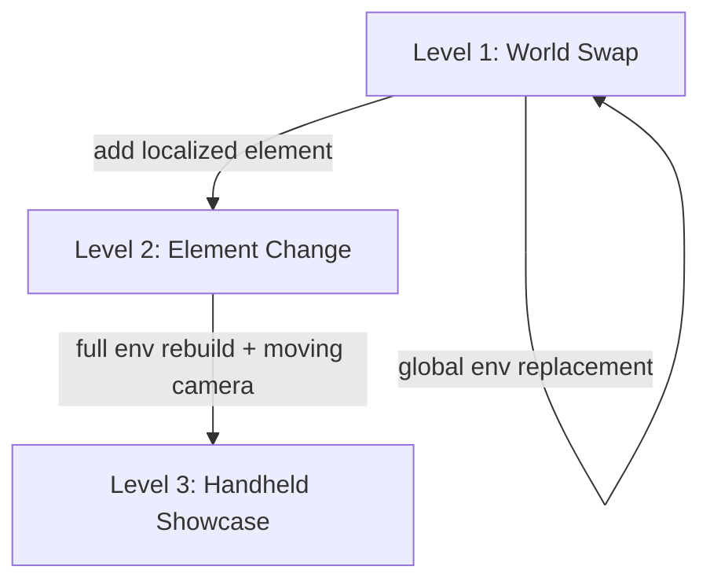

# Seedance VFX Prompt

Write production-grade prompts for BytePlus Seedance 2.0 **video-to-video VFX
editing**. This skill is for editing **existing footage** — not text-to-video
generation. The source clip is the anchor; the prompt describes what to change.

Use this skill when the user wants to:
- **replace a background or location** in an existing video clip
- **add or modify an element** in-frame (creature, object, effect)
- **rebuild the entire environment** around a moving-camera shot
- apply any **footage-driven visual effect** with Seedance
- chain VFX shots where the last frame of one becomes the first frame of the next

Do **not** use this skill for:
- text-to-video generation from a blank prompt (use `seedance-prompt`)
- image-to-video from a still frame (use `seedance-prompt`)
- character sheet or location still generation (use Seedream skills)

This skill is designed to partner with:
- `seedance-vfx-shot` for the end-to-end submission, poll, and save pipeline
- `seedance-prompt` for text-to-video and image-to-video generation
- `seedream-*` skills for generating reference images used in VFX prompts

## Source authority

The VFX methodology in this skill is sourced from:
- [Higgsfield — Seedance 4K VFX guide](https://higgsfield.ai/blog/vfx_4k)
- [Dreamina Seedance 2.0 prompt guide](https://docs.byteplus.com/en/docs/ModelArk/2222480)
- [Seedance video generation API](https://docs.byteplus.com/en/docs/ModelArk/1520757)
- Project conventions in `AGENTS.md` for asset structure and `@tag` references

When the official guide is updated, prefer the live page over this skill where
they conflict.

## Core principle: the source clip is the lock

In VFX editing, the source video is the **identity anchor**. The prompt must
preserve what the model should keep (subject identity, performance, camera
motion) and describe only what should change. Never write a VFX prompt that
re-describes the entire scene from scratch — that tells the model to ignore the
source footage.

The `@source:` lock-header pattern enforces this discipline.

A VFX prompt is only as good as the source footage. **Shoot each clip already
knowing the effect you want** — stable, well-lit, single-subject footage with a
clear, describable camera motion locks more reliably than improvised footage.
That one habit makes every downstream prompt easier to write and more likely to
hold.

## Mandatory prompt structure — VFX Edit

Every Seedance VFX prompt must be assembled in this order. Do not skip
sections that apply to the task.

```text
@source: [describe the source clip — what is in it, what the camera does]

=== LOCKS ===
[what must be preserved from the source]

=== CHANGE ===
[what should change, with timestamp if the change is localized]

=== NEW WORLD ===
[full description of the replacement or added environment/element]

=== LIGHTING (embedded) ===
[lighting that lives inside the world, never a pasted-on layer]

=== SPACE (layered) ===
[foreground, midground, background depth]

=== TIMING (if applicable) ===
[when the change triggers, how it progresses]

=== AUDIO (diegetic only) ===
[sound that physically exists in the new world]

=== GUARDS ===
[NON-IP, face protection, no-warp constraints]
```

## 1. @source: lock-header

**Always first. Always one line.** This is the single most important element of
a VFX prompt — it tells the model that the source clip is the reference to
match.

```text
@source: A man in a yellow raincoat walks down a wet city sidewalk at night, handheld camera following from behind, slight vertical bob, 5 seconds.
```

Rules:
- Describe the **subject, action, camera motion, and duration** of the source
  clip in one or two sentences.
- Do not describe what you want to change here — that goes in `=== CHANGE ===`.
- If the source clip has notable motion (handheld, whip-pan, dolly), state it
  explicitly so the model knows to transfer that motion to the new world.

## 2. === LOCKS ===

Declare what must be preserved from the source footage. This prevents the model
from reinterpreting the subject or camera.

```text
=== LOCKS ===
Lock the man's face, body, raincoat, and walking cadence exactly.
Lock the camera's handheld follow motion and vertical bob frame-for-frame.
```

Lock categories:
- **Identity**: face, body, costume, props held by the subject
- **Performance**: gait, gestures, expressions, timing of actions
- **Camera**: motion type (handheld, dolly, static, whip-pan), framing, lens, bob
- **Continuity**: anything that must match a prior or subsequent shot

## 3. === CHANGE ===

Name the exact change and **when it happens** if it is localized in time.

```text
=== CHANGE ===
At 0:00, replace the city sidewalk and buildings with a dense alien jungle path.
The man continues walking the same path; only the environment changes.
```

```text
=== CHANGE ===
At 0:02, a small bioluminescent creature emerges from the foliage on the right
and follows the man for the remaining 3 seconds. The man does not notice it.
```

Rules:
- Use `At 0:NN` timestamps for localized changes.
- State whether the subject reacts or does not react.
- If the change is global (entire environment swap), say so at `0:00`.

## 4. === NEW WORLD ===

Describe the replacement or added environment/element in full detail. This is
where cinematic richness lives.

```text
=== NEW WORLD ===
A dense alien jungle path, towering bioluminescent fungi in deep blues and
purples, mist rolling low across the ground, enormous fern-like fronds arching
overhead. The path is a narrow dirt trail, wet and glistening. Distant
waterfall sounds. The atmosphere is humid and otherworldly.
```

For element additions (Level 2), describe only the added element:

```text
=== NEW WORLD ===
A small bioluminescent creature, roughly the size of a cat, with translucent
skin showing glowing blue veins, six legs, large curious eyes, and a
sinuous tail. It moves with a skittish, darting gait, low to the ground.
```

## 5. === LIGHTING (embedded) ===

**Lighting must live inside the world.** Never describe lighting as a layer
pasted on top of the footage — the model will produce a flat, artificial look.

```text
=== LIGHTING (embedded) ===
The bioluminescent fungi cast cool blue light upward onto the man's raincoat
and face from below. Warm amber light leaks from distant fire-spores deep in
the jungle, creating a warm-cool contrast. The mist catches the light as a
soft volumetric haze. No flat ambient fill.
```

Embedded lighting rules:
- Light **sources** must be physically present in the new world (fungi, fires,
  neon signs, portal glow, moonlight through canopy).
- Describe **where the light falls** on the subject (direction, color, intensity).
- Describe **how the light interacts** with the environment (volumetric mist,
  reflections on wet surfaces, shadows cast by foreground elements).
- Never say "cinematic lighting" or "dramatic lighting" alone — name the source.

## 6. === SPACE (layered) ===

Build depth with explicit foreground, midground, and background layers.

```text
=== SPACE (layered) ===
Foreground: wet fern fronds and low mist passing close to camera as it moves.
Midground: the man on the jungle path, the bioluminescent fungi lining both sides.
Background: towering fungal columns receding into blue-black fog, distant waterfall.
```

Layered space rules:
- Foreground elements should **pass through frame** as the camera moves — this
  sells the parallax and makes the composite feel real.
- Midground holds the subject and the primary environment.
- Background provides atmosphere and scale, often partially obscured by fog,
  mist, or darkness.

## 7. === TIMING (if applicable) ===

For sequential or progressive VFX, describe when each event triggers and how it
develops.

```text
=== TIMING ===
0:00 — Environment is fully replaced; man is already on the jungle path.
0:02 — Creature emerges from right foliage, initially just glowing eyes.
0:02.5 — Creature fully visible, begins following at a distance of 2 meters.
0:04 — Creature ducks back into foliage as the man turns a corner.
```

## 8. === AUDIO (diegetic only) ===

Seedance 2.0 generates native audio with video. In VFX, **only diegetic sound**
— sound that physically exists in the new world — should be requested. Do not
request non-diegetic music or narration unless the source clip already contains
it and must be preserved.

```text
=== AUDIO (diegetic only) ===
Jungle ambience: distant waterfall, dripping moisture, insect chirps, soft
undergrowth crunching under the man's boots. The creature emits a faint
chittering sound when it emerges. Wet footsteps preserved from source.
```

Diegetic audio rules:
- Every sound must have a **physical source** in the new world.
- Preserve source-clip diegetic sounds that still make sense (footsteps on a
  surface, breath, wind if the new world has wind).
- Do not request background music, score, or voiceover unless it is part of the
  source footage and must be locked.

## 9. === GUARDS ===

Safety and quality constraints. Always include face protection when a human face
is in the source clip.

```text
=== GUARDS ===
NON-IP: No recognizable real persons, no copyrighted characters, no brand logos.
Face protection: the man's face must remain real human skin with visible pores,
stubble texture, and natural catchlights in the eyes. Never waxy, smoothed,
blurred, or warped. The jaw and lip sync must match the source frame-for-frame.
No morphing artifacts at the boundary between the man and the new environment.
```

Face protection is the most important guard for footage involving people:

> "Real human skin with pores, stubble, and catchlights — never waxy, smoothed
> or warped."

This is why **4K resolution** is the default for any VFX shot involving faces,
lip-sync, or fine detail. At lower resolutions, the model tends to smooth and
warp faces to hide artifacts. At 4K, the model can preserve skin texture, pore
detail, and natural catchlights.

## The three VFX levels

Adapt the prompt structure to the complexity of the effect. Each level adds
complexity — start at Level 1 and escalate only when the effect demands it.



### Level 1 — World Swap

**Replace the entire background/environment while preserving the subject and
camera motion.** This is the most common VFX edit.

The change happens at `0:00` and is global. The subject's identity,
performance, and camera motion are fully locked.

```text
@source: A woman in a red coat stands on a train platform, static camera, she
looks left then right, 5 seconds.

=== LOCKS ===
Lock the woman's face, red coat, hair, and body exactly.
Lock her head-turn timing and the static camera framing.

=== CHANGE ===
At 0:00, replace the train platform with an abandoned subway station flooded
with knee-deep water. The woman stands on a raised section of platform above
the water line.

=== NEW WORLD ===
An abandoned subway station, tiled walls cracked and covered in moss, water
reflecting dim emergency lighting, old turnstiles half-submerged in the
foreground, a collapsed ceiling letting in a shaft of pale daylight from above.

=== LIGHTING (embedded) ===
A single emergency light on the far wall casts a flickering amber glow across
the water surface. The daylight shaft from the collapsed ceiling provides a
cool white key light on the woman from above-left. The water reflects and
scatters the amber light across the lower walls.

=== SPACE (layered) ===
Foreground: submerged turnstile, rippling water surface close to camera.
Midground: the woman on the raised platform, the tiled wall behind her.
Background: dark tunnel mouth receding into black, faint amber reflection on
the water fading to darkness.

=== AUDIO (diegetic only) ===
Water dripping echoing in the large space, a low electrical hum from the
emergency light, distant rumble from somewhere deep in the tunnel. The woman's
breath and the faint rustle of her coat preserved from source.

=== GUARDS ===
NON-IP: No recognizable real persons, no copyrighted characters.
Face protection: real human skin with pores and catchlights, never waxy or
warped. Lip and jaw sync must match source frame-for-frame.
```

### Level 2 — Element Change

**Add or modify one element in-frame without changing the rest of the
environment.** The change is localized in both space and time.

Use sequential staging: introduce the element at a specific timestamp, let it
develop, and resolve it before the end of the clip.

```text
@source: A man sits at a wooden desk writing in a notebook, static medium shot,
warm lamp light, 5 seconds.

=== LOCKS ===
Lock the man's face, hands, desk, notebook, pen, and the lamp light.
Lock the static camera framing and the man's writing motion.

=== CHANGE ===
At 0:01, small glowing runes begin appearing on the notebook page under the
man's pen as he writes. The runes spread gradually across the page. The man
does not notice them. The desk and room do not change.

=== NEW WORLD ===
The runes are golden, luminous, floating slightly above the paper surface. They
are angular geometric symbols that glow with a warm inner light and cast tiny
shadows on the page. As more appear, they form connected lines like a circuit
pattern. The ink from the pen transitions seamlessly into the glowing runes.

=== LIGHTING (embedded) ===
The runes emit a warm golden glow that intensifies as more appear, casting a
soft upward light on the man's hand and the underside of his jaw. The existing
lamp light is preserved. The rune light creates a faint moving reflection on
the pen's metal surface.

=== SPACE (layered) ===
Foreground: the man's writing hand, the pen, the glowing runes on the page.
Midground: the desk surface, the lamp base.
Background: the man's torso and face, the room behind him (unchanged, soft focus).

=== TIMING ===
0:00 — No runes, normal writing.
0:01 — First rune appears under the pen tip, faint.
0:02 — Runes begin spreading, glow intensifies, connecting lines form.
0:04 — The page is half-covered in a connected rune circuit, glow is steady.
0:05 — The man lifts his pen; the runes remain glowing on the page.

=== AUDIO (diegetic only) ===
Pen scratching on paper preserved from source. A faint crystalline hum
emanates from the runes, growing slightly louder as they spread. The hum is
subtle, almost subliminal.

=== GUARDS ===
NON-IP: No recognizable real persons, no copyrighted symbols or languages.
Face protection: real human skin with pores and catchlights, never waxy or
warped. The man's hand and finger joints must remain anatomically correct.
```

### Level 3 — Handheld Cinematic Showcase

**Full environment rebuild on a moving-camera shot.** This is the most complex
level — the camera is handheld (or otherwise in motion), and the entire
environment must be rebuilt to follow the camera's exact motion path.

The critical discipline: **transfer the camera motion frame-for-frame** to the
new world. The handheld bob, sway, and forward movement must be preserved so
the new environment feels like it was genuinely filmed with the same camera.

```text
@source: Handheld camera follows a man walking through a parking garage,
vertical bob and lateral sway, camera roughly 2 meters behind, fluorescent
lights overhead, 5 seconds.

=== LOCKS ===
Lock the man's face, body, clothing, gait, and arm swing exactly.
Lock the camera's handheld motion: the vertical bob frequency, the lateral
sway, the forward tracking speed, the lens, and the framing distance — all
frame-for-frame.

=== CHANGE ===
At 0:00, replace the parking garage with a vast cathedral-like alien cavern.
The man walks the same path at the same pace; only the environment changes.

=== NEW WORLD ===
A vast cathedral-like cavern with walls of dark crystalline stone, towering
bioluminescent mineral veins running in branching patterns up the walls like
circulatory systems, a floor of smooth dark stone with shallow reflective water
covering it ankle-deep. The ceiling is lost in darkness far above. Enormous
crystal formations jut from the walls at angles, some glowing, some dark.
The space feels ancient, vast, and alive.

=== LIGHTING (embedded) ===
The bioluminescent mineral veins pulse with a slow deep-blue glow, casting
moving light patterns across the water and the man's back. Patches of warmer
amber-glowing crystals near the floor provide underlighting. The shallow water
reflects and scatters all light sources, creating a continuously shifting
play of blue and amber reflections. No flat fill — all light comes from
specific geological features in the walls and floor.

=== SPACE (layered) ===
Foreground: shallow water splashing under the man's steps, low crystal
formations passing close to camera as it tracks forward, mist at ankle height.
Midground: the man walking, the reflective water surface, the immediate wall
formations with glowing veins.
Background: towering crystal columns receding into blue-black darkness, the
cavern ceiling lost above, faint distant glows deep in the space suggesting
scale.

=== TIMING ===
0:00–5:00 — Continuous walk, environment fully present throughout. The
bioluminescent veins pulse on roughly a 4-second cycle, brightening and dimming
organically. No sudden changes; the effect is ambient and continuous.

=== AUDIO (diegetic only) ===
Footsteps splashing through shallow water, echoing heavily in the vast cavern
space. A deep resonant hum from the mineral veins, almost subsonic, pulsing
in sync with the blue glow. Distant dripping water echoing from far above.

=== GUARDS ===
NON-IP: No recognizable real persons, no copyrighted characters or designs.
Face protection: real human skin with pores and catchlights, never waxy or
warped. No morphing artifacts at the boundary between the man and the new
environment. The camera motion must not drift — the bob and sway must match
the source exactly.
```

## 4K resolution: why and when

| Shot type | Recommended resolution | Why |
|---|---|---|
| Any shot with a human face | `4k` | Preserves skin pores, stubble, catchlights; prevents waxy warping |
| Lip-sync or dialogue shots | `4k` | Jaw and mouth must match source frame-for-frame |
| Fine-texture VFX (runes, particles, hair) | `4k` | Prevents smearing of small detail |
| B-roll, landscape only, no faces | `1080p` acceptable | Lower cost, no face-protection risk |

**Default to 4K for any VFX shot involving faces or fine detail.** Only drop to
1080p for pure landscape or environment-only shots where no human face appears.

## Integrating with project elements

When a VFX prompt references a reusable element from the project (a character, a
creature, a prop, a location), use the `@tag` reference convention from the
workspace's `elements/` directory.

```text
@source: A woman walks through a park, static medium shot, 5 seconds.

=== LOCKS ===
Lock the woman's face, body, clothing, and walking cadence exactly.
Lock the static camera framing.

=== CHANGE ===
At 0:00, replace the park with the @neon-alley location. The @red-motorcycle
prop should be parked to the left of frame.

=== NEW WORLD ===
@neon-alley as defined in the project location sheet: a narrow neon-lit alley
behind a 24-hour noodle bar, wet asphalt reflecting pink and blue signs,
steam from a noodle cart. @red-motorcycle parked to the left, its red
fuel tank catching the neon reflections.
```

The `@tag` convention (e.g. `@neon-alley`, `@red-motorcycle`, `@gloria`)
ensures the model treats these as established identities rather than freeform
descriptions. The reference images from `elements/<id>/references/` should be
attached to the Seedance task as `reference_image` entries alongside the source
video.

## Chaining VFX shots

For multi-shot VFX sequences, use Seedance's `return_last_frame` parameter on
each task. The returned last frame becomes the `first_frame` image for the next
shot, ensuring visual continuity across cuts.


In the prompt for chained shots, the `@source:` header should describe both the
source video and the inherited first frame:

```text
@source: Continuation shot. First frame inherited from the last frame of the
prior shot (woman standing in @neon-alley). She turns and walks toward camera,
5 seconds.
```

## VFX prompt checklist

Before finalizing any VFX prompt, verify:

- [ ] **`@source:` lock-header is first** — describes the source clip only
- [ ] **`=== LOCKS ===`** — identity, performance, and camera motion are locked
- [ ] **`=== CHANGE ===`** — the change is named with a timestamp
- [ ] **`=== NEW WORLD ===`** — the replacement/added element is fully described
- [ ] **`=== LIGHTING (embedded) ===`** — light sources are physical, not pasted
- [ ] **`=== SPACE (layered) ===`** — foreground, midground, background depth
- [ ] **`=== TIMING ===`** — sequential changes have timestamps (if applicable)
- [ ] **`=== AUDIO (diegetic only) ===`** — every sound has a physical source
- [ ] **`=== GUARDS ===`** — NON-IP and face protection are included
- [ ] **4K resolution** — if faces or fine detail are present
- [ ] **`@tag` references** — project elements are referenced by tag, not re-described
