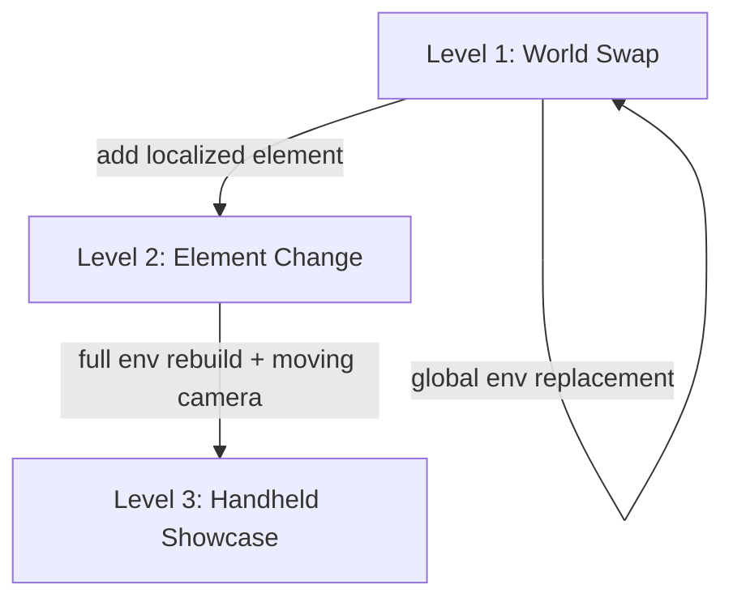

# Seedance VFX Prompt

Write production-grade prompts for BytePlus Seedance 2.0 **video-to-video VFX
editing**. This skill is for editing **existing footage** — not text-to-video
generation. The source clip is the anchor; the prompt describes what to change.

Use this skill when the user wants to:
- **replace a background or location** in an existing video clip
- **add or modify an element** in-frame (creature, object, effect)
- **rebuild the entire environment** around a moving-camera shot
- apply any **footage-driven visual effect** with Seedance
- chain VFX shots where the last frame of one becomes the first frame of the next

Do **not** use this skill for:
- text-to-video generation from a blank prompt (use `seedance-prompt-25` for 2.5, `seedance-prompt-20` for 2.0)
- image-to-video from a still frame (use `seedance-prompt-25` for 2.5, `seedance-prompt-20` for 2.0)
- character sheet or location still generation (use Seedream skills)

> **Version note**: This skill covers **both** Seedance generations. The core
> methodology (sections 1–11) is written for Seedance 2.0. For Seedance 2.5
> video-to-video editing — the preferred path for full-duration edits — see
> [Seedance 2.5 editing](#seedance-25-editing) below; the `seedance-prompt-25`
> skill remains the authority for 2.5 T2V/R2V and native extension. For 2.0
> T2V/R2V prompts, use `seedance-prompt-20`.

> **2.5 resolution guard**: Seedance 2.5 supports 480p/720p/1080p output. The
> 4K face-protection methodology below is 2.0-only. For face-critical structured
> edits on 2.5, weigh 1080p fidelity against 2.0's 4K path. For 4K output,
> stay on 2.0.

This skill is designed to partner with:
- `seedance-vfx-pipeline` for the end-to-end submission, poll, and save pipeline
- `seedance-prompt-20` for Seedance 2.0 text-to-video and image-to-video generation
- `seedance-prompt-25` for Seedance 2.5 text-to-video, R2V, and structured editing
- `seedream-*` skills for generating reference images used in VFX prompts

## Source authority

The VFX methodology in this skill is sourced from:
- [Higgsfield — Seedance 4K VFX guide](https://higgsfield.ai/blog/vfx_4k)
- [Dreamina Seedance 2.0 prompt guide](https://docs.byteplus.com/en/docs/ModelArk/2222480)
- [Seedance video generation API](https://docs.byteplus.com/en/docs/ModelArk/1520757)
- Project conventions for asset structure and `@tag` references (characters, locations, props live under `elements/<element-id>/` and are referenced by `@tag` in prompts)

When the official guide is updated, prefer the live page over this skill where
they conflict.

## Core principle: the source clip is the lock

In VFX editing, the source video is the **identity anchor**. The prompt must
preserve what the model should keep (subject identity, performance, camera
motion) and describe only what should change. Never write a VFX prompt that
re-describes the entire scene from scratch — that tells the model to ignore the
source footage.

The `@Video N` source-clip binding plus the `Locks:` heading enforce this
discipline. VFX prompts use the same natural-language heading style as the
general `seedance-prompt-20` skill — short descriptive words followed by a colon,
never decorative delimiters.

A VFX prompt is only as good as the source footage. **Shoot each clip already
knowing the effect you want** — stable, well-lit, single-subject footage with a
clear, describable camera motion locks more reliably than improvised footage.
That one habit makes every downstream prompt easier to write and more likely to
hold.

## Recommended prompt structure — VFX Edit

Every Seedance VFX prompt follows the same heading convention as the general
`seedance-prompt-20` skill: short natural-language headings with a colon, no
decorative delimiters. Assemble in this order. Omit a heading only when it does
not apply to the task.

```text
Asset preparation:
@Video 1: source clip — [subject, action, camera motion, duration]
@Image 1: [element reference] — [role: character/location/prop sheet]
@Image 2: [texture reference] — [role: texture only, ignore background/lighting]

Subject definitions:
Define the [2-3 core static features] in @Video 1 as [Subject_Label]

Prompt:
Task type: Video Editing
Strictly edit @Video 1, and modify [what changes] at [timestamp]. Preserve [locks].

[New world — full description of the replacement or added environment/element]

Lighting: [lighting that lives inside the world, never a pasted-on layer]

Space: [foreground, midground, background depth]

Timing: [when the change triggers, how it progresses — if applicable]

Audio: [diegetic sound that physically exists in the new world]

Quality and constraints:
Quality: photoreal, 4K, [look/grade]
Constraints: [NON-IP, face protection, no-warp, camera-motion lock, etc.]
```

## 1. Asset preparation (always first)

List every reference asset the user provides, using the same `@Video N`,
`@Image N`, `@Audio N` index convention as the general `seedance-prompt-20` skill.
For VFX, the source clip being edited is always `@Video 1`.

```text
Asset preparation:
@Video 1: source clip — a man in a yellow raincoat walks down a wet city sidewalk at night, handheld camera following from behind, slight vertical bob, 5 seconds.
@Image 1: character sheet — man's face and wardrobe reference.
@Image 2: texture reference — real fur/face photo for the creature (appearance and texture only; ignore background and lighting, do not use for the environment).
```

Rules:
- The source clip is `@Video 1`. Use `Strictly edit @Video 1` in the Prompt
  section to declare the editing mode — do not write "Reference @Video 1" or
  the model treats it as a multimodal reference task, not an edit.
- Describe the **subject, action, camera motion, and duration** of the source
  clip in the role description.
- If the source clip has notable motion (handheld, whip-pan, dolly), state it
  explicitly so the model knows to transfer that motion to the new world.
- Element references (character sheets, location sheets, prop sheets) are
  `@Image N` with a role description. These provide identity, not pixels.
- A texture reference for a creature or material is also `@Image N`, but its role
  must say **texture only** — "appearance and fur/skin texture reference only;
  ignore the photo's background and lighting, do not use it for the
  environment."

Before writing the asset preparation for a clip you can open, **inspect it**:
probe its duration, fps, and aspect ratio, and extract a few frames. Build the
`@Video 1` role description and the prompt duration from what the footage
actually shows — subject, wardrobe, framing, camera move, time of day, key light
direction — not from the user's one-line summary. Set the prompt duration to the
probed runtime by default. If no source clip is available, ask what footage
they're starting from before writing.

## 2. Subject definitions

Define every distinct subject that appears in the references using the `Define`
keyword, exactly as the general `seedance-prompt-20` skill requires. Use 2-3 clear,
stable static features (clothing, hairstyle, appearance, category) to uniquely
identify each subject.

```text
Subject definitions:
Define the man in the yellow raincoat and dark boots in @Video 1 as Man
```

For single subjects across multiple references:

```text
Subject definitions:
Define the man with short dark hair and a yellow raincoat in @Video 1 and @Image 1 as Man
```

Rules:
- Static features only: clothing, hairstyle, build, species. Do not use mutable
  attributes like expression or pose.
- Reuse the same label in every shot and section that features that character.
- For simple scenarios without definitions, use `<Subject>@Video 1` inline to
  bind subject to asset (e.g. `Man@Video 1`).
- Do not use Asset IDs directly; always use `@Video 1` / `@Image 1`.

## 3. Prompt and task type

Start the main prompt by declaring the editing mode. VFX is always
`Video Editing`.

```text
Prompt:
Task type: Video Editing
Strictly edit @Video 1, and modify [Original] in it to [New]. [Unmentioned parts stay unchanged.]
```

For VFX, the editing pattern is:

```text
Strictly edit @Video 1, and modify the city sidewalk and buildings to a dense alien jungle path at 0:00. The man continues walking the same path; only the environment changes.
```

If adding an element rather than replacing:

```text
Strictly edit @Video 1. At 0:02, add a small bioluminescent creature that emerges from the foliage on the right and follows the man for the remaining 3 seconds. The man does not notice it.
```

Then continue with the new-world description, lighting, space, timing, and audio
as natural-language prose sections under their headings — not as delimited
blocks.

## 4. Locks

Declare what must be preserved from the source footage. This prevents the model
from reinterpreting the subject or camera. State the locks in natural language
under the `Prompt:` heading or as a dedicated `Locks:` paragraph.

```text
Locks: Man@Video 1's face, body, raincoat, and walking cadence locked exactly.
Camera handheld follow motion and vertical bob locked frame-for-frame.
```

Lock categories:
- **Identity**: face, body, costume, props held by the subject
- **Performance**: gait, gestures, expressions, timing of actions
- **Camera**: motion type (handheld, dolly, static, whip-pan), framing, lens, bob
- **Continuity**: anything that must match a prior or subsequent shot

## 5. Change

Name the exact change and **when it happens** if it is localized in time.

```text
At 0:00, replace the city sidewalk and buildings with a dense alien jungle path.
Man@Video 1 continues walking the same path; only the environment changes.
```

```text
At 0:02, a small bioluminescent creature emerges from the foliage on the right
and follows Man@Video 1 for the remaining 3 seconds. The man does not notice it.
```

Rules:
- Use `At 0:NN` timestamps for localized changes.
- State whether the subject reacts or does not react.
- If the change is global (entire environment swap), say so at `0:00`.

## 6. New world

Describe the replacement or added environment/element in full detail. This is
where cinematic richness lives.

```text
New world: A dense alien jungle path, towering bioluminescent fungi in deep
blues and purples, mist rolling low across the ground, enormous fern-like
fronds arching overhead. The path is a narrow dirt trail, wet and glistening.
Distant waterfall sounds. The atmosphere is humid and otherworldly.
```

For element additions (Level 2), describe only the added element:

```text
New world: A small bioluminescent creature, roughly the size of a cat, with
translucent skin showing glowing blue veins, six legs, large curious eyes, and
a sinuous tail. It moves with a skittish, darting gait, low to the ground.
```

## 7. Lighting (embedded)

**Lighting must live inside the world.** Never describe lighting as a layer
pasted on top of the footage — the model will produce a flat, artificial look.

```text
Lighting: The bioluminescent fungi cast cool blue light upward onto Man@Video 1's
raincoat and face from below. Warm amber light leaks from distant fire-spores
deep in the jungle, creating a warm-cool contrast. The mist catches the light
as a soft volumetric haze. No flat ambient fill.
```

Embedded lighting rules:
- Light **sources** must be physically present in the new world (fungi, fires,
  neon signs, portal glow, moonlight through canopy).
- Describe **where the light falls** on the subject (direction, color, intensity).
- Describe **how the light interacts** with the environment (volumetric mist,
  reflections on wet surfaces, shadows cast by foreground elements).
- Never say "cinematic lighting" or "dramatic lighting" alone — name the source.

### The integration fork

Decide explicitly which of these two paths the shot takes — it changes the
lighting instruction and the identity risk. State the choice in the `Lighting:`
section.

- **Preserve the subject's lighting; grade only the new elements.** Lock the
  subject's original key light; light and grade the added environment/creature
  to match that existing key so they integrate. Lowest identity risk — use this
  as the default.
- **Relight the whole frame under one look.** Subject included. Use this for a
  unified cinematic or commercial grade. Higher risk to the face — keep
  identity, expression, and wardrobe explicitly locked in the `Locks:` section
  while only lighting and grade change.

### The "looks pasted in" failure

Color matching alone is **not enough** to make a preserved subject sit in a new
world — that is the most common composite failure. When integrating a subject
(or a creature) into a plate, go beyond color with this recipe:

- **Light:** same key direction (name it — screen-left or screen-right), same
  softness, same shadow density and direction across the subject.
- **Environmental bounce:** let the world spill onto the subject — cool skylight
  from above, a warm bounce from sunlit ground or foliage, subtle ambient
  occlusion where forms meet.
- **Optics & atmosphere:** match lens character and micro-contrast; add a touch
  of the scene's atmospheric haze over the subject so they aren't unnaturally
  crisp against a hazy background; match depth of field, focus falloff, and film
  grain to the rest of the frame.
- **Edges & grounding:** remove hard cut-out edges, halos, and mismatched rims;
  ground the subject with believable depth so they occupy the same space.

State the time of day and key direction concretely: "soft, diffused midday
daylight with the key from screen-right." "Softer" means a larger, more diffuse
source — gentle soft-edged shadows, low contrast, smooth highlight rolloff,
light haze. **Warm, directional daylight worlds are safer** for face/identity
consistency than night or neon — those force a full relight of the subject and
raise drift risk. Flag this tradeoff and bake the relight instruction in when
the user wants night or neon anyway.

## 8. Space (layered)

Build depth with explicit foreground, midground, and background layers.

```text
Space: Foreground — wet fern fronds and low mist passing close to camera as it
moves. Midground — Man@Video 1 on the jungle path, the bioluminescent fungi
lining both sides. Background — towering fungal columns receding into blue-black
fog, distant waterfall.
```

Layered space rules:
- Foreground elements should **pass through frame** as the camera moves — this
  sells the parallax and makes the composite feel real.
- Midground holds the subject and the primary environment.
- Background provides atmosphere and scale, often partially obscured by fog,
  mist, or darkness.

## 9. Timing (if applicable)

For sequential or progressive VFX, describe when each event triggers and how it
develops.

```text
Timing:
0:00 — Environment is fully replaced; Man@Video 1 is already on the jungle path.
0:02 — Creature emerges from right foliage, initially just glowing eyes.
0:02.5 — Creature fully visible, begins following at a distance of 2 meters.
0:04 — Creature ducks back into foliage as the man turns a corner.
```

### Timed camera moves synced to dialogue

A crash zoom or smooth push-in landing on a beat is a recurring payoff. Anchor
it **two ways at once** so it lands even if Seedance's internal timing drifts:
a semantic cue and a numeric cue.

- **Semantic:** `At the line "<exact words>," the camera <snaps into a hard
  crash zoom | begins a smooth, steady push-in>…` Requires `SFX and source
  dialogue only` in the audio section so the talk track survives.
- **Numeric:** `At about <T> seconds… the camera…` Derive `T` from the source
  audio — measure the timecode of the spoken line and convert.
- **Crash zoom** = fast hard punch-in; **smooth push-in** = slow steady glide,
  no snap. Match the user's word.
- If a landmark or subject must stay visible **through** the move, say so
  explicitly — the camera pushes toward the element, keeping the landmark in
  frame throughout, never cropping it.
- Leave enough tail after the trigger for the payoff to play (a creature slowly
  turning to camera needs ~2–3s). If the clip is short, fire the zoom on the
  first word of the line rather than after it.

### Reveal pull-back (the outward move)

The mirror of the push-in: open tight on the **added** element in isolation —
a long-telephoto, compressed framing of the creature or effect with the subject
out of frame — then move outward to land on the real plate.

- **Hard / snap zoom-out** = fast punch outward, abrupt.
- **Smooth pull-back** = slow steady decompression, no snap.

Anchor the landing the same two ways (semantic + numeric). Critically, demand
a **100% match of the source composition** at the landing: name the matched
attributes — same angle, headroom, horizon, lens character — or the model
lands on a near-miss framing that no longer cuts against the original. After
the landing, hand off to the preserved take and keep the source's own camera
motion running.

### Preserving lip-sync to a known line

When the payoff is the subject's mouth matching a specific line, quote it
**verbatim** and anchor it twice: once inside the change or action
("…lips matching the source exactly, saying clearly: '<line>'…") and once in
the audio section. Require `SFX and source dialogue only` so the talk track
survives, and add "lips matching the source exactly" to the `Locks:` section.
Then check the line against the surviving dialogue window (see **Duration
discipline**) — a line that runs ~6s cannot sit in a 5s tail. If it doesn't fit,
resolve the runtime before delivering; do not ship a prompt that cannot lip-sync.

## 10. Audio (diegetic only)

Seedance 2.0 generates native audio with video. In VFX, **only diegetic sound**
— sound that physically exists in the new world — should be requested. Do not
request non-diegetic music or narration unless the source clip already contains
it and must be preserved.

```text
Audio: Jungle ambience — distant waterfall, dripping moisture, insect chirps,
soft undergrowth crunching under Man@Video 1's boots. The creature emits a
faint chittering sound when it emerges. Wet footsteps preserved from source.
SFX and source dialogue only.
```

Diegetic audio rules:
- Every sound must have a **physical source** in the new world.
- Preserve source-clip diegetic sounds that still make sense (footsteps on a
  surface, breath, wind if the new world has wind).
- Do not request background music, score, or voiceover unless it is part of the
  source footage and must be locked.

## 11. Quality and constraints

Close with image quality, style, and negative constraints. This section
tightens the generation boundaries and holds the guards — NON-IP, face
protection, no-warp, camera-motion lock.

```text
Quality and constraints:
Quality: photoreal, 4K, cinematic texture, natural colors, soft lighting.
Constraints: NON-IP — no recognizable real persons, no copyrighted characters,
no brand logos. Face protection — Man@Video 1's face must remain real human skin
with visible pores, stubble texture, and natural catchlights in the eyes. Never
waxy, smoothed, blurred, or warped. The jaw and lip sync must match the source
frame-for-frame. No morphing artifacts at the boundary between the man and the
new environment.
```

Face protection is the most important guard for footage involving people:

> "Real human skin with pores, stubble, and catchlights — never waxy, smoothed
> or warped."

This is why **4K resolution** is the default for any VFX shot involving faces,
lip-sync, or fine detail. At lower resolutions, the model tends to smooth and
warp faces to hide artifacts. At 4K, the model can preserve skin texture, pore
detail, and natural catchlights.

## The three VFX levels

Adapt the prompt structure to the complexity of the effect. Each level adds
complexity — start at Level 1 and escalate only when the effect demands it.



### Level 1 — World Swap

**Replace the entire background/environment while preserving the subject and
camera motion.** This is the most common VFX edit.

The change happens at `0:00` and is global. The subject's identity,
performance, and camera motion are fully locked.

```text
Asset preparation:
@Video 1: source clip — a woman in a red coat stands on a train platform, static camera, she looks left then right, 5 seconds.

Subject definitions:
Define the woman with the red coat and shoulder-length dark hair in @Video 1 as Woman

Prompt:
Task type: Video Editing
Strictly edit @Video 1, and modify the train platform to an abandoned subway station flooded with knee-deep water at 0:00. Woman@Video 1 stands on a raised section of platform above the water line. Unmentioned parts stay unchanged.

Locks: Woman@Video 1's face, red coat, hair, and body locked exactly. Head-turn
timing and the static camera framing locked frame-for-frame.

New world: An abandoned subway station, tiled walls cracked and covered in moss,
water reflecting dim emergency lighting, old turnstiles half-submerged in the
foreground, a collapsed ceiling letting in a shaft of pale daylight from above.

Lighting: A single emergency light on the far wall casts a flickering amber glow
across the water surface. The daylight shaft from the collapsed ceiling provides
a cool white key light on Woman@Video 1 from above-left. The water reflects and
scatters the amber light across the lower walls.

Space: Foreground — submerged turnstile, rippling water surface close to camera.
Midground — Woman@Video 1 on the raised platform, the tiled wall behind her.
Background — dark tunnel mouth receding into black, faint amber reflection on
the water fading to darkness.

Audio: Water dripping echoing in the large space, a low electrical hum from the
emergency light, distant rumble from somewhere deep in the tunnel. Woman@Video 1's
breath and the faint rustle of her coat preserved from source. SFX and source
dialogue only.

Quality and constraints:
Quality: photoreal, 4K, cinematic texture, natural colors.
Constraints: NON-IP — no recognizable real persons, no copyrighted characters.
Face protection — real human skin with pores and catchlights, never waxy or
warped. Lip and jaw sync must match source frame-for-frame.
```

### Level 2 — Element Change

**Add or modify one element in-frame without changing the rest of the
environment.** The change is localized in both space and time.

Use sequential staging: introduce the element at a specific timestamp, let it
develop, and resolve it before the end of the clip.

```text
Asset preparation:
@Video 1: source clip — a man sits at a wooden desk writing in a notebook, static medium shot, warm lamp light, 5 seconds.

Subject definitions:
Define the man with short hair and a grey sweater in @Video 1 as Man

Prompt:
Task type: Video Editing
Strictly edit @Video 1. At 0:01, add small glowing runes that begin appearing on the notebook page under Man@Video 1's pen as he writes. The runes spread gradually across the page. The man does not notice them. The desk and room do not change.

Locks: Man@Video 1's face, hands, desk, notebook, pen, and the lamp light
locked exactly. Static camera framing and the man's writing motion locked
frame-for-frame.

New world: The runes are golden, luminous, floating slightly above the paper
surface. They are angular geometric symbols that glow with a warm inner light
and cast tiny shadows on the page. As more appear, they form connected lines
like a circuit pattern. The ink from the pen transitions seamlessly into the
glowing runes.

Lighting: The runes emit a warm golden glow that intensifies as more appear,
casting a soft upward light on Man@Video 1's hand and the underside of his jaw.
The existing lamp light is preserved. The rune light creates a faint moving
reflection on the pen's metal surface.

Space: Foreground — Man@Video 1's writing hand, the pen, the glowing runes on
the page. Midground — the desk surface, the lamp base. Background — Man@Video 1's
torso and face, the room behind him (unchanged, soft focus).

Timing:
0:00 — No runes, normal writing.
0:01 — First rune appears under the pen tip, faint.
0:02 — Runes begin spreading, glow intensifies, connecting lines form.
0:04 — The page is half-covered in a connected rune circuit, glow is steady.
0:05 — Man@Video 1 lifts his pen; the runes remain glowing on the page.

Audio: Pen scratching on paper preserved from source. A faint crystalline hum
emanates from the runes, growing slightly louder as they spread. The hum is
subtle, almost subliminal. SFX only.

Quality and constraints:
Quality: photoreal, 4K, cinematic texture, warm tones.
Constraints: NON-IP — no recognizable real persons, no copyrighted symbols or
languages. Face protection — real human skin with pores and catchlights, never
waxy or warped. Man@Video 1's hand and finger joints must remain anatomically
correct.
```

### Level 3 — Handheld Cinematic Showcase

**Full environment rebuild on a moving-camera shot.** This is the most complex
level — the camera is handheld (or otherwise in motion), and the entire
environment must be rebuilt to follow the camera's exact motion path.

The critical discipline: **transfer the camera motion frame-for-frame** to the
new world. The handheld bob, sway, and forward movement must be preserved so
the new environment feels like it was genuinely filmed with the same camera.

```text
Asset preparation:
@Video 1: source clip — handheld camera follows a man walking through a parking garage, vertical bob and lateral sway, camera roughly 2 meters behind, fluorescent lights overhead, 5 seconds.

Subject definitions:
Define the man with dark hair and a dark jacket in @Video 1 as Man

Prompt:
Task type: Video Editing
Strictly edit @Video 1, and modify the parking garage to a vast cathedral-like alien cavern at 0:00. Man@Video 1 walks the same path at the same pace; only the environment changes. Unmentioned parts stay unchanged.

Locks: Man@Video 1's face, body, clothing, gait, and arm swing locked exactly.
Camera handheld motion — the vertical bob frequency, the lateral sway, the
forward tracking speed, the lens, and the framing distance — all locked
frame-for-frame.

New world: A vast cathedral-like cavern with walls of dark crystalline stone,
towering bioluminescent mineral veins running in branching patterns up the walls
like circulatory systems, a floor of smooth dark stone with shallow reflective
water covering it ankle-deep. The ceiling is lost in darkness far above.
Enormous crystal formations jut from the walls at angles, some glowing, some
dark. The space feels ancient, vast, and alive.

Lighting: The bioluminescent mineral veins pulse with a slow deep-blue glow,
casting moving light patterns across the water and Man@Video 1's back. Patches
of warmer amber-glowing crystals near the floor provide underlighting. The
shallow water reflects and scatters all light sources, creating a continuously
shifting play of blue and amber reflections. No flat fill — all light comes
from specific geological features in the walls and floor.

Space: Foreground — shallow water splashing under Man@Video 1's steps, low
crystal formations passing close to camera as it tracks forward, mist at ankle
height. Midground — Man@Video 1 walking, the reflective water surface, the
immediate wall formations with glowing veins. Background — towering crystal
columns receding into blue-black darkness, the cavern ceiling lost above, faint
distant glows deep in the space suggesting scale.

Timing:
0:00–5:00 — Continuous walk, environment fully present throughout. The
bioluminescent veins pulse on roughly a 4-second cycle, brightening and dimming
organically. No sudden changes; the effect is ambient and continuous.

Audio: Footsteps splashing through shallow water, echoing heavily in the vast
cavern space. A deep resonant hum from the mineral veins, almost subsonic,
pulsing in sync with the blue glow. Distant dripping water echoing from far
above. SFX only.

Quality and constraints:
Quality: photoreal, 4K, cinematic texture, natural colors.
Constraints: NON-IP — no recognizable real persons, no copyrighted characters or
designs. Face protection — real human skin with pores and catchlights, never
waxy or warped. No morphing artifacts at the boundary between Man@Video 1 and
the new environment. The camera motion must not drift — the bob and sway must
match the source exactly.
```

## 4K resolution: why and when

| Shot type | Recommended resolution | Why |
|---|---|---|
| Any shot with a human face | `4k` | Preserves skin pores, stubble, catchlights; prevents waxy warping |
| Lip-sync or dialogue shots | `4k` | Jaw and mouth must match source frame-for-frame |
| Fine-texture VFX (runes, particles, hair) | `4k` | Prevents smearing of small detail |
| B-roll, landscape only, no faces | `1080p` acceptable | Lower cost, no face-protection risk |

**Default to 4K for any VFX shot involving faces or fine detail.** Only drop to
1080p for pure landscape or environment-only shots where no human face appears.

## Photoreal creature / element integration

When a creature or hard-surface element is added and must read as real:

- Demand wildlife-documentary or practical realism explicitly: "fully
  photoreal, real fur with depth and individual strands (or true-scale detail /
  brushed metal), true anatomy, **never CG, plastic, or cartoonish**."
- Tie it into the plate: same sun direction and color temperature as the
  subject, real soft-edged contact shadow on what it touches, same hazy
  atmosphere and depth as the far background.
- **Scale must be explicit** for giant creatures, or the model renders them
  life-size. Say "enormous, its massive body dwarfing the structure, clearly
  colossal relative to the mast."
- If it still reads as CG after a take, the reliable fix is a **second input**
  — a reference photo of the real animal or material — declared as a
  texture-only `@Image N` reference in `Asset preparation:`:

  ```text
  Asset preparation:
  @Video 1: source clip — [subject, action, camera]. Preserve identity,
  performance, framing, camera exactly; [what to change].
  @Image 1: texture reference — reference photo of a real <animal>. Appearance
  and fur/skin texture reference only; ignore the photo's background and lighting,
  do not use it for the environment.
  ```

  Then rewrite the prompt to point the creature at the `@Image 1` reference.
- **Behavior must match the species:** a sloth shifts slow heavy weight; a chimp
  is alert and twitchy; a snake's coils tighten and a forked tongue tastes the
  air (and snakes don't blink — use an unblinking stare, not a blink, for a
  reptile payoff).
- The subject usually stays **oblivious / unfazed**, mid-delivery — that
  contrast is the joke. State it.
- When a long hold lands on a static creature, add small **"living"
  micro-movements** (a slow blink, jaw shift, steady breath) so it doesn't
  look frozen.

## Duration discipline

Default to the source clip's exact runtime. When the user changes the runtime,
**recompute** any numeric zoom timing and tell them the new mark. When a long
hold lands on a static creature, add small "living" micro-movements (a slow
blink, jaw shift, steady breath) so it doesn't look frozen.

### Prepended-intro budget: intro + remaining = total

When you prepend a beat (a reveal, a telephoto hold, an establishing creature
shot) to footage you must preserve, the preserved take does not get longer — it
gets *pushed back*. State the arithmetic every time and flag what falls off:

`total runtime − intro length = surviving window for the source performance`

If the source take is longer than that surviving window, some of it cannot
play. Say so explicitly and offer the three resolutions, in order of fidelity:

1. **Extend the total** so the full source fits (intro + full source). Highest
   fidelity, longest clip.
2. **Start the source earlier** — sacrifice the clip's own quiet lead-in so the
   dialogue still lands in the window. Keeps total fixed, keeps the words,
   loses pre-roll.
3. **Accept truncation** — the first N seconds of the source won't appear. Only
   safe if the dropped head has no dialogue.

Never promise "100% lip-sync" and a prepended intro on a fixed total without
doing this subtraction first. Recompute and re-flag it on *every* change to
either number.

## Integrating with project elements

When a VFX prompt references a reusable element from the project (a character, a
creature, a prop, a location), use the `@tag` reference convention from the
workspace's `elements/` directory alongside the `@Image N` / `@Video N` index
convention.

```text
Asset preparation:
@Video 1: source clip — a woman walks through a park, static medium shot, 5 seconds.
@Image 1: location sheet — @neon-alley reference.
@Image 2: prop sheet — @red-motorcycle reference.

Subject definitions:
Define the woman with the ponytail and green jacket in @Video 1 as Woman

Prompt:
Task type: Video Editing
Strictly edit @Video 1, and modify the park to the @neon-alley location from @Image 1 at 0:00. The @red-motorcycle prop from @Image 2 should be parked to the left of frame. Unmentioned parts stay unchanged.

Locks: Woman@Video 1's face, body, clothing, and walking cadence locked exactly.
Static camera framing locked frame-for-frame.

New world: @neon-alley as defined in @Image 1: a narrow neon-lit alley behind a
24-hour noodle bar, wet asphalt reflecting pink and blue signs, steam from a
noodle cart. @red-motorcycle from @Image 2 parked to the left, its red fuel tank
catching the neon reflections.
```

The `@tag` convention (e.g. `@neon-alley`, `@red-motorcycle`, `@gloria`)
ensures the model treats these as established identities rather than freeform
descriptions. The reference images from `elements/<id>/references/` should be
attached to the Seedance task as `reference_image` entries alongside the source
video.

## Chaining VFX shots

For multi-shot VFX sequences, use Seedance's `return_last_frame` parameter on
each task. The returned last frame becomes the `first_frame` image for the next
shot, ensuring visual continuity across cuts.


In the prompt for chained shots, the `@Video 1` description should note the
inherited first frame:

```text
Asset preparation:
@Video 1: continuation shot — first frame inherited from the last frame of the
prior shot (Woman standing in @neon-alley). She turns and walks toward camera,
5 seconds.
```

> **Seedance 2.5 alternative**: For pure extension tasks (no VFX change, just
> extending a clip), Seedance 2.5's native forward/backward extension can replace
> the manual `return_last_frame` chaining above. Use `seedance-prompt-25` with
> the 2.5 model (`dreamina-seedance-2-5-260628`) and `seedance_2_5_create_task`.

## Iteration discipline

The user iterates fast and in small steps: "softer light," "from the right,"
"bigger snowier mountains," "make the chimp huge," "a beat before the zoom,"
"keep the original runtime." Change **only the named thing** and keep the rest
of the prompt stable — re-rolling the whole prompt loses what already worked.

When refining a generated still or frame, edit the chosen result (pass it back
as the base) and fix only what is off, rather than starting over.

## Voice

Write in a terse, kinetic, physically precise director's voice within each
heading section. Name exact materials, behaviors, scale, lenses, angles, and
moves. Avoid generic adjectives — no "beautiful," "stunning," "amazing,"
"cinematic" — use texture words instead. Don't inflate, don't soften, don't
explain what things "represent."

## Alternative: compact format

The heading-based structure above is the primary format. For simpler edits or
when the user wants plain-text output, use this compact format instead.

**Output rules:** Plain text — no bold, no headers, no bullets inside the
prompt, no code blocks. A short label above each prompt (e.g. `Hook_2 · Variant
1 — Through the clouds`) is fine; the prompt body stays plain text.

**Compact declarations:**

```text
@source: Original <clip name> — <who/what is in it: subject, wardrobe, setting, action>. Preserve <identity, face, wardrobe, performance, framing, camera and motion> exactly; <what to change>.
@creature: Reference photo of a real <animal> — <fur / face / anatomy notes>. Appearance and fur/skin texture reference only; ignore the photo's background and lighting, do not use it for the environment.
```

**Compact specs line:**

```text
Photoreal. <aspect, default 16:9>. <duration — match the source clip>s. <look / grade>. NON-IP — generic <creature/design>, not based on any brand or character. <SFX only | SFX and source dialogue only>.
```

- Match the source runtime by default. Extend only when a payoff needs room,
  and say why.
- NON-IP guardrail belongs in the specs line whenever a creature, armor,
  vehicle, or character design is added.
- `SFX only` for added effects; `SFX and source dialogue only` when the source
  talk track must survive.

**Compact skeleton:**

```text
@source: ...
@creature: ...            (only if a texture reference is used)

Photoreal. 16:9. <N>s. <look/grade>. NON-IP — generic <X>. SFX [and source dialogue] only.

<Continuous shot, same framing as source. Preserved performance. The transformation, with physics and plate interaction. Any timed camera move with semantic + numeric anchor. Lock-down clause: face and identity unchanged; everything else identical to the source.>

SFX [and source dialogue] only: <specific, ordered sounds>.
```

## Structure patterns (quick reference)

- **Add-element:** `@source (preserve all, add effect)` → `specs + NON-IP + SFX only` → `continuous shot, preserved performance, effect igniting/creeping with plate interaction, subject unfazed` → `lock-down clause` → `SFX`.
- **Environment-swap:** `@source (preserve subject + vehicle + rig + motion, replace world)` → `specs + grade for the new world` → `continuous shot from the same rig, new world streaming past with parallax, relight to match or relight-all` → `lock-down` → `SFX`.
- **Creature-on-landmark with timed zoom:** `@source` + `@creature (texture ref)` → `specs + NON-IP + SFX and source dialogue only` → `continuous locked shot, giant photoreal creature integrated on the landmark, subject delivering to camera` → `at ~T / on the line "…", smooth push-in keeping the landmark in frame, creature turns to camera` → `lock-down` → `SFX and dialogue`.
- **Prepended reveal intro (transform + outward move + preserved performance):** `@source (preserve subject + performance + lip-sync + framing, add element on landmark, prepend a telephoto intro)` + `@creature (texture ref)` → `specs + NON-IP + SFX and source dialogue only` → `open tight/telephoto on the added element in isolation for the intro beat, hard or smooth zoom-out at ~T landing on a 100% match of the source composition, then the preserved take plays with exact lip-sync to the quoted line while the added element continues behind` → `budget check (intro + remaining = total)` → `lock-down` → `SFX and dialogue`.

## Seedance 2.0 input limits (reference)

Images ≤ 9; videos ≤ 3 items, total ≤ 15s; audio ≤ 3 MP3s, total ≤ 15s; total
mixed inputs ≤ 12; generation duration 4–15s. A source clip plus a
texture-reference photo fits easily. If a request needs more inputs than
allowed, flag it and say what to prioritize.

> **Seedance 2.5 limits**: 2.5 raises these to 30 images / 10 videos / 10
> audios and 30s generation duration. If your request exceeds the 2.0 limits
> above, route to `seedance-prompt-25` and use the 2.5 model
> (`dreamina-seedance-2-5-260628`) with `seedance_2_5_create_task`.

## Seedance 2.5 editing

The methodology above (sections 1–11) targets Seedance 2.0. For **Seedance 2.5**
video-to-video editing, combine this skill's VFX discipline with the
`seedance-prompt-25` structured-editing pattern. Field-tested notes:

### Model matrix

| Need | Model | `omni_reference_task_type` | Notes |
|---|---|---|---|
| Full-duration edit (match source length) | Seedance 2.5 (`dreamina-seedance-2-5-260628`) | `edit` | Preferred. Duration auto-locks to ~source length (up to 30s). |
| 4K output / Fast / Mini | Seedance 2.0 (`dreamina-seedance-2-0-260128`) | `edit_video` | 2.0 edit **caps output at ~5s** in practice regardless of source length — do not use for edits longer than ~5s. |
| Video extension | 2.5 | `extend` | Native forward/backward extension. |

> 2.5 accepts `auto | reference | edit | extend`. It **rejects `edit_video`**
> (that value is 2.0-only) with `InvalidParameter`. 2.0 uses `edit_video`.

### Canonical 2.5 edit structure

```text
[Edit Goal]
Edit @Video 1. <one-sentence change: replace / add / relight / weather>.

[Source Video Role]
@Video 1 is the sole editing master. It defines <subject, scene, actions,
camera movement, occlusion, event order>.

[Target Material Role]          (only when a reference defines the target)
@Image 1 defines only <target>'s <appearance/structure/material>. Do not use
<irrelevant background/people/composition>.

[Edit Scope]
Modify only <object / region / time range / audio category>. Exactly one
<subject> remains in frame — never a second or duplicated copy. Do not modify
<content to preserve>.

[Content to Preserve]
Keep <identity, motion, timing, camera, lighting> from @Video 1 unchanged.
```

Carry the VFX discipline over: name the change with a timestamp when localized,
embed lighting in the new world, keep audio diegetic, add face protection, and
ground the preserved subject (no cut-out edge, no halo).

### Standard edit guardrails (field-tested)

Include these lines in every 2.5 edit that preserves a subject:

- **Quantity**: `Exactly one <subject> in frame — never a second or duplicated copy.`
- **Non-reaction** (when the subject must not react): `The <subject> does not react to the <change> — performance, gaze, and timing stay exactly as in @Video 1.`
- **Grounding**: `The <subject> stays naturally grounded in the scene — no cut-out edge, no halo; rim light matches the key direction.`
- **Face protection** (any visible face): `Real human skin with pores and catchlights — never waxy, smoothed, or warped.`

### Weather / subject-state change (wet ↔ dry)

To change only the weather while keeping lighting and camera fixed (and flip the
subject's wet/dry state):

```text
[Edit Goal] Change the weather from <A> to <B> while keeping <subject>, the camera
movement, and the lighting direction the same.
[Edit Scope] Change only the weather — <rain/sun…> — and <soak | dry> the subject's
hair and clothing. Do not modify <face, body, gestures, timing, camera, key light>.
Lighting: Keep the same key light direction from @Video 1; <overcast softens /
sun brightens> slightly. No other lighting change.
```

Name the state change on the body: dry→wet (`hair flattened, darker, clinging,
water running down the face; fabric darkens and clings; rain beads`) or wet→dry
(`hair lightens and fluffs, lifts in the breeze; fabric dries loose`). That
visible state change is the acceptance test for the edit.

### Language swap / audio edit (re-lip-sync)

Change only the spoken language and the lip movement, keeping the character,
environment, framing, lighting, and timing identical. Field-tested template:

```text
[Edit Goal]
Edit @Video 1. Change the presenter's spoken language from <source> to natural
<target>, keeping the dialogue content and speaking times, and re-sync the lip
movement to the new <target> words.

[Source Video Role]
@Video 1 is the sole editing master. It defines the presenter, his appearance,
the background, the framing, the lighting, and the event order.

[Edit Scope]
Change only the spoken language and the lip movement to match it. Do not modify
the presenter's appearance, the background, the lighting, the camera framing, or
the timing. Exactly one presenter remains in frame — never a second or
duplicated copy.

[Content to Preserve]
Keep the presenter's face, appearance, the background, the lighting, the camera
framing, and the speaking times from @Video 1. Real human skin with pores and
catchlights — never waxy, smoothed, or warped. The presenter's facial expression,
gaze, and gestures remain exactly as in @Video 1; only the mouth and lips
re-animate to the new words.
```

Contract and notes:

- **Same content.** The target `{}` line is the source line translated — no
  paraphrasing, no added or omitted words. State it with language reinforcement
  and delivery style: `now in natural <regional variety>, with the same
  <delivery> as @Video 1: {<line>}`.
- **Source-side reinforcement.** The BEFORE T2V clip needs a `Dialogue language:`
  line (`natural, conversational American English` / `Mandarin Chinese` /
  `Japanese`) plus its `{}` line. English, Chinese, and Japanese are all
  natively supported by Seedance 2.5.
- **CJK punctuation.** In Japanese dialogue use `……` (ideographic ellipsis) or a
  comma, not the em dash `——`.
- **Visuals must not change.** If the AFTER drifts in face, background, or
  framing, tighten the `[Edit Scope]` / `[Content to Preserve]` locks rather
  than piling on negative constraints.

### Combining dialogue rewrite + emotion + camera (director's retake)

A superset of the mouth-only swap: when the user also wants the performance and
the camera re-staged, the edit intentionally changes three things and preserves
only identity, environment, and runtime:

- `[Edit Goal]` rewrites the dialogue and changes the delivery/emotion and the
  camera movement; `[Content to Preserve]` locks the face/clothes/room/lighting
  (face protection + grounding) and `[Edit Scope]` carries the "exactly one
  <subject>" guard.
- New script in `{}` with delivery style; lips sync the NEW words; emotion is
  externalised as posture/gesture/jaw/eyes, not bare labels.
- Camera: ≤ 2 moves in one take, each dual-anchored (semantic + "At about
  0:NN"), orbit expanded with direction and foreground/background parallax.

Keep the camera block to two moves — three or more reads as unstable in one
continuous take.

### Routing vs `audio-dubbing`

Two different techniques both change language — pick by whether the lips are
visible:

| Technique | Skill | Result |
|---|---|---|
| Re-voice + **re-render lips** | `seedance-vfx-prompt` (2.5 audio edit, this section) | Video re-rendered; mouth re-animated to the new language. Use when the mouth is visible and lip-sync matters. |
| Voice-clone + **overlay audio** | `audio-dubbing` (Seed Audio 1.0 TA2A) | Video frames untouched; cloned audio laid on top. Use when lips are off-screen or not the focus. |

### Content-safety note (copyright false positives on output)

Seedance can reject an otherwise-innocuous edit with
`OutputVideoSensitiveContentDetected.PolicyViolation` ("copyright restrictions")
when the *generated output* resembles a film/photo cliché — interrogation rooms,
a figure arguing in the rain, well-known movie setups. This is an output-level
false positive, not a prompt error. Mitigate by softening the trope wording
(e.g. `arguing` → `talking into his phone`; `bare-bulb interrogation` → a neutral
desk scene), resubmitting once, and recording the failed task. Never retry the
identical prompt unchanged.

## VFX prompt checklist

Before finalizing any VFX prompt, verify:

- [ ] **`Asset preparation:` is first** — `@Video 1` is the source clip, with
      subject, action, camera motion, and duration in the role description
- [ ] **Source inspected** — duration, fps, aspect probed; `@Video 1` role built
      from footage, not from a one-line summary
- [ ] **`Subject definitions:`** — subjects defined with `Define ... in @Video 1
      as <Label>`, 2-3 static features each
- [ ] **`Prompt: Task type: Video Editing`** — `Strictly edit @Video 1` declared
- [ ] **`Locks:`** — identity, performance, and camera motion are locked, using
      `<Label>@Video 1` binding
- [ ] **Change named with timestamp** — `At 0:NN` for localized changes
- [ ] **`New world:`** — the replacement/added element is fully described
- [ ] **`Lighting:`** — light sources are physical, not pasted
- [ ] **Lighting fork decided** — preserve-subject vs relight-all chosen
      explicitly
- [ ] **Integration recipe applied** — light direction, environmental bounce,
      optics/atmosphere, edges/grounding (if subject composited into new world)
- [ ] **`Space:`** — foreground, midground, background depth
- [ ] **`Timing:`** — sequential changes have timestamps (if applicable)
- [ ] **Timed moves dual-anchored** — semantic + numeric cues (if camera move
      synced to dialogue)
- [ ] **Lip-sync window checked** — quoted line fits the surviving dialogue
      window (if lip-sync is the payoff)
- [ ] **`Audio:`** — every sound has a physical source; `SFX [and source
      dialogue] only` declared
- [ ] **`Quality and constraints:`** — NON-IP, face protection, 4K, and other
      guards included
- [ ] **4K resolution** — if faces or fine detail are present
- [ ] **`@tag` references** — project elements referenced by tag and bound to
      `@Image N`, not re-described
- [ ] **Creature realism demanded** — wildlife-doc realism, species behavior,
      scale explicit (if creature added)
- [ ] **Texture `@Image N` reference** — second input added if CG still reads
      fake (if creature added)
- [ ] **Living micro-movements** — added for static creature holds
- [ ] **Prepended-intro budget computed** — `total − intro = surviving window`
      (if intro prepended)
- [ ] **Iteration discipline** — only the named change applied, rest of prompt
      stable (if iterating)
