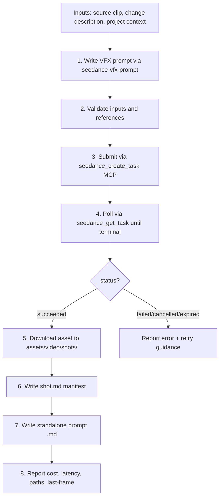

# Seedance VFX Shot Pipeline

End-to-end pipeline for producing a Seedance 2.0 VFX shot from a source clip.
This skill composes the `seedance-vfx-prompt` skill (prompt writing) with the
`modelark-mcp` tools (task submission, polling, download) to produce a saved,
manifested asset following the workspace's `projects/<project>/` directory
conventions.

> **Version note**: This pipeline targets Seedance 2.0 video-to-video VFX with
> 4K face protection. For Seedance 2.5's structured editing (subject replacement,
> background replacement, audio editing) and native forward/backward extension,
> use the `seedance-prompt-25` skill. Note that 2.5 supports only 480p/720p
> output — the 4K face-protection path below is 2.0-only. For 2.0 T2V/R2V
> prompts, use `seedance-prompt-20`.

Use this skill when the user wants to:
- **run a complete VFX shot** from source clip to saved output
- **submit a VFX edit** to Seedance and get the result back as a local file
- **produce a manifested, reproducible VFX asset** with `shot.md` + prompt file

Do **not** use this skill when the user only wants to:
- write a VFX prompt without submitting (use `seedance-vfx-prompt`)
- generate text-to-video or image-to-video (use `seedance-prompt`)
- generate images or audio (use Seedream / Seed Audio skills)

## Prerequisites

- `ARK_API_KEY` (or `BYTEPLUS_MODELARK_API_KEY`) set in environment or `.env`
- `mcp_modelark-seed` MCP server running and healthy
- Source video clip accessible as a local file path or URL
- Project directory exists under `projects/<project-name>/`

## Pipeline overview



## Inputs

| Input | Required | Description |
|---|---|---|
| `source_video` | Yes | Local path or URL to the source clip to edit |
| `change_description` | Yes | Plain-language description of the VFX change |
| `project` | Yes | Project name (kebab-case, must exist under `projects/`) |
| `scene` | Yes | Scene ID (e.g. `scene-01`) |
| `shot` | Yes | Shot ID (e.g. `s01_sh010`) |
| `element_refs` | No | List of element reference paths (characters, locations, props) |
| `resolution` | No | Default `4k` for face/detail shots; `1080p` for landscape-only |
| `duration` | No | Default: match source clip duration (max 15s) |
| `ratio` | No | Default `16:9` |
| `return_last_frame` | No | Default `true` (enables shot chaining) |
| `safety_identifier` | No | Default `<project>-<scene>-<shot>` |

## Step 1 — Write the VFX prompt

Use the `seedance-vfx-prompt` skill to write the prompt. The prompt must follow
the natural-language heading structure with all applicable sections:

```text
Asset preparation:
@Video 1: source clip — [subject, action, camera motion, duration]
@Image 1: [element reference] — [role]

Subject definitions:
Define the [features] in @Video 1 as [Label]

Prompt:
Task type: Video Editing
Strictly edit @Video 1, and modify [what changes] at [timestamp]. Preserve [locks].

[New world — full description of the replacement or added environment/element]

Lighting: [embedded lighting]
Space: [foreground, midground, background depth]
Timing: [if applicable]
Audio: [diegetic only]

Quality and constraints:
Quality: photoreal, 4K, [look/grade]
Constraints: [NON-IP, face protection, no-warp, camera-motion lock]
```

Pass the user's `change_description` to the prompt skill. The prompt skill will
produce the structured prompt text.

## Step 2 — Validate inputs

Before submitting, verify:

1. **Source video exists** — confirm the local file path resolves or the URL
   is reachable. If local, note the file size (large base64 uploads compete for
   bandwidth; the MCP server handles encoding).
2. **Element references exist** — for each path in `element_refs`, confirm the
   file exists under `projects/<project>/elements/`. Each reference should be
   a character sheet, location sheet, or prop sheet image.
3. **Prompt is complete** — run through the VFX prompt checklist from
   `seedance-vfx-prompt` (all applicable sections present, `Asset preparation:`
   first with `@Video 1` source clip, face protection in constraints if faces
   are present).
4. **4K check** — if the source clip contains a human face, `resolution` must
   be `4k`. Only allow `1080p` for pure landscape/environment shots with no
   human faces.

> **2.5 guard**: Seedance 2.5 supports only 480p/720p. If using the 2.5 model (`dreamina-seedance-2-5-260628`), set `resolution` to `"720p"` — `"4k"` and `"1080p"` are invalid and will be rejected.

5. **Duration** — 1 to 15 seconds. The API also accepts `-1` (auto/match-source),
   but for VFX prefer an explicit duration matching the source clip. If the
   source clip is longer than 15s, split it into multiple chained shots.

For Seedance 2.5, single-pass duration extends to 30s, and native forward/backward extension can replace the manual `return_last_frame` chaining workflow.

6. **Project/scene/shot directories exist** — create them if missing:
   - `projects/<project>/scenes/<scene>/shots/<shot>/`
   - `projects/<project>/assets/video/shots/<scene>/<shot>/`

## Step 3 — Submit via MCP

Call `seedance_create_task` on the `mcp_modelark-seed` MCP server.

**MCP request structure:**

```json
{
  "server_name": "mcp_modelark-seed",
  "tool_name": "seedance_create_task",
  "args": {
    "input": {
      "prompt": "<full VFX prompt text from Step 1>",
      "videos": [
        {
          "kind": "url",
          "url": "<source video URL or local path>",
          "role": "reference_video"
        }
      ],
      "images": [
        {
          "kind": "base64",
          "data": "<base64-encoded character/location sheet>",
          "mime_type": "image/png",
          "role": "reference_image"
        }
      ],
      "model": "{{model_id}}",  # default: dreamina-seedance-2-0-260128 (2.0); use dreamina-seedance-2-5-260628 for 2.5 (note: 2.5 supports only 480p/720p)
      "resolution": "4k",
      "ratio": "16:9",
      "duration": 5,
      "generate_audio": true,
      "watermark": false,
      "return_last_frame": true,
      "execution_expires_after": 3600,
      "priority": 0,
      "safety_identifier": "<project>-<scene>-<shot>"
    }
  }
}
```

Key parameters for VFX:
- **`videos[].role = "reference_video"`** — the source clip to edit. This is
  what makes it a video-to-video (VFX) task rather than text-to-video.
- **`images[].role = "reference_image"`** — element references (character
  sheets, location sheets, prop sheets) for identity consistency.
- **`resolution = "4k"`** — face protection; preserves skin texture, prevents
  waxy warping.
- **`generate_audio = true`** — Seedance 2.0 native audio. The prompt's
  `Audio:` section guides the audio generation.
- **`return_last_frame = true`** — returns the last frame image, enabling
  shot chaining for multi-shot VFX sequences.
- **`safety_identifier`** — set to `<project>-<scene>-<shot>` for
  traceability.

The tool returns a `task_id` and `polling_interval`. Store both.

## Step 4 — Poll for completion

Call `seedance_get_task` repeatedly, respecting the `polling_interval` from
creation:

```json
{
  "server_name": "mcp_modelark-seed",
  "tool_name": "seedance_get_task",
  "args": {
    "task_id": "<task_id from Step 3>",
    "persist_output": true
  }
}
```

Task states transition through: `queued` → `running` → `succeeded` / `failed`
/ `cancelled` / `expired`.

Poll until the status is terminal:
- **`succeeded`** — proceed to Step 5. The response includes `artifacts` (the
  generated video, and optionally the last frame image if
  `return_last_frame=true`), `usage` (token counts, cost), and `settings`.
- **`failed`** — check the `error` field. Common causes: content safety
  rejection, invalid reference format, prompt too long. Report the error and
  retry guidance to the user.
- **`cancelled`** — the task was cancelled (manually or by timeout). Report
  and ask the user whether to resubmit.
- **`expired`** — the `execution_expires_after` window elapsed before the task
  completed. Resubmit with a longer expiry.

## Step 5 — Download and save the asset

On `succeeded`, the MCP response includes `artifacts` with the generated video
(and optionally the last frame image). The MCP server's artifact store
(`persist_output: true`) has already persisted the asset.

Save the video to the project's asset directory:

```
projects/<project>/assets/video/shots/<scene>/<shot>/<shot>_t01_v01.mp4
```

File naming follows the workspace convention:
- `<scene>_sh<NNN>_t<NN>_v<NN>.mp4` — e.g. `s01_sh010_t01_v01.mp4`
- If approved as final: `<scene>_sh<NNN>_final_v<NN>.mp4`

If `return_last_frame=true`, save the last frame image alongside the video for
chaining:

```
projects/<project>/assets/video/shots/<scene>/<shot>/<shot>_t01_v01_lastframe.png
```

## Step 6 — Write the shot.md manifest

Write the `shot.md` file in the shot directory with full YAML frontmatter for
reproducibility:

```
projects/<project>/scenes/<scene>/shots/<shot>/shot.md
```

**Manifest template:**

```yaml
---
project: <project>
scene: <scene>
shot: <shot>
model: dreamina-seedance-2-0-260128  # 2.0 default; use dreamina-seedance-2-5-260628 for 2.5 (720p max)
mode: V2V
vfx_level: <1 | 2 | 3>
references:
  - <source video path or URL>
  - elements/characters/<id>/sheets/<sheet>.png
  - elements/locations/<id>/sheets/<sheet>.png
seed: null
params:
  resolution: 4k
  ratio: "16:9"
  duration: 5
  audio: true
  watermark: false
  return_last_frame: true
  submission_mode: single
take: t01
version: v01
status: review
cost_usd: <from MCP response>
billing_tokens_total: <from MCP response>
artifacts:
  - take: t01
    id: <artifact_id from MCP>
    uri: <seed-media:// URI from MCP>
    task_id: <task_id from MCP>
    media_type: video
    mime_type: video/mp4
    bytes: <file size>
    sha256: <hash>
    width: 3840
    height: 2160
    duration: <actual duration>
    audio_channels: 2
    audio_sample_rate: <from MCP>
    completion_tokens: <from MCP>
    cost_usd: <per-take cost>
    created_at: <ISO timestamp>
safety_identifier: <project>-<scene>-<shot>
---

# <shot> — VFX edit (<vfx_level>, 4K, audio)

<Description of the VFX edit performed on the source clip.>

## Source clip

- **Source**: `<source video path or URL>`
- **VFX level**: <1 — World Swap | 2 — Element Change | 3 — Handheld Showcase>

## Element references

- **@Image 1**: `<sheet>` — <element description>
- **@Video 1**: `<source>` — source clip for VFX edit

## Generation parameters

- **Model**: `dreamina-seedance-2-0-260128` (Seedance 2.0 Standard; for 2.5 use `dreamina-seedance-2-5-260628` — note 2.5 caps at 720p)
- **Resolution**: 4K (3840×2160)
- **Ratio**: 16:9
- **Duration**: <N>s
- **generate_audio**: `true` (native diegetic audio)
- **watermark**: `false`
- **return_last_frame**: `true` (for shot chaining)
- **safety_identifier**: `<project>-<scene>-<shot>`

## Cost

- <N> take × $<cost>/take = **$<total> total**
- <N> × <tokens> completion tokens = <total> total tokens

## Prompt

Full prompt text saved at:
- `scenes/<scene>/shots/<shot>/<shot>_prompt.md` (shot-level)
- `assets/video/shots/<scene>/<shot>/<shot>_prompt.md` (asset-level copy)

## Reproduction

To re-create this take from this manifest alone:

1. Encode the source video and element reference images.
2. Call `seedance_create_task` on `mcp_modelark-seed` with the prompt from
   `<shot>_prompt.md`, `model=dreamina-seedance-2-0-260128  # or dreamina-seedance-2-5-260628 for 2.5 (720p max)`,
   `resolution=4k`, `ratio=16:9`, `duration=<N>`, `generate_audio=true`,
   `return_last_frame=true`.
3. Poll with `seedance_get_task` until `status=succeeded`.
4. Download via `runtime.artifact_store.get(artifact_id)`.
5. Expect ~<N>s of 4K `video/mp4` with AAC audio, cost ~$<cost>/take.
```

## Step 7 — Write the standalone prompt file

Save the full prompt text as a standalone Markdown file alongside the asset:

```
projects/<project>/assets/video/shots/<scene>/<shot>/<shot>_prompt.md
```

Also write a copy at the shot level:

```
projects/<project>/scenes/<scene>/shots/<shot>/<shot>_prompt.md
```

The file is plain Markdown containing the full VFX prompt text (from
`Asset preparation:` through `Quality and constraints:`), human-readable and
shareable without parsing YAML frontmatter.

## Step 8 — Report results

After completion, report to the user:

| Field | Source |
|---|---|
| **Status** | `succeeded` / `failed` |
| **Local file path** | `projects/<project>/assets/video/shots/<scene>/<shot>/<file>.mp4` |
| **Artifact URI** | `seed-media://artifacts/<id>` (MCP artifact store) |
| **Task ID** | From MCP response |
| **Cost** | `cost_usd` from MCP response |
| **Tokens** | `completion_tokens` from MCP response |
| **Resolution** | Confirmed 4K (3840×2160) |
| **Duration** | Actual output duration |
| **Last frame** | Path to saved last-frame PNG (if `return_last_frame=true`) |
| **Latency** | Wall-clock time from submit to succeeded |
| **Manifest** | `projects/<project>/scenes/<scene>/shots/<shot>/shot.md` |

If the task failed, report:
- The `error` field from the MCP response
- The `task_id` for support reference
- Suggested retry action (fix prompt, change reference, resubmit)

## Error handling

| Error | Cause | Action |
|---|---|---|
| Content safety rejection | Source clip or prompt flagged by moderation | Review source clip content; simplify the `New world:` description; remove any borderline language |
| Invalid reference format | Video URL unreachable, image not valid PNG/JPEG | Verify file paths; re-encode images as PNG; use `kind: "base64"` for local files |
| Prompt too long | Exceeds 32,000 character limit (the MCP `seedance_create_task` video-generation tool accepts up to 32,000 characters) | Condense `New world:` and `Lighting:` sections; remove redundant detail |
| Task timeout / expired | `execution_expires_after` too short | Resubmit with `execution_expires_after: 7200` (2 hours) |
| Face warp in output | Resolution too low or face protection not in constraints | Ensure `resolution: "4k"` and face protection guard is present; resubmit |
| Camera motion drift | Camera lock too vague in `Locks:` | Specify exact motion type (handheld bob, lateral sway, tracking speed) and add "frame-for-frame" lock; resubmit |

Always surface the `task_id` in error reports — it is the reference for support
and debugging.

## Cost considerations

VFX shots using Seedance 2.0 at 4K with audio are the **most expensive**
generation mode in the workspace. Each 4K VFX take costs significantly more than
a 1080p text-to-video take.

Seedance 2.5 at 720p is cheaper per generation but cannot produce 4K output — use 2.5 for structured editing and extension, 2.0 for 4K face protection.

Guidelines:
- **Default to a single take** (`t01`) for VFX development. Generate multiple
  takes only for final selection.
- **Use `seedance_create_task_variations`** (1–5 parallel tasks) when the user
  wants multiple takes in one submission — but only for 1080p development
  iterations. For 4K final takes, submit sequentially to avoid bandwidth
  contention from large base64 payloads.
- **Never submit 4K VFX shots without explicit user confirmation** of the cost.
  State the expected per-take cost before submitting.
- **Cache and reuse** — if a take is approved, mark `status: approved` in the
  manifest. Do not regenerate approved takes.

## Shot chaining workflow

For multi-shot VFX sequences (e.g. a character walking through multiple
environments), chain shots using `return_last_frame`:

```mermaid
flowchart LR
    SRC1[Source clip 1] -->|seedance_create_task| SHOT1[Shot 1: VFX edit]
    SHOT1 -->|return_last_frame| LF1[Last frame PNG]
    LF1 -->|first_frame for Shot 2| SRC2[Source clip 2 + last frame]
    SRC2 -->|seedance_create_task| SHOT2[Shot 2: VFX edit]
    SHOT2 -->|return_last_frame| LF2[Last frame PNG]
    LF2 -->|first_frame for Shot 3| SRC3[Source clip 3 + last frame]
```



Chaining procedure:
1. Submit Shot 1 with `return_last_frame: true`.
2. On success, save the last-frame PNG to the shot's asset directory.
3. For Shot 2, submit the source clip as `reference_video` AND the last-frame
   PNG as an image with `role: "first_frame"`.
4. In Shot 2's prompt `Asset preparation:` section, note that the first frame
   is inherited from Shot 1's last frame.
5. Repeat for each subsequent shot.

This ensures visual continuity across cuts — the environment and subject
position carry forward seamlessly.

## Pipeline checklist

Before declaring a VFX shot complete, verify:

- [ ] **Prompt written** — full natural-language heading structure, all applicable
      sections, VFX prompt checklist passed
- [ ] **4K resolution** — if faces or fine detail are present
- [ ] **`return_last_frame: true`** — if chaining to a subsequent shot
- [ ] **`generate_audio: true`** — native diegetic audio enabled
- [ ] **Task submitted** — `seedance_create_task` returned a `task_id`
- [ ] **Task polled** — `seedance_get_task` returned `status: succeeded`
- [ ] **Video saved locally** — asset in `assets/video/shots/<scene>/<shot>/`
- [ ] **Last frame saved** — PNG alongside the video (if chaining)
- [ ] **`shot.md` manifest written** — full YAML frontmatter with model, prompt
      references, seed, params, cost, status, artifacts
- [ ] **Prompt file written** — standalone `.md` at both shot-level and
      asset-level paths
- [ ] **Cost recorded** — `cost_usd` and `billing_tokens_total` in manifest
- [ ] **Status set** — `review` (default), `approved`, or `rejected`
- [ ] **No secrets in manifest** — API keys, tokens, credentials never in
      frontmatter or prompt files
