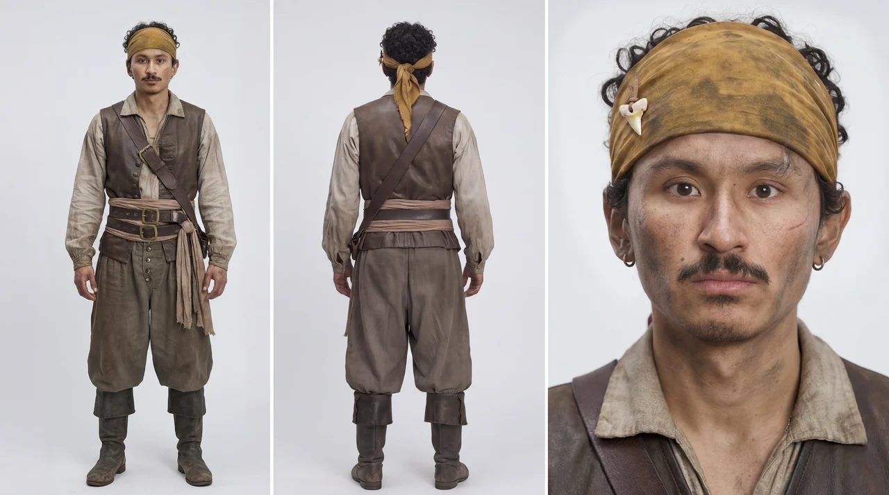
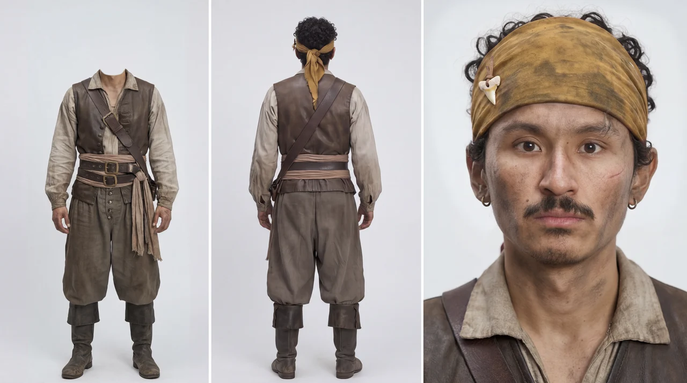

# Seedream Character Sheet Cleanup

Use this skill immediately after generating a three-panel character sheet and
before handing that sheet to Seedance or reusing it as a canonical identity
reference.

The purpose is simple: a character sheet with multiple readable faces can
confuse Seedance during downstream video generation. If the front full-body
panel shows a second readable face, the model can drift between faces over time.
The cleanup pass keeps only one face anchor: the dedicated close-up panel.

## Non-destructive output rule

Never overwrite the source character sheet.

Always save cleanup output as a **new image file or new version** so the
original sheet remains available for review, rollback, or alternate use.

This skill is designed to partner with:
- `seedream-character-sheet` for generating the original three-panel sheet
- `seedream-edit` and the `seedream_edit_image` MCP tool for the actual cleanup
- `modelark-mcp` (`seed_understand`) for verifying the cleanup result

## When to Invoke

Invoke this skill when all of the following are true:
- you already generated a character sheet
- the sheet contains a dedicated close-up face panel
- at least one full-body panel still shows a readable face
- the sheet will later be used as a Seedance identity lock or character reference

Do not invoke this skill when:
- the sheet already has only one readable face
- the user explicitly wants visible facial detail in multiple panels
- the image is a regular portrait sheet rather than a Seedance-facing identity sheet

## Core Rule

For Seedance-facing character sheets, keep exactly one readable face on the
sheet: the close-up panel.

The front full-body panel should preserve:
- pose
- clothing
- silhouette below the shoulders
- panel spacing
- background consistency

The front full-body panel should NOT preserve the head at all. Remove the
entire head (and optionally the neck) so the figure is headless. Do not blur
the face and do not replace it with a featureless surface: the head must be
gone, with the studio background filling the space where it was.

## Default Cleanup Target

The default target is the front full-body panel's face region.

If the back-view panel accidentally exposes too much face because of head turn
or profile leakage, clean that panel too. The close-up face panel remains the
only authoritative face and should stay untouched.

## Gender and identity drift warning

Removing the head from the full-body panel can cause **gender identity drift**
in Seedance video generation. When the body panel is headless, the model may
lose gender cues (hair length, facial structure, jawline) and render the
character as the wrong gender. This was confirmed in production: a cleaned
female character sheet caused the model to render the character as male.

**Mitigation strategies:**

1. **Test before committing.** After cleanup, run `seed_understand` on the
   cleaned sheet and ask "Is this character male or female?" If the answer is
   wrong, do not use the cleaned sheet for video generation.
2. **Keep the uncleaned original as a fallback.** If the cleaned sheet causes
   gender drift, switch back to the uncleaned sheet. The identity-consistency
   benefit of cleanup is outweighed by the gender-accuracy risk.
3. **Reinforce gender in the video prompt.** State the character's gender
   explicitly and repeatedly: "Maya, a young Filipina woman — she is female."
4. **When in doubt, skip cleanup.** The cleanup step exists to prevent
   identity cloning (two faces competing on one sheet). If the character sheet
   has a clear close-up panel and the full-body panels are not confusing, the
   cleanup may not be necessary. Use cleanup only when the model is actually
   cloning faces.

## Recommended Editing Mode

Use `seedream_edit_image` with a bounding box around the entire head in the
full-body panel. This is a deletion or cleanup edit, not a full regeneration.

Box the whole head (hair and headwear included), not just the facial features.
Do not box the entire panel unless absolutely necessary.

## Prompt Template

Use this as the default edit instruction:

```text
Remove the entire head from the full-body front-view panel so the figure is
headless. There must be no head, no face, no hair and no headwear in that
panel. Fill the space where the head was with the studio background. Keep the
neck, shoulders, body, costume, pose, panel spacing, divider lines, studio
background, and the close-up face panel unchanged.
```

## Stronger Prompt Variant

Use this variant when the user also wants the neck removed, or when the edit
keeps recreating a head:

```text
Remove the entire head and neck from the full-body front-view panel so the
body begins at the shoulders and collarbone. Fill the space where the head and
neck were with the studio background. Keep the shoulders, body, costume, pose,
panel spacing, divider lines, studio background, and the close-up face panel
unchanged.
```

## Coordinate Guidance

When using `seedream_edit_image`:
- place the bbox around the entire head in the full-body panel (hair and
  headwear included, down to the neck), not just the facial features
- include the neck inside the box when the user wants the neck removed too
- avoid covering the shoulders, torso, divider line, or close-up panel
- a box that is too small leaves a blurred or featureless head — widen it to
  the full head before changing the prompt

For the standard three-panel 16:9 sheet (e.g. 2048×1152), the front full-body
panel is the middle third and the head sits at the top of that panel. A good
starting box in `seedream_edit_image` normalized coordinates (0–999) is:

```text
bbox: {x1: 454, y1: 22, x2: 549, y2: 204}
```

That box covers the head and neck with margin and stays clear of the panel
divider lines. Start there, widen it if `seed_understand` still reports a face
in the center panel, and re-run the mandatory verification after every edit.

## Acceptance Check

Confirm the points below with `seed_understand` (see Verification). Do not
trust a visual glance at the sheet. The cleanup is successful when:
- the close-up panel is the only readable face on the sheet
- the front full-body panel shows no head at all — the figure is headless and
  the studio background fills the space where the head was
- the front full-body panel still reads as the same character and costume
- the sheet layout remains stable
- the background and divider lines stay consistent
- no blurred face, featureless head, or new facial detail appears in the body
  panels

## Verification (mandatory)

Do not accept the cleanup until you have verified it with `seed_understand`
(Seed 2.1 multimodal understanding). This is the only reliable way to confirm
that the correct panel was removed and the close-up face survived the edit — a
side-by-side glance is not enough.

After producing the cleaned sheet, call `seed_understand` with the cleaned
image and a prompt that forces a per-panel answer. Ask for a structured,
panel-by-panel inventory of faces and require it to:

- confirm the full-body panel is headless: no head, no face, no hair, and no
  headwear in that panel;
- confirm the close-up panel still shows exactly one intact, readable face;
- confirm no new face appeared in any other panel.

If `seed_understand` reports that the close-up panel lost its face, or that a
face remains in a full-body panel, the edit targeted the wrong region. Re-run
the edit with a corrected bounding box and verify again. Do not hand the sheet
to Seedance until the verification passes.

### Example verification prompt

```text
Look at this character sheet carefully, panel by panel. In every full-body
panel, is the character headless — no head, face, hair, or headwear visible?
In the close-up panel, does the face remain intact and unchanged? Answer each
panel explicitly: list the panels left to right, state "headless" or "face
present" for each, and name by position which panel (if any) still has a face.
```

Re-run this verification after every re-edit so a second-face sheet never
reaches Seedance.

## Workflow Pairing

Recommended sequence:
1. Use `seedream-character-sheet` to generate the three-panel character sheet.
2. Inspect the full-body panels for duplicate readable faces.
3. If a second face is visible, invoke this skill.
4. Use `seedream-edit` with `seedream_edit_image` to remove the extra face.
5. Verify the result with `seed_understand` — full-body panel headless,
   close-up face intact. Re-edit with a corrected bbox if verification fails.
6. Save the cleaned sheet as a **new version/file**, not as an overwrite of the
   source image.
7. Use the cleaned sheet as the version that Seedance should trust.

## Example From The User

The user provided a before-and-after pirate character-sheet example:
- Before: the left full-body panel still shows a readable front face, while the
  right close-up panel also shows the face. This creates two competing face
  anchors.
- After: the left full-body panel keeps the body, costume, and headwear, but
  the readable face is removed so the right close-up panel is the only face
  anchor left on the sheet.

Use that exact before-and-after logic whenever the sheet is meant to stabilize a
character for Seedance.

## Notes For Example Images

The example images live beside this skill under `examples/` using these
filenames:
- `examples/before_duplicate-face.png`
- `examples/after_single-face.png`

Treat that pair as the canonical before-and-after reference for future agents.

### Before



### After


