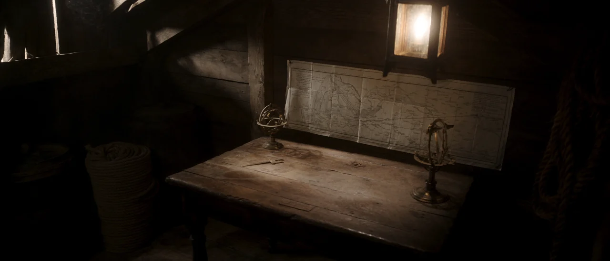

# Seedream Location Asset

Write production-grade prompts for BytePlus Seedream location and environment
asset generation. This skill is for **places**, not characters: interiors,
exteriors, establishing shots, reusable location sheets, set references, and
worldbuilding environment stills intended for downstream Seedance, storyboards,
or project `elements/locations/` assets.

Use this skill when the user wants:
- a reusable **location asset** for a project
- an **interior** or **exterior** environment still
- a **set reference** or **location sheet**
- an **establishing shot** prompt for Seedream
- a cinematic environment image with strong worldbuilding consistency

Do **not** use this skill for:
- character sheets
- product packshots
- infographic-heavy layouts
- local image edits that need coordinate-based editing

## Source authority

This skill follows the Seedream prompt structure and adapts it specifically for
location/environment generation.

- [Seedream 5.0 Pro official blog](https://seed.bytedance.com/en/blog/beyond-generation-it-understands-design-introducing-seedream-5-0-pro)
- [Seedream 4.0-5.0 API Tutorial](https://docs.byteplus.com/en/docs/ModelArk/1824121)
- [Seedream 4.0-4.5 Prompt Guide](https://docs.byteplus.com/en/docs/ModelArk/1829186)
- Project conventions in `AGENTS.md` for `elements/locations/` and location sheets

When official documentation changes, prefer the live docs over this skill where
they conflict.

## Recommended prompt structure — Location Asset

Every Seedream location-asset prompt should be assembled in this order:

```text
=== INPUT REFERENCES ===
=== TASK TYPE ===
=== LOCATION ===
=== ERA & WORLD RULES ===
=== SET DRESSING & OBJECTS ===
=== STYLE ===
=== LIGHTING & ATMOSPHERE ===
=== COMPOSITION & LENS ===
=== TEXT IN IMAGE ===
=== CONSTRAINTS ===
```

This keeps the prompt grounded in:
1. **What the place is**
2. **What world/time it belongs to**
3. **What objects and materials define it**
4. **How it is photographed**

## 1. INPUT REFERENCES

List every reference image the user provides. Label them in order:

```text
=== INPUT REFERENCES ===
@Image 1: location reference
@Image 2: style reference
@Image 3: material or prop reference
```

Rules:
- Use `None` when no references are provided.
- For a reusable location asset, separate references by role:
  - **location geometry**
  - **lighting mood**
  - **material / dressing detail**
- If the user provides a prior approved location still, treat it as the
  highest-priority identity reference.

## 2. TASK TYPE

Declare the mode:

```text
=== TASK TYPE ===
Text-to-Image (T2I) | Image-to-Image (I2I)
```

- **T2I** for first-pass location creation.
- **I2I** when the user wants to preserve an already-approved location identity
  while iterating angle, dressing, weather, or lighting.

## 3. LOCATION

Describe the place itself first, clearly and concretely.

```text
=== LOCATION ===
[What the location is, interior/exterior, architectural character, spatial feel.]
```

Include:
- interior or exterior
- function of the space
- scale and spatial mood
- core architectural identity

Examples:
- "A cramped below-deck captain's cabin on an old wooden sailing ship."
- "A narrow neon-lit alley behind a 24-hour noodle bar."
- "A humid colonial-era trading office with tall louvered windows."

## 4. ERA & WORLD RULES

Anchor the image in the correct historical, cultural, or fictional logic.

```text
=== ERA & WORLD RULES ===
[Time period, geography, technology level, cultural context, realism rules.]
```

Use this section to prevent visual drift:
- historical period
- geography / climate
- technology limitations
- realism constraints

Examples:
- "Early 18th-century Golden Age of Piracy, Caribbean maritime realism, lantern-and-candle era."
- "Late-1990s Manila urban realism, analog signage, no smartphones."
- "Near-future Asian megacity, grounded cyberpunk, practical infrastructure not fantasy magic."

## 5. SET DRESSING & OBJECTS

List the objects, materials, and dressing elements that define the location.

```text
=== SET DRESSING & OBJECTS ===
[Foreground objects, hero props, wall details, materials, clutter, wear, environmental storytelling.]
```

Prioritize:
- 1–3 hero set pieces
- practical objects that imply use
- material realism and wear
- foreground/midground/background depth cues

Good location prompts feel **lived in**, not empty.

Examples:
- "A weathered sea-chart pinned to the plank wall above a waxed-oak table strewn with brass navigation instruments."
- "Tarred rope, a barrel in the foreground edge, smoke-stained beams, brittle parchment, tarnished brass."

## 6. STYLE

Describe the image language.

```text
=== STYLE ===
[Photorealistic, cinematic, editorial, painterly, film-stock feel, realism level.]
```

Recommended style anchors for location assets:
- photorealistic
- cinematic
- naturalistic editorial reference
- grounded realism
- film still
- period-authentic or production-design reference

Avoid vague style stacks. Pick 2–4 strong anchors.

## 7. LIGHTING & ATMOSPHERE

Define the actual light sources and environmental mood.

```text
=== LIGHTING & ATMOSPHERE ===
[Practical sources, time of day, weather, haze, smoke, dust, shadow behavior, emotional tone.]
```

For strong location work, specify:
- practical key source
- time of day / weather
- shadow falloff
- haze / dust / smoke / moisture
- how bright or restrained the scene is

Examples:
- "Warm tungsten lantern as the single practical key from frame-left, deep shadow falloff into the corners."
- "Thin hard daylight slivers leaking through plank gaps."
- "Slightly underexposed, hushed, conspiratorial, enclosed."

## 8. COMPOSITION & LENS

Tell the model how the location is being photographed.

```text
=== COMPOSITION & LENS ===
[Shot type, angle, lens, aspect ratio, camera feel, depth of field.]
```

Important for location assets:
- establishing vs. detail vs. reference sheet
- eye level / high angle / low angle
- lens length
- aspect ratio
- depth of field

Examples:
- "Wide three-quarter interior establishing shot, eye-level, 24mm, 2.39:1 Cinemascope."
- "Location sheet, straight-on, symmetrical, front elevation reference."

## 9. TEXT IN IMAGE

Use only when the user explicitly wants signage or readable labels.

```text
=== TEXT IN IMAGE ===
None
```

For reusable location assets, default to `None`.

## 10. CONSTRAINTS

Close with quality directives and negatives:

```text
=== CONSTRAINTS ===
Quality: [2K / 4K, rich material detail, consistent location identity]
Negative: [no characters, no modern objects, no bright white walls, no text overlays, no watermarks]
```

Common location negatives:
- no characters
- no modern props
- no plastic CGI surfaces
- no bright white cyc background unless explicitly requested
- no text overlays
- no watermark

## Location prompt patterns

### A. Reusable location asset

Use when the goal is a project location sheet for `elements/locations/`.

Focus on:
- stable architecture
- clear material language
- minimal action
- readable space layout
- reusable identity

### B. Cinematic establishing still

Use when the goal is mood + worldbuilding + photoreal atmosphere.

Focus on:
- emotional lighting
- camera language
- atmosphere
- foreground/background layering

### C. Reference-preserving iteration

Use I2I when a location is approved and the next task is:
- new time of day
- weather shift
- additional dressing
- cleaner/wider angle
- closer detail shot of the same place

## Full example: Maritime captain's cabin

```text
=== INPUT REFERENCES ===
None

=== TASK TYPE ===
Text-to-Image (T2I)

=== LOCATION ===
A cramped below-deck captain's cabin on an old wooden sailing ship.

=== ERA & WORLD RULES ===
Early 18th-century Golden Age of Piracy, Caribbean privateer vessel, grounded period maritime realism, lantern-and-candle era, no modern objects.

=== SET DRESSING & OBJECTS ===
A large weathered sea-chart pinned to the rough plank back wall above a heavy waxed-oak table strewn with brass navigation instruments including dividers and a sextant. A gimbaled brass lantern hangs low in the upper frame. Tarred coiled rope and a barrel fill the foreground edges. Low heavy-beamed ceiling, rough plank walls and floor, hand-hewn waxed oak grain, tarred rough hemp, tarnished brass, brittle creased parchment, coarse canvas.

=== STYLE ===
Photorealistic cinematic movie still, grounded period maritime realism, naturalistic editorial reference, painterly low-key cinematography, fine low-intensity 35mm grain, organic texture.

=== LIGHTING & ATMOSPHERE ===
Mid-morning, calm weather, warm and enclosed tropical maritime atmosphere. Warm tungsten lantern as the single key practical from frame-left, soft Rembrandt pooling, deep shadow falloff into the corners, thin hard daylight slivers leaking through plank gaps. Color palette of aged oak brown, tarred black, oxidized brass amber, sun-bleached parchment cream, shadowed sea-grey — warm-leaning but desaturated, muted period grade. Drifting dust motes in the lantern beam, faint smoke haze, intimate and conspiratorial mood.

=== COMPOSITION & LENS ===
Wide three-quarter interior establishing shot, eye-level, slow push-in feel. Shot on a modern digital cinema camera with vintage spherical prime lenses, 24mm, 2.39:1 Cinemascope. Gentle anamorphic horizontal flare off the lantern, soft bokeh, mild halation on the flame. Deep depth of field, bow-to-stern interior in focus, slight falloff only in the darkest corners.

=== TEXT IN IMAGE ===
None

=== CONSTRAINTS ===
Quality: 4K, rich material realism, strong environmental storytelling, consistent period authenticity
Negative: no people, no modern objects, no electric light fixtures, no plastic surfaces, no text overlays, no watermarks
```

## Example From The User

The user provided a canonical pirate-era location example for this skill:
- Example image: `examples/pirate-location.png`
- Example type: cinematic interior location asset
- Use case: period-authentic maritime set reference, reusable environment still,
  or establishing shot prompt

The supplied sample prompt maps directly to the structure above:

```text
=== INPUT REFERENCES ===
None

=== TASK TYPE ===
Text-to-Image (T2I)

=== LOCATION ===
A cramped below-deck captain's cabin on an old wooden sailing ship.

=== ERA & WORLD RULES ===
Early 18th-century Golden Age of Piracy, Caribbean privateer vessel, grounded period maritime realism, lantern-and-candle era, tropical maritime setting, no modern objects.

=== SET DRESSING & OBJECTS ===
A large weathered sea-chart is pinned to the rough plank back wall above a heavy waxed-oak table strewn with brass navigation instruments including dividers and a sextant. A gimbaled brass lantern hangs low in the upper frame, swaying gently with ship motion. Tarred coiled rope and a barrel fill the foreground edges. Low heavy-beamed ceiling, rough plank walls and floor. Hand-hewn waxed oak grain, tarred rough hemp, tarnished brass, brittle creased parchment, coarse canvas.

=== STYLE ===
Photorealistic cinematic movie still, grounded period maritime realism, painterly low-key cinematography, warm-leaning but desaturated muted period grade, fine low-intensity 35mm grain, organic texture.

=== LIGHTING & ATMOSPHERE ===
Mid-morning, calm weather, warm and enclosed tropical maritime atmosphere. Warm tungsten lantern as the single key practical from frame-left, soft Rembrandt pooling, deep shadow falloff into the corners, thin hard daylight slivers leaking through plank gaps. Color palette of aged oak brown, tarred black, oxidized brass amber, sun-bleached parchment cream, shadowed sea-grey. Drifting dust motes in the lantern beam, faint smoke haze. Mood: enclosed, hushed, conspiratorial, weathered, anticipatory, intimate.

=== COMPOSITION & LENS ===
Wide three-quarter interior establishing shot, eye-level, slow push-in feel. Shot on a modern digital cinema camera with vintage spherical prime lenses, 24mm, 2.39:1 Cinemascope. Gentle anamorphic horizontal flare off the lantern, soft bokeh, mild halation on the flame. Deep depth of field, bow-to-stern interior in focus, slight falloff in the darkest corners. In-camera practical lantern light with film emulation, slight chromatic aberration at the light edge, soft vignetting.

=== TEXT IN IMAGE ===
None

=== CONSTRAINTS ===
Quality: 4K, rich material realism, strong environmental storytelling, consistent period authenticity
Negative: no people, no modern objects, no electric light fixtures, no plastic surfaces, no bright white walls, no text overlays, no watermarks
```

Treat `examples/pirate-location.png` as the canonical visual reference for this
sample prompt when future agents update or reuse this skill.

### Example Image



## Usage notes

- Put the **place** before the mood.
- Put the **era/world rules** before lens/style polish.
- If realism matters, explicitly exclude modern intrusions.
- For reusable assets, keep the frame readable and avoid too many dramatic
  obstructions.
- If the user provides an approved result image, use it as `@Image 1` and move
  to I2I for continuity.

## Suggested file targets in this workspace

When a generated location asset is approved, save it under:

- `projects/<project>/elements/locations/<location-id>/sheets/`

Recommended names:

- `loc_<location-id>_wide_v01.png`
- `loc_<location-id>_interior_v01.png`
- `loc_<location-id>_detail_v01.png`

## Quick defaults

- Model: `dola-seedream-5-0-pro-260628`
- Format: `png`
- Prompt optimization: `standard`
- Typical size:
  - `2048x2048` for square sheets
  - `2816x1584` for 16:9 / 2.39:1-feel landscape compositions

## Invocation reminder

Invoke this skill when the user asks for a Seedream prompt or workflow for a
**location, interior, exterior, environment still, set reference, or
establishing shot** — especially when the output should become a reusable
project location asset.
