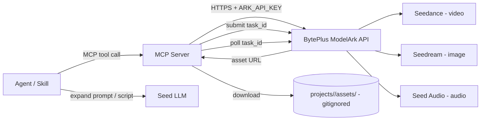
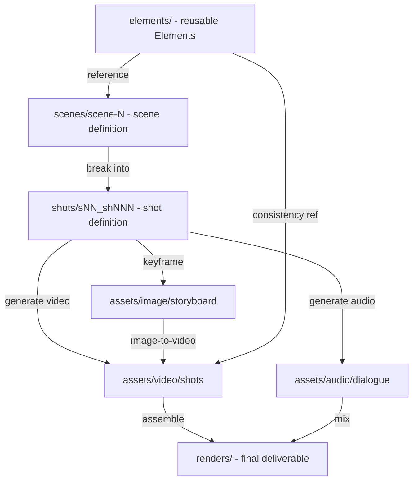

# AGENTS.md — ai-director

> Guidance for AI coding agents and human contributors working in this workspace.

## What this workspace is

`ai-director` is a workspace for producing **AI-generated content (AIGC)** using BytePlus / Volcano Engine generative models. It behaves like an "AI director": it orchestrates multiple BytePlus model families — **Seedance** (video), **Seedream** (images), and **Seed Audio** (audio) — to turn prompts and references into finished content assets.

The primary integration mechanism is **MCP (Model Context Protocol) servers** plus **agent skills**:

- **MCP servers** wrap the BytePlus ModelArk REST API and expose narrowly-scoped, composable tools.
- **Agent skills** are higher-level content-creation recipes that compose those MCP tools into end-to-end pipelines (e.g. "short ad spot", "storyboard to video", "podcast intro").

AI coding agents working here should treat MCP tools as the canonical way to invoke BytePlus models, and skills as the canonical way to package reusable content recipes. Do not call the Ark REST API directly from skills — go through the MCP tools.

## Model catalog

All models are accessed through **BytePlus ModelArk** (the international surface of Volcano Engine Ark). Authentication uses a single API key (`ARK_API_KEY`). Several surfaces are OpenAI-compatible and can be driven by the OpenAI SDK pointed at the Ark base URL.

| Family | Model(s) | Modality | Key capabilities | Ark API surface |
|---|---|---|---|---|
| Seedance | Dreamina Seedance 2.0, Seedance 1.5 Pro, Seedance 1.0 Pro / Fast | Video | Text-to-video, image-to-video (first frame; first+last frame), multimodal reference generation, video editing, video extension, native audio+video | `POST /contents/generations/tasks` (async task + poll) |
| Seedream | `seedream-4-5-251128` (4.5), `seedream-4-0-250828` (4.0) | Image | Text-to-image, image-to-image editing, multi-reference fusion (2–10 refs), sequential/multi-image output | `POST /images/generations` (OpenAI-compatible) |
| Seed Audio | Seed Audio 1.0 (`doubao-seed-audio`) | Audio | Voice + music + SFX + ambience in one pass, multi-character dialogue, zero-shot voice cloning, cross-lingual, ~2 min/clip | Volcano Ark audio generation task API |
| Seed / Doubao | `seed-2-0-lite-260228` and siblings | Text | Prompt expansion, scene scripting, structured output for pipelines | `POST /responses` (OpenAI-compatible) |

**Region base URLs** (read from environment, never hard-coded):
- `ap-southeast-1` (default): `https://ark.ap-southeast.bytepluses.com/api/v3`
- `eu-west-1`: `https://ark.eu-west.bytepluses.com/api/v3`
- Volcano Engine (China domestic): `https://ark.cn-beijing.volces.com/api/v3`

**SDKs** (install via package manager — do not hand-edit lockfiles):
- Python: `pip install 'byteplus-python-sdk-v2[ark]'` or `pip install openai`
- Go: `github.com/byteplus-sdk/byteplus-go-sdk-v2`
- Java: `com.byteplus:byteplus-java-sdk-v2-ark-runtime`

## Architecture



- MCP tools submit an Ark task, poll until completion, and return the resulting asset URL (downloading to the relevant `projects/<project>/assets/...` path when appropriate).
- Generated assets are written to a **gitignored** project-scoped `assets/` directory (see [Project & asset directory structure](#project--asset-directory-structure)); never commit binary outputs.
- The Seed LLM is used inside skills for prompt expansion and scene scripting, not as a content generator itself.

## Project & asset directory structure

This workspace hosts many projects (films, ad campaigns, series, etc.). Each project lives under `projects/<project-name>/` and follows the same internal layout. The structure adapts two proven patterns to a local filesystem:

- **Higgsfield-style "Elements"** — reusable characters, locations, and props are authored once under `elements/` and referenced by many scenes (mirroring Higgsfield Cinema Studio's Elements + SOUL ID character-consistency model).
- **VFX pipeline shot/versioning** — scenes break into numbered shots with gaps for insertions, and every generated file carries structured, padded, versioned tokens.

The core separation: **`elements/` holds reusable assets** (referenced across scenes), **`scenes/` holds scene/shot definitions**, and **`assets/` holds generated outputs** split by modality. Storyboards and concept art are scene/production outputs; character/location/prop sheets are Element outputs.

### Directory tree

```
projects/
  <project-name>/                     # kebab-case, e.g. midnight-run
    project.md                        # brief, cast, locations, model & credit defaults, status
    elements/                         # reusable Elements (authored once, referenced by many scenes)
      characters/
        <character-id>/               # e.g. gloria   (folder = element id)
          character.md                # sheet: role, traits, voice, consistency model & notes
          references/                 # SOUL-ID style seed set (multi-angle, incl. full-body)
            ref_01_front.png
            ref_02_side.png
            ref_03_fullbody.png
          sheets/                     # generated character sheets
            char_gloria_turnaround_v01.png
            char_gloria_expression_happy_v01.png
      locations/
        <location-id>/                # e.g. neon-alley
          location.md
          references/
          sheets/
            loc_neon-alley_wide_v01.png
      props/
        <prop-id>/                    # e.g. red-motorcycle
          prop.md
          references/
          sheets/
            prop_red-motorcycle_side_v01.png
    scenes/
      <scene-id>/                     # e.g. scene-01
        scene.md                      # script, prompt, cast, location, props, camera, style, status
        shots/
          s01_sh010/                  # shot folder (gaps of 10 so shots can be inserted later)
            shot.md                   # shot prompt, camera move, refs, model, params, seed, cost
    assets/                           # generated asset library — split by modality, then scene/shot
      video/
        shots/<scene>/<shot>/        # e.g. shots/scene-01/s01_sh010/
          s01_sh010_t01_v01.mp4
        renders/                      # assembled scene/film renders
          s01_render_v01.mp4
      image/
        storyboard/<scene>/          # Seedream keyframes (visual anchors)
          s01_kf01_v01.png
        concept/                       # concept art, mood boards
        shots/<scene>/<shot>/
      audio/
        dialogue/<scene>/<shot>/
          dlg_s01_sh010_gloria_t01_v01.wav
        music/                         # reusable music beds
        sfx/                           # reusable sound effects
        ambience/<scene>/
        mix/<scene>/                  # full scene mixes
    sub-projects/                     # ONLY when the project splits into sub-projects (segregated)
      <sub-project-id>/               # e.g. episode-01  (full parallel structure, own assets/)
        project.md
        elements/
        scenes/
        assets/
          video/
          image/
          audio/
        renders/
    renders/                          # final assembled deliverables (final cuts, exports, masters)
    trash/                            # rejected / superseded assets (gitignored, periodic cleanup)
```

- Small projects can omit `sub-projects/` entirely; a single-project film just uses `scenes/` + `assets/` directly.
- The `assets/` tree is the single home for generated outputs. Dialogue is shot-specific (`audio/dialogue/<scene>/<shot>/`); music/SFX are reusable library assets (`audio/music/`, `audio/sfx/`).
- Elements (characters, locations, props) and their sheets live under `elements/`, never under `assets/`, because they are reusable references, not scene outputs.

### Production flow



### Folder & project naming

All folders and project/scene/element names are **lowercase kebab-case**, no spaces, no capitals.

| Entity | Rule | Example |
|---|---|---|
| Project | kebab-case, descriptive slug | `midnight-run`, `spring-campaign-2026` |
| Sub-project | kebab-case | `episode-01`, `ad-variant-a` |
| Scene | `scene-NN` (2-digit, 10-gap) | `scene-01`, `scene-02` |
| Character id | kebab-case, short, human | `gloria`, `villain-marcus` |
| Location id | kebab-case | `neon-alley`, `rooftop-night` |
| Prop id | kebab-case | `red-motorcycle`, `antique-key` |

Element ids double as `@tags` in scene/shot prompts (e.g. `@gloria`, `@neon-alley`), mirroring Higgsfield's element-referencing model so the same identity stays consistent across generations.

### Asset file naming

Individual generated files use **structured token prefixes** (underscore-separated fields; hyphens allowed inside a descriptor token). This makes files self-describing, sortable, and parseable by tools.

**Numbering rules**
- Scenes: 2-digit, prefixed `s` → `s01`, `s02`.
- Shots: 3-digit, increments of **10** so shots can be inserted without renumbering → `sh010`, `sh020`; insert `sh015` between them.
- Takes: 2-digit → `t01`, `t02` (one take = one generation attempt).
- Versions: 2-digit → `v01`, `v02`; approved/final suffix → `final`.
- References: 2-digit → `ref_01`.

**Video**
| Asset | Pattern | Example |
|---|---|---|
| Shot take | `<scene>_sh<NNN>_t<NN>_v<NN>.<ext>` | `s01_sh010_t01_v01.mp4` |
| Shot final | `<scene>_sh<NNN>_final_v<NN>.<ext>` | `s01_sh010_final_v01.mp4` |
| Scene render | `<scene>_render_v<NN>.<ext>` | `s01_render_v01.mp4` |

**Image**
| Asset | Pattern | Example |
|---|---|---|
| Storyboard keyframe | `<scene>_kf<NN>_v<NN>.png` | `s01_kf01_v01.png` |
| Concept art | `concept_<descriptor>_v<NN>.png` | `concept_mood-board_v01.png` |
| Character sheet | `char_<character-id>_<sheet-type>_v<NN>.png` | `char_gloria_turnaround_v01.png` |
| Location sheet | `loc_<location-id>_<view>_v<NN>.png` | `loc_neon-alley_wide_v01.png` |
| Prop sheet | `prop_<prop-id>_<view>_v<NN>.png` | `prop_red-motorcycle_side_v01.png` |
| Reference (seed) | `ref_<NN>_<descriptor>.<ext>` | `ref_01_front.png` |

**Audio**
| Asset | Pattern | Example |
|---|---|---|
| Dialogue | `dlg_<scene>_sh<NNN>_<character-id>_t<NN>_v<NN>.wav` | `dlg_s01_sh010_gloria_t01_v01.wav` |
| Music | `mus_<descriptor>_v<NN>.wav` | `mus_tension-build_v01.wav` |
| SFX | `sfx_<descriptor>_v<NN>.wav` | `sfx_door-slam_v01.wav` |
| Ambience | `amb_<scene>_<descriptor>_v<NN>.wav` | `amb_s01_rain_v01.wav` |
| Scene mix | `mix_<scene>_v<NN>.wav` | `mix_s01_v01.wav` |

### Metadata & manifests

Every project, element, scene, and shot carries a Markdown file (`project.md`, `character.md`, `scene.md`, `shot.md`) with YAML frontmatter so generations are **reproducible** — model, prompt, references, seed, params, cost, and status are recorded alongside the asset. Reproducibility is a first-class requirement: a later agent must be able to re-create any asset from its manifest alone.

Minimal `shot.md` frontmatter:

```yaml
---
project: midnight-run
scene: s01
shot: s01_sh010
model: seedance-2-0
prompt: "A cinematic action scene of @gloria riding @red-motorcycle at speed down @neon-alley"
references:
  - elements/characters/gloria/references/ref_01_front.png
  - elements/props/red-motorcycle/references/ref_01_side.png
seed: 8842
params:
  resolution: "2K"
  duration: 5
  audio: true
take: t01
version: v01
status: approved   # draft | review | approved | rejected
cost_usd: 0.14
---
```

### Prompt files

In addition to the `prompt` field embedded in each manifest's frontmatter, the **full prompt text** used for every generation is also saved as a standalone Markdown file inside the project directory — alongside the asset it produced (e.g., `assets/video/shots/s01/s01_sh010/s01_sh010_t01_v01_prompt.md` next to the MP4, or `s01_sh010_prompt.md` next to `shot.md`). The file is plain Markdown, human-readable, and named to mirror its source asset so prompts stay easy to share, review, and iterate on without parsing YAML frontmatter.

### Sub-projects

When a project contains multiple discrete sub-projects (a film series, a multi-ad campaign), each sub-project gets a **fully parallel, segregated** structure under `sub-projects/<sub-project-id>/` — its own `elements/`, `scenes/`, `assets/`, and `renders/`. Assets are **not** shared between sub-projects by duplication; anything reused across sub-projects (a recurring character, brand elements) is promoted up to the **parent project's** `elements/` and referenced from there. This keeps sub-projects independent and archivable while avoiding duplicated character sheets.

## Conventions

### Secrets
- Load `ARK_API_KEY`, `ARK_BASE_URL`, and `ARK_REGION` from environment variables or a local `.env` (gitignored). Never hard-code keys or base URLs.
- Keep a `.env.example` with placeholder values only. Never commit real credentials.

### Adding a new model tool (MCP)
1. Define the tool with a clear, verb-noun name (e.g. `seedance.text_to_video`), a JSON Schema for inputs, and a single responsibility.
2. Resolve key/region/base URL from env at runtime.
3. Submit the Ark task, then poll for completion (video/audio are async). Return the asset URL and optionally download to `assets/`.
4. Validate all prompt/reference inputs before calling the API.
5. Normalize Ark error responses into actionable messages; surface `task_id` and retry guidance on failure.

### Adding a new content skill
- Compose existing MCP tools; do not call Ark directly.
- Prefer deterministic, parameterized recipes over free-form prompts.
- Document inputs, outputs, expected cost, latency, and failure modes.

### Code style
- Match the conventions of neighboring files; keep functions small and single-purpose.
- No comments unless explicitly requested; prefer clear names.
- No debug `console.log` / `print` statements left in committed code.

## Costs & guardrails
- These models bill **per generation**. Default to the lowest-cost / fast variant for development and tests; gate expensive runs behind explicit flags.
- Video and audio generation are **asynchronous** and can take tens of seconds to minutes. Always poll or stream — never block synchronously on a UI thread.
- Default to a small `size`/short duration and low `n` for iterations; bump only for final renders.
- Respect content-safety and moderation requirements. Do not generate content depicting identifiable real people without rights, or otherwise restricted content.

## Verification
- Every MCP tool needs: (a) a **smoke test** against the live Ark API using the fast/low-cost variant, and (b) mocked unit tests for input validation, the task-polling state machine, and error handling.
- Skills must assert end-to-end that an asset is produced and saved.
- Run the project's linter and type checker before finalizing any change. Record the exact commands in `.trae/rules/project_rules.md` once the runtime is established.

## References
- BytePlus ModelArk quick start — https://docs.byteplus.com/en/docs/ModelArk/1399008
- Seedance video generation API — https://docs.byteplus.com/en/docs/ModelArk/1520757
- Dreamina Seedance 2.0 prompt guide — https://docs.byteplus.com/en/docs/ModelArk/2222480
- ModelArk model list — https://docs.byteplus.com/en/docs/ModelArk/1330310
- Region availability — https://docs.byteplus.com/en/docs/ModelArk/2191806
- ByteDance Seed (Seed Audio 1.0) — https://seed.bytedance.com
