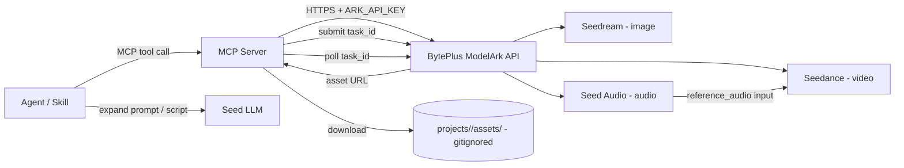
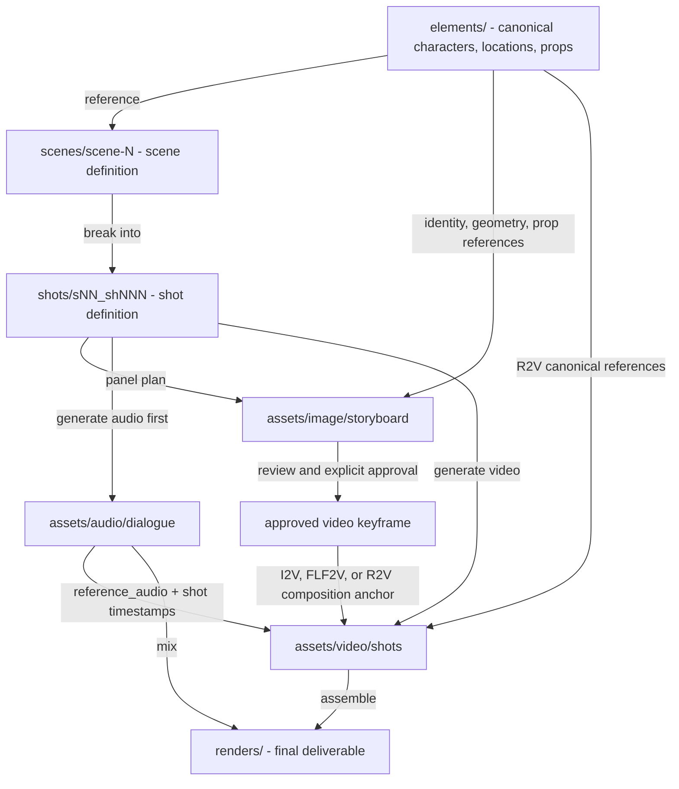
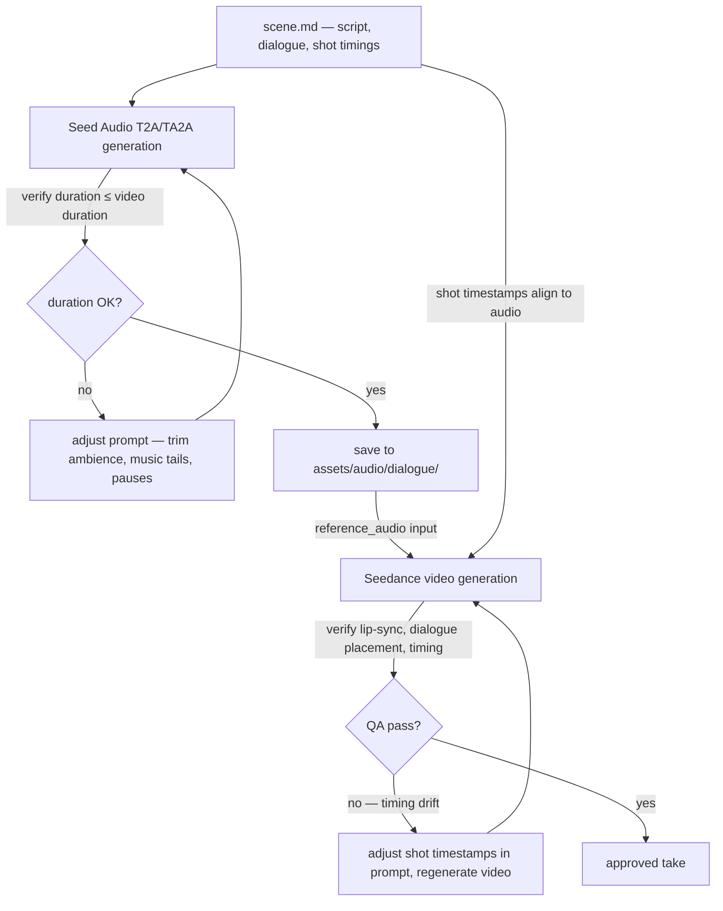

# AGENTS.md — ai-director

> Guidance for AI coding agents and human contributors working in this workspace.

## What this workspace is

`ai-director` is a workspace for producing **AI-generated content (AIGC)** using BytePlus / Volcano Engine generative models. It behaves like an "AI director": it orchestrates multiple BytePlus model families — **Seedance** (video), **Seedream** (images), and **Seed Audio** (audio) — to turn prompts and references into finished content assets.

The primary integration mechanism is **MCP (Model Context Protocol) servers** plus **agent skills**:

- **MCP servers** wrap the BytePlus ModelArk REST API and expose narrowly-scoped, composable tools.
- **Agent skills** are higher-level content-creation recipes that compose those MCP tools into end-to-end pipelines (e.g. "short ad spot", "storyboard to video", "podcast intro").

AI coding agents working here should treat MCP tools as the canonical way to invoke BytePlus models, and skills as the canonical way to package reusable content recipes. Do not call the Ark REST API directly from skills — go through the MCP tools.

**Always save generated files locally.** Every asset produced via MCP (video, image, audio) must be downloaded and saved to the appropriate path under `projects/<project>/assets/` inside this workspace — never rely solely on a remote URL or ephemeral link. Remote URLs expire; the local `assets/` tree is the durable source of truth for generated content.

## Model catalog

Models are accessed through **BytePlus ModelArk** and the BytePlus Seed Speech
surface. Resolve credentials from the environment at runtime:
`BYTEPLUS_MODELARK_API_KEY` for Seedream and Seedance, and
`BYTEPLUS_SEED_AUDIO_API_KEY` for Seed Audio. Compatibility aliases may exist
in individual tools, but project documentation and new integrations should use
the canonical names.

| Family | Model(s) | Modality | Key capabilities | Ark API surface |
|---|---|---|---|---|
| Seedance | **Seedance 2.5** (`dreamina-seedance-2-5-260628`, default) — 30s single-pass, multi-round extensions, 30 images / 10 videos / 10 audio refs, timestamp-level editing. Seedance 2.0 Standard (`dreamina-seedance-2-0-260128`) available as fallback; configured Fast/Mini bindings | Video | Text-to-video, first/last-frame generation, multimodal references, editing, extension, native audio+video | `POST /contents/generations/tasks` (async task + poll) |
| Seedream | Seedream 5.0 Pro (`dola-seedream-5-0-pro-260628`); configured Lite/4.x bindings | Image | Text-to-image, reference-based generation/editing, multi-reference fusion, sequential/multi-image output | `POST /images/generations` (OpenAI-compatible) |
| Seed Audio | Seed Audio 1.0 (`seed-audio-1.0`) | Audio | Voice + music + SFX + ambience in one pass, multi-character dialogue, voice references, cross-lingual generation, up to ~2 min/clip | BytePlus Seed Speech audio generation API |
| Seed / Doubao | `seed-2-0-lite-260228` and siblings | Text | Prompt expansion, scene scripting, structured output for pipelines | `POST /responses` (OpenAI-compatible) |

**Region base URLs** (read from environment, never hard-coded):
- `ap-southeast-1` (default): `https://ark.ap-southeast.bytepluses.com/api/v3`
- `eu-west-1`: `https://ark.eu-west.bytepluses.com/api/v3`
- Volcano Engine (China domestic): `https://ark.cn-beijing.volces.com/api/v3`

**SDKs** (install via package manager — do not hand-edit lockfiles):
- Python: `pip install 'byteplus-python-sdk-v2[ark]'` or `pip install openai`
- Go: `github.com/byteplus-sdk/byteplus-go-sdk-v2`
- Java: `com.byteplus:byteplus-java-sdk-v2-ark-runtime`

## Architecture



- MCP tools submit an Ark task, poll until completion, download the resulting asset to the relevant `projects/<project>/assets/...` path inside this workspace, and return both the local file path and the asset URL. Always save locally — remote URLs expire, the local `assets/` tree is the durable source of truth.
- Generated assets are written to a **gitignored** project-scoped `assets/` directory (see [Project & asset directory structure](#project--asset-directory-structure)); never commit binary outputs.
- The Seed LLM is used inside skills for prompt expansion and scene scripting, not as a content generator itself.

## Production gates

Treat expensive media generation as a gated production workflow:

1. **Brief and creative locks** — record approved identities, environments,
   props, tone, forbidden behavior, target resolution, duration, and audio mode.
2. **Reference preflight** — classify each asset as visible identity, visible
   environment, motion/camera reference, or control-only. Control-only images
   can leak into output; translate them to text and omit them by default.
3. **Spatial and temporal preflight** — for movement-heavy scenes, record start,
   travel axis, subject order, boundary behavior, end state, and forbidden
   transitions. Resolve contradictions between the brief, references, and
   prompt before generation.
4. **Audio-first generation (dialogue scenes)** — when a scene has spoken
   dialogue, generate the Seed Audio dialogue track before submitting the
   Seedance video task. Verify the audio duration fits within the planned
   video duration, then use the audio as a `reference_audio` input to
   Seedance. See [Audio-video alignment](#audio-video-alignment-dialogue-scenes).
5. **Low-cost prototype** — validate motion, geography, anatomy, camera,
   boundary behavior, and audio at the lowest suitable resolution and variant.
6. **Creative review** — preserve user-approved decisions and write the single
   requested delta plus observable acceptance criteria for the next take.
7. **Final candidate** — increase resolution only after the important creative
   behavior is approved.
8. **Technical and semantic QA** — inspect actual streams, decode integrity,
   contact sheets, key story transitions, and audio before requesting approval.

For tightly controlled 30-second scenes, do not overload one generation with
too many cuts, action beats, close encounters, and location changes. Split the
scene into separate shots and chain approved frames when continuity risk is
higher than the benefit of a single generation.

## Project & asset directory structure

The entire `projects/` tree is **local-only working state — never commit it to
git.** Project files (manifests, prompts, references, generated assets, scripts)
are large, frequently changing, and not meant to live in version control. They
are the workspace's durable local source of truth, not the remote's. Do not
`git add` anything under `projects/`. This rule is enforced by convention, not
by `.gitignore` — the directory is intentionally left un-ignored so that
individual tracked files (e.g. a project template or doc) *could* be added
explicitly if ever needed, but the default is: hands off.

This workspace hosts many projects (films, ad campaigns, series, etc.). Each project lives under `projects/<project-name>/` and follows the same internal layout. The structure adapts two proven patterns to a local filesystem:

- **Higgsfield-style "Elements"** — reusable characters, locations, and props are authored once under `elements/` and referenced by many scenes (mirroring Higgsfield Cinema Studio's Elements + SOUL ID character-consistency model).
- **VFX pipeline shot/versioning** — scenes break into numbered shots with gaps for insertions, and every generated file carries structured, padded, versioned tokens.

The core separation: **`elements/` holds reusable assets** (referenced across scenes), **`scenes/` holds scene/shot definitions**, and **`assets/` holds generated outputs** split by modality. Storyboards and concept art are scene/production outputs; character/location/prop sheets are Element outputs.

### Directory tree

```
projects/
  <project-name>/                     # kebab-case, e.g. midnight-run
    project.md                        # brief, cast, locations, model & credit defaults, status
    docs/                             # project-specific documentation (limitations, visual packages)
    elements/                         # reusable Elements (authored once, referenced by many scenes)
      characters/
        <character-id>/               # e.g. gloria   (folder = element id)
          character.md                # sheet: role, traits, voice, consistency model & notes
          references/                 # SOUL-ID style seed set (multi-angle, incl. full-body)
            ref_01_front.png
            ref_02_side.png
            ref_03_fullbody.png
          sheets/                     # generated character sheets
            char_gloria_turnaround_v01.png
            char_gloria_expression_happy_v01.png
      locations/
        <location-id>/                # e.g. neon-alley
          location.md
          references/
          sheets/
            loc_neon-alley_wide_v01.png
      props/
        <prop-id>/                    # e.g. red-motorcycle
          prop.md
          references/
          sheets/
            prop_red-motorcycle_side_v01.png
    scenes/
      <scene-id>/                     # e.g. scene-01
        scene.md                      # script, prompt, cast, location, props, camera, style, status
        shots/
          s01_sh010/                  # shot folder (gaps of 10 so shots can be inserted later)
            shot.md                   # shot prompt, camera move, refs, model, params, seed, cost
    assets/                           # generated asset library — split by modality, then scene/shot
      video/
        shots/<scene>/<shot>/        # e.g. shots/scene-01/s01_sh010/
          s01_sh010_t01_v01.mp4
          prompt_s01_sh010_t01_v01.md  # immutable prompt snapshot (prefix: prompt_<asset>.md)
        renders/                      # assembled scene/film renders
          s01_render_v01.mp4
      image/
        storyboard/<scene>/          # Seedream keyframes (visual anchors)
          s01_kf01_v01.png
          prompt_s01_kf01_v01.md      # prompt snapshot beside each asset
        concept/                       # concept art, mood boards
        shots/<scene>/<shot>/
      audio/
        dialogue/<scene>/<shot>/
          dlg_s01_sh010_gloria_t01_v01.wav
          prompt_dlg_s01_sh010_gloria_t01_v01.md
        music/                         # reusable music beds
        sfx/                           # reusable sound effects
        ambience/<scene>/
        mix/<scene>/                  # full scene mixes
      task_ids.json                   # project-level task registry (provider task IDs)
    sub-projects/                     # ONLY when the project splits into sub-projects (segregated)
      <sub-project-id>/               # e.g. episode-01  (full parallel structure, own assets/)
        project.md
        elements/
        scenes/
        assets/
          video/
          image/
          audio/
        renders/
    renders/                          # final assembled deliverables (final cuts, exports, masters)
    scripts/                          # helper scripts, generation utilities
    trash/                            # rejected / superseded assets (gitignored, periodic cleanup)
```

- Small projects can omit `sub-projects/` entirely; a single-project film just uses `scenes/` + `assets/` directly.
- The `assets/` tree is the single home for generated outputs. Dialogue is shot-specific (`audio/dialogue/<scene>/<shot>/`); music/SFX are reusable library assets (`audio/music/`, `audio/sfx/`).
- Elements (characters, locations, props) and their sheets live under `elements/`, never under `assets/`, because they are reusable references, not scene outputs.
- **Prompt snapshots live beside the media asset they produced, nowhere else.** Do not duplicate prompts in shot folders, scene folders, or any other location. The `shot.md` manifest references the asset-level prompt via `prompt_file` in frontmatter. See [Prompt files](#prompt-files).

### Production flow



### Storyboard-to-video handoff

Use the project-local `seedream-storyboard` skill to create or revise
storyboard panels when a video depends on visualized composition, blocking, or
continuity. Coordination belongs in this project contract; the storyboard skill
remains independently usable.

Treat references in this order:

1. **Elements are canonical** — approved character, location, and prop assets
   define identity, geometry, materials, and persistent design.
2. **Storyboard panels are derivative** — they combine canonical Elements with
   shot composition, staging, lighting, and visible state.
3. **Video keyframes are approved promotions** — only a panel that has passed
   storyboard and visual-anchor review may become a video input.

Choose one Seedance image mode per generation:

| Need | Mode | Image bundle |
|---|---|---|
| Lock the exact opening composition | I2V | One approved keyframe as `first_frame` |
| Lock exact opening and ending states | FLF2V | Two approved keyframes as `first_frame` and `last_frame` |
| Keep canonical assets explicit while using storyboard composition | R2V | Approved panel plus the smallest sufficient character, location, and prop set as `reference_image` inputs |

Do not mix I2V/FLF2V frame roles with an R2V reference bundle unless the live
model and tool explicitly support that combination. In R2V, assign stable
`@Image N` indices and repeat each applicable binding inside the relevant shot.

Before video submission:

- require explicit approval or `selected_variant` for every storyboard panel
  used as a video input;
- verify the panel's recorded source asset paths, selected variants, and hashes
  still match the current approved Elements;
- return the panel to `review` if any source Element changed after generation;
- omit rough or control-only boards from the request and translate their
  choreography into text;
- record the chosen mode, ordered image roles, panel path/hash, canonical
  Element paths/hashes, and approval status in `shot.md`;
- respect the live reference-count and face-input restrictions.

For the Seedance prompt itself, use `seedance-prompt-25` (2.5, default) or
`seedance-prompt-20` (2.0, for 4K/1080p output or Fast/Mini variants).

### Audio-video alignment (dialogue scenes)

When a scene has spoken dialogue, **generate the Seed Audio dialogue track
first** and use it as a `reference_audio` input to Seedance. The audio drives
the video — not the other way around. This prevents lip-sync drift, ensures
the video duration fits the audio, and keeps dialogue timing verifiable.

**Audio-first pipeline:**



**Alignment contract:**

1. **Same dialogue text in both prompts.** The exact lines written in the
   Seed Audio `text_prompt` must appear in the Seedance prompt inside
   `{curly braces}` for lip-sync. No paraphrasing, no reordering, no omitted
   lines. If one changes, both change.
2. **Audio duration ≤ video duration.** Seed Audio output must fit within the
   planned Seedance `duration` parameter. If the audio exceeds the video
   duration, trim the audio prompt (shorter ambience tails, fewer pauses,
   tighter scene descriptions) and regenerate before submitting the video
   task. Never pad the video to fit an over-long audio.
3. **Shot timestamps align to audio.** The `Shot N (start–ends)` time ranges
   in the Seedance prompt must place each dialogue line at the second it
   actually occurs in the generated audio. After generating the audio,
   inspect it (or transcribe it with `speech_to_text`) and adjust the shot
   timestamps before submitting the Seedance task.
4. **Audio as `reference_audio`.** Pass the generated `.wav` file as a
   `reference_audio` input to the Seedance task tool —
   `seedance_2_5_create_task` for 2.5 (up to 10 audio refs, 30s) or
   `seedance_create_task` for 2.0 (up to 3 audio refs, 15s). Label it `@Audio N` in
   the Seedance prompt and bind it in every shot that contains dialogue or
   music from that audio.
5. **Single source of truth.** The `scene.md` file records the audio asset
   path, SHA-256, verified duration, and the dialogue-to-shot timestamp
   mapping. The `shot.md` manifest records the same audio asset as a
   reference input. If the audio is regenerated, both files are updated and
   any video that used the old audio is invalidated.

**Before video submission (dialogue scenes):**

- verify the audio file exists locally and its SHA-256 matches the manifest;
- verify `audio_duration ≤ video_duration` (e.g., 28.88s ≤ 30s for 2.5; ≤ 15s for 2.0);
- confirm every `{dialogue line}` in the Seedance prompt matches the Seed
  Audio prompt verbatim;
- adjust shot timestamps in the Seedance prompt to match the actual audio
  timing;
- pass the audio file as `reference_audio` in the Seedance task request;
- record the audio asset path, hash, duration, and the dialogue-to-shot
  timestamp mapping in `shot.md`.

### Long-form video (2.5) via native extension

Seedance 2.5 generates **up to 30s per single pass**, but supports **multi-round
video extension up to 180s (beta)** from a 30s base — so a longer piece (e.g. a
2-minute video) is built by **extending a 30s base forward/backward**, not by
forcing cuts at every 30s mark.

- Generate a 30s base take, then extend it forward (and/or backward) in rounds to
  reach the target runtime. Scene changes happen naturally wherever the story
  needs them; you do **not** have to align to 30s boundaries.
- **Audio with extension.** Generate a Seed Audio master aligned to the **full**
  timeline (up to ~2 min per call) and pass it as `reference_audio`, so dialogue
  and sound arc stay continuous across the extension. The audio-first alignment
  contract above applies to the whole timeline.
- Caveats: extension boundaries are **not pixel-identical** — inspect both sides
  of each seam (boundary image, motion trend, audio continuity). Multi-round
  extension is **beta**; validate each seam before committing. Extension locks the
  input video's aspect ratio.
- For multi-location / multi-edit pieces where per-scene control matters more
  than a single seamless pass, generate separate 30s scenes chained via
  `return_last_frame` / `first_frame` + a shared reference bundle, then assemble
  in post (`renders/`). Only in that path slice the Seed Audio master into
  per-scene wavs (each ≤ 30s) at natural boundaries.

### Folder & project naming

All folders and project/scene/element names are **lowercase kebab-case**, no spaces, no capitals.

| Entity | Rule | Example |
|---|---|---|
| Project | kebab-case, descriptive slug | `midnight-run`, `spring-campaign-2026` |
| Sub-project | kebab-case | `episode-01`, `ad-variant-a` |
| Scene | `scene-NN` (2-digit, 10-gap) | `scene-01`, `scene-02` |
| Character id | kebab-case, short, human | `gloria`, `villain-marcus` |
| Location id | kebab-case | `neon-alley`, `rooftop-night` |
| Prop id | kebab-case | `red-motorcycle`, `antique-key` |

Element ids double as `@tags` in scene/shot prompts (e.g. `@gloria`, `@neon-alley`), mirroring Higgsfield's element-referencing model so the same identity stays consistent across generations.

### Asset file naming

Individual generated files use **structured token prefixes** (underscore-separated fields; hyphens allowed inside a descriptor token). This makes files self-describing, sortable, and parseable by tools.

**Numbering rules**
- Scenes: 2-digit, prefixed `s` → `s01`, `s02`.
- Shots: 3-digit, increments of **10** so shots can be inserted without renumbering → `sh010`, `sh020`; insert `sh015` between them.
- Takes: 2-digit → `t01`, `t02` (one take = one generation attempt).
- Versions: 2-digit → `v01`, `v02`; approved/final suffix → `final`.
- References: 2-digit → `ref_01`.

**Video**
| Asset | Pattern | Example |
|---|---|---|
| Shot take | `<scene>_sh<NNN>_t<NN>_v<NN>.<ext>` | `s01_sh010_t01_v01.mp4` |
| Shot final | `<scene>_sh<NNN>_final_v<NN>.<ext>` | `s01_sh010_final_v01.mp4` |
| Scene render | `<scene>_render_v<NN>.<ext>` | `s01_render_v01.mp4` |

**Image**
| Asset | Pattern | Example |
|---|---|---|
| Storyboard keyframe | `<scene>_kf<NN>_v<NN>.png` | `s01_kf01_v01.png` |
| Concept art | `concept_<descriptor>_v<NN>.png` | `concept_mood-board_v01.png` |
| Character sheet | `char_<character-id>_<sheet-type>_v<NN>.png` | `char_gloria_turnaround_v01.png` |
| Location sheet | `loc_<location-id>_<view>_v<NN>.png` | `loc_neon-alley_wide_v01.png` |
| Prop sheet | `prop_<prop-id>_<view>_v<NN>.png` | `prop_red-motorcycle_side_v01.png` |
| Reference (seed) | `ref_<NN>_<descriptor>.<ext>` | `ref_01_front.png` |

**Audio**
| Asset | Pattern | Example |
|---|---|---|
| Dialogue | `dlg_<scene>_sh<NNN>_<character-id>_t<NN>_v<NN>.wav` | `dlg_s01_sh010_gloria_t01_v01.wav` |
| Music | `mus_<descriptor>_v<NN>.wav` | `mus_tension-build_v01.wav` |
| SFX | `sfx_<descriptor>_v<NN>.wav` | `sfx_door-slam_v01.wav` |
| Ambience | `amb_<scene>_<descriptor>_v<NN>.wav` | `amb_s01_rain_v01.wav` |
| Scene mix | `mix_<scene>_v<NN>.wav` | `mix_s01_v01.wav` |

**Prompt snapshots** (all modalities)
| Asset | Pattern | Example |
|---|---|---|
| Video prompt | `prompt_<scene>_sh<NNN>_t<NN>_v<NN>.md` | `prompt_s01_sh010_t01_v01.md` |
| Image prompt | `prompt_<scene>_kf<NN>_v<NN>.md` | `prompt_s01_kf01_v01.md` |
| Character sheet prompt | `prompt_char_<character-id>_<sheet-type>_v<NN>.md` | `prompt_char_gloria_turnaround_v01.md` |
| Location sheet prompt | `prompt_loc_<location-id>_<view>_v<NN>.md` | `prompt_loc_neon-alley_wide_v01.md` |
| Prop sheet prompt | `prompt_prop_<prop-id>_<view>_v<NN>.md` | `prompt_prop_red-motorcycle_side_v01.md` |
| Audio dialogue prompt | `prompt_dlg_<scene>_sh<NNN>_<character-id>_t<NN>_v<NN>.md` | `prompt_dlg_s01_sh010_gloria_t01_v01.md` |
| Music prompt | `prompt_mus_<descriptor>_v<NN>.md` | `prompt_mus_tension-build_v01.md` |
| Ambience prompt | `prompt_amb_<scene>_<descriptor>_v<NN>.md` | `prompt_amb_s01_rain_v01.md` |
| Scene mix prompt | `prompt_mix_<scene>_v<NN>.md` | `prompt_mix_s01_v01.md` |

### Metadata & manifests

Every project, element, scene, and shot carries a Markdown file (`project.md`, `character.md`, `scene.md`, `shot.md`) with YAML frontmatter so generations are **reproducible** — model, prompt, references, seed, params, cost, and status are recorded alongside the asset. Reproducibility is a first-class requirement: a later agent must be able to re-create any asset from its manifest alone.

Use these generation lifecycle states:

`draft → ready → submitted → queued/running → review → approved/rejected`

Use `failed`, `cancelled`, or `expired` for terminal failures. Save the
provider task ID immediately after submission so polling can resume after a
timeout or client restart. A local polling timeout does not authorize a second
generation; continue the existing task unless it has reached a terminal state.

Reserve `selected_variant` and `approved` for an explicit user choice. While a
take is awaiting review, record it under `outputs` or `generated_output`.

Minimal `shot.md` frontmatter:

```yaml
---
project: midnight-run
scene: s01
shot: s01_sh010
model: seedance-2-5
prompt: "A cinematic action scene of @gloria riding @red-motorcycle at speed down @neon-alley"
prompt_file: assets/video/shots/scene-01/s01_sh010/prompt_s01_sh010_t01_v01.md
prompt_sha256: "a1b2c3d4..."
references:
  - elements/characters/gloria/references/ref_01_front.png
  - elements/props/red-motorcycle/references/ref_01_side.png
seed: 8842
params:
  resolution: "720p"
  duration: 5
  audio: true
take: t01
version: v01
status: review
cost_usd: 0.14
---
```

For generated video and audio, also record when available:

- Prompt file and SHA-256
- Provider task and artifact IDs
- Submitted request parameters
- Estimated cost, confirmed cost, and usage as separate fields
- Output path, byte size, and SHA-256
- Actual media properties from inspection
- Locked decisions, requested delta, acceptance criteria, and known rejections

### Prompt files

Save an immutable snapshot of the exact submitted prompt **beside the media
asset it produced, nowhere else.** The prompt file is the single source of
truth for what was submitted to the model. Do not duplicate prompts in shot
folders, scene folders, or any other location.

**Naming:** Use the `prompt_` prefix followed by the media asset name (without
extension), e.g. `prompt_s01_sh010_t01_v01.md` beside `s01_sh010_t01_v01.mp4`.
This groups all prompts together when sorted and makes them immediately
identifiable.

**Manifest linkage:** The `shot.md` frontmatter references the prompt file via
`prompt_file` (relative path from project root) and `prompt_sha256`. An agent
or tool can locate the prompt for any shot by reading these two fields — no
guessing, no searching.

**Element sheets:** Prompt snapshots for character/location/prop sheets live
beside the sheet image under `elements/<type>/<id>/sheets/`, using the same
`prompt_` prefix convention (e.g. `prompt_char_gloria_turnaround_v01.md`
beside `char_gloria_turnaround_v01.png`).

**Working prompts vs. snapshots:** The editable working prompt may be developed
inline in `shot.md` or `scene.md` during the drafting phase. Once a generation
is submitted, the exact submitted text is frozen as the asset-side snapshot and
the working copy is superseded — the snapshot is canonical from that point on.

### Sub-projects

When a project contains multiple discrete sub-projects (a film series, a multi-ad campaign), each sub-project gets a **fully parallel, segregated** structure under `sub-projects/<sub-project-id>/` — its own `elements/`, `scenes/`, `assets/`, and `renders/`. Assets are **not** shared between sub-projects by duplication; anything reused across sub-projects (a recurring character, brand elements) is promoted up to the **parent project's** `elements/` and referenced from there. This keeps sub-projects independent and archivable while avoiding duplicated character sheets.

## Workspace-level directories

In addition to the `projects/` tree, the workspace root has three top-level directories for documentation and planning artifacts:

| Directory | Purpose | Naming convention |
|---|---|---|
| `docs/` | Project-level and cross-project documentation — architecture guides, model references, workflow docs, how-tos, and any written reference that isn't a plan or spec | `kebab-case.md`; prefix with topic area when useful (e.g. `modelark-mcp-guide.md`, `seedance-25-reference.md`) |
| `plans/` | Implementation plans — concrete, actionable plans for features, projects, or pipelines. Plans should contain actual implementation details (code structures, API signatures, data models, file organization), not just task steps | `PLAN_<NAME>.md` (uppercase) or `<project>-<feature>-plan.md` (kebab-case) |
| `specs/` | Specifications — proposed or potential features, formats, and contracts that may or may not be implemented yet. Specs are exploratory and aspirational; they describe what something *could* be before it becomes a plan | `SPEC_<NAME>.md` (uppercase) or `<project>-<feature>-spec.md` (kebab-case) |

**Lifecycle:** An idea typically flows `specs/ → plans/ → implementation`. A spec matures into a plan when the user approves the direction; a plan is consumed during implementation and may be archived or deleted after the work ships.

**No loose files at workspace root.** All documentation, research, and reference files must live in `docs/`, `plans/`, or `specs/` — never loose at the workspace root. If a file doesn't fit one of those three purposes, it belongs inside a `projects/<project>/` subdirectory.

### Project-level documentation

Project-specific documentation (model limitations, visual packages, research notes for a single project) lives inside the project under `docs/`:

```
projects/
  <project-name>/
    docs/                       # project-specific documentation
      seedance-25-limitations.md
      visual-package.md
      style-guide.md
    project.md
    elements/
    scenes/
    assets/
```

Do not scatter project-level docs at the project root alongside `project.md`. Only `project.md` and the standard subdirectories (`elements/`, `scenes/`, `assets/`, `docs/`, `renders/`, `trash/`) belong at the project root.

### Task ID tracking

Keep a single project-level task registry at `projects/<project>/assets/task_ids.json`. This file maps provider task IDs to shot/asset metadata and is the canonical place to resume polling after a timeout or restart. Do not scatter per-scene `task_ids.json` files or freeform submission JSONs across scene/shot folders.

```json
{
  "tasks": [
    {
      "task_id": "cv3-abc123",
      "shot": "s01_sh010",
      "take": "t01",
      "version": "v01",
      "model": "dreamina-seedance-2-5-260628",
      "status": "succeeded",
      "asset_path": "assets/video/shots/scene-01/s01_sh010/s01_sh010_t01_v01.mp4",
      "submitted_at": "2026-08-07T10:30:00Z"
    }
  ]
}
```

### Helper scripts

Ad-hoc generation scripts, utilities, and one-off tools do not belong inside shot folders. Place them in a project-level `scripts/` directory:

```
projects/
  <project-name>/
    scripts/                   # helper scripts, generation utilities
      generate_dialogue.py
      batch_submit.py
```

## Conventions

### Secrets
- Load `BYTEPLUS_MODELARK_API_KEY`, `BYTEPLUS_SEED_AUDIO_API_KEY`, base URL, and region from environment variables or a local `.env` (gitignored). Never hard-code keys or base URLs.
- Keep a `.env.example` with placeholder values only. Never commit real credentials.

### Adding a new model tool (MCP)
1. Define the tool with a clear, verb-noun name (e.g. `seedance.text_to_video`), a JSON Schema for inputs, and a single responsibility.
2. Resolve key/region/base URL from env at runtime.
3. Submit the Ark task, then poll for completion (video/audio are async). Always download the resulting asset and save it locally to the correct `assets/` path inside this workspace. Return both the local file path and the asset URL; never return only a remote URL.
4. Validate all prompt/reference inputs before calling the API.
5. Normalize Ark error responses into actionable messages; surface `task_id` and retry guidance on failure.
6. Persist the task ID before polling and support resuming the same task after a timeout or restart.
7. On success, record provider metadata and inspect the saved media instead of trusting incomplete response settings.

### Adding a new content skill
- Compose existing MCP tools; do not call Ark directly.
- Prefer deterministic, parameterized recipes over free-form prompts.
- Document inputs, outputs, expected cost, latency, and failure modes.

### Lumina (web workspace) workflow
- **Default workflow is local, not Lumina.** Unless the user explicitly says they are working in Lumina, assume the normal MCP-driven, local-`assets/` workflow. Lumina mode is opt-in only.
- Lumina is BytePlus's all-in-one AI creative workspace at `https://ai.byteplus.com/lumina` (image page: `https://ai.byteplus.com/lumina/en/model/image?mode=image`), where a human drives Seedream/Seedance generation directly in the browser rather than via the API/MCP.
- When the user indicates they are working in Lumina (e.g. "I'm in Lumina", "use Lumina", "paste this into Lumina", or they share a `ai.byteplus.com/lumina/...` URL), do NOT call MCP/Ark generation tools or write local `assets/`. Instead, write the ready-to-use prompt(s) directly in chat so the user can copy-paste them into Lumina's prompt box.
- Deliver clean, final, copy-pasteable prompts as plain text or fenced code blocks. Offer multiple variants (e.g. v01/v02/v03) as separate blocks when useful.
- This is an explicit exception to the "MCP is canonical" rule: in Lumina mode the human runs the model; the assistant only authors prompts.
- If the user later asks to programmatically generate or download assets, resume the normal MCP-driven workflow.

### Code style
- Match the conventions of neighboring files; keep functions small and single-purpose.
- No comments unless explicitly requested; prefer clear names.
- No debug `console.log` / `print` statements left in committed code.

## Costs & guardrails
- These models bill **per generation**. Default to the lowest-cost / fast variant for development and tests; gate expensive runs behind explicit flags.
- **Version selection**: Seedance 2.5 (`dreamina-seedance-2-5-260628`) is the default — 30s single-pass, 30/10/10 refs, structured editing, native extension. Fall back to Seedance 2.0 (`dreamina-seedance-2-0-260128`) when you need 1080p/4K output (2.5 caps at 720p), Fast/Mini speed variants, or lower cost per generation.
- Video and audio generation are **asynchronous** and can take tens of seconds to minutes. Always poll or stream — never block synchronously on a UI thread.
- Default to a small `size`/short duration and low `n` for iterations; bump only for final renders.
- For Seedance, BytePlus recommends prompts under 1,000 words for focus; this is not a hard rejection limit. The current local tool ceiling is 32,000 characters. Prefer concise, prioritized direction and validate against the live tool when limits change.
- Treat preflight cost figures as estimates. Keep estimated cost, confirmed billing, and provider usage separate.
- **Default variant count:** When generating character sheets, location sheets, prop sheets, concept art, or storyboard keyframes, generate **at least 3 distinct variants (v01, v02, v03)** by default so the user has options to choose from. This applies to Seedream image generations in the Elements pipeline and concept/storyboard pipelines. Increase or decrease only when the user explicitly requests it.
- **Persisting variant selection:** After presenting the variants, prompt the user to choose their preferred one. Once the user selects a variant, **persist the choice by updating the status field in the element's manifest** (e.g., `character.md`, `location.md`, `prop.md`, `scene.md`, or `shot.md`) — set the chosen variant to `approved` and mark the others as `rejected`, or add a `selected_variant` field pointing to the chosen file. This ensures the selection is durable and reproducible.
- Respect content-safety and moderation requirements. Do not generate content depicting identifiable real people without rights, or otherwise restricted content.

## Verification
- Every MCP tool needs: (a) a **smoke test** against the live Ark API using the fast/low-cost variant, and (b) mocked unit tests for input validation, the task-polling state machine, and error handling.
- Skills must assert end-to-end that an asset is produced, saved, hashed, and associated with its exact submitted prompt.
- For video, record `ffprobe` output, run a full decode check, and inspect contact sheets covering the opening, major transitions, and ending.
- For native audio, confirm the audio stream exists and evaluate the requested sound arc. Loudness measurements support but do not replace listening.
- Technical success sets a take to `review`; only explicit user approval sets it to `approved`.
- Preserve high-quality masters. Generate separately named review proxies when a codec or pixel format is unreliable in the review surface.
- Run the project's linter and type checker before finalizing any change. Record the exact commands in `.trae/rules/project_rules.md` once the runtime is established.

## References
- BytePlus ModelArk quick start — https://docs.byteplus.com/en/docs/ModelArk/1399008
- Seedance video generation API — https://docs.byteplus.com/en/docs/ModelArk/1520757
- Dreamina Seedance 2.0 prompt guide — https://docs.byteplus.com/en/docs/ModelArk/2222480
- Seedance 2.5 announcement — https://seed.bytedance.com/en/blog/one-take-creation-flexible-referencing-introducing-seedance-2-5
- Seedance 2.5 prompt guide (Lark) — https://bytedance.larkoffice.com/docx/A88jd0B47oAd8zxWp5ycZFMfnxh
- Seed Audio 1.0 API reference — https://docs.byteplus.com/en/docs/byteplusvoice/seedaudio-01
- ModelArk model list — https://docs.byteplus.com/en/docs/ModelArk/1330310
- Region availability — https://docs.byteplus.com/en/docs/ModelArk/2191806
- ByteDance Seed (Seed Audio 1.0) — https://seed.bytedance.com
