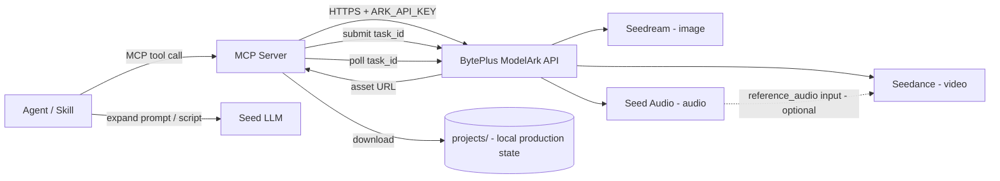

# ark-director

> An AI director workspace that orchestrates BytePlus / Volcano Engine generative models — **Seedance** (video), **Seedream** (images), and **Seed Audio** (audio) — to turn prompts and references into finished content assets.

`ark-director` behaves like an "AI director": it composes multiple BytePlus model families into end-to-end content pipelines. The primary integration mechanism is **MCP (Model Context Protocol) servers** plus **agent skills**:

- **MCP servers** wrap the BytePlus ModelArk REST API and expose narrowly-scoped, composable tools.
- **Agent skills** are higher-level content-creation recipes that compose those MCP tools into end-to-end pipelines (e.g. "short ad spot", "storyboard to video", "podcast intro").

AI coding agents working here treat MCP tools as the canonical way to invoke BytePlus models, and skills as the canonical way to package reusable content recipes. Skills never call the Ark REST API directly — they go through the MCP tools.

---

## Model catalog

Models are accessed through **BytePlus ModelArk** and the BytePlus Seed Speech surface. Credentials are resolved from the environment at runtime: `BYTEPLUS_MODELARK_API_KEY` for Seedream and Seedance, and `BYTEPLUS_SEED_AUDIO_API_KEY` for Seed Audio.

| Family | Model(s) | Modality | Key capabilities |
|---|---|---|---|
| Seedance | **Seedance 2.5** (`dreamina-seedance-2-5-260628`, default) — up to 30s/pass, 1080p, 30 imgs / 10 vids / 10 audio refs. Seedance 2.0 (`dreamina-seedance-2-0-260128`) as fallback for 4K / Fast / Mini. | Video | Text-to-video, first/last-frame, multimodal references, editing, extension, native audio+video |
| Seedream | Seedream 5.0 Pro (`dola-seedream-5-0-pro-260628`); configured Lite/4.x bindings | Image | Text-to-image, reference-based generation/editing, multi-reference fusion, sequential output |
| Seed Audio | Seed Audio 1.0 (`seed-audio-1.0`) | Audio | Voice + music + SFX + ambience in one pass, multi-character dialogue, voice references, cross-lingual generation |
| Seed / Doubao | `seed-2-0-lite-260228` and siblings | Text | Prompt expansion, scene scripting, structured output |

---

## Architecture



- MCP tools submit an Ark task, poll until completion, download the resulting asset to the relevant `projects/<project>/scenes/...` path, and return both the local file path and the asset URL.
- **Always save generated files locally.** Remote URLs expire; the local project tree is the durable source of truth.
- The Seed LLM is used inside skills for prompt expansion and scene scripting, not as a content generator itself.

---

## Directory structure

```
ai-director/
  AGENTS.md                         # workspace contract for agents and contributors
  skills-lock.json                  # registry of installed/vendored skills
  .agents/skills/                   # project-authored + vendored skills
  docs/                             # architecture guides, model references, how-tos
  plans/                            # implementation plans (PLAN_*.md)
  specs/                            # exploratory specifications (SPEC_*.md)
  projects/                         # local-only production state (never committed)
    <project-name>/
      project.md                    # brief, cast, locations, model & credit defaults, status
      task_ids.json                 # provider task ID registry
      ref_cache.json                # uploaded reference object-key registry
      library/                      # reusable music, SFX, ambience
      elements/                     # canonical characters, locations, props
        <element-id>/
          character.md | location.md | prop.md
          ref_01_*.png               # reference seed images
          char_*_v01.png             # character / location / prop sheets
          prompt_*.md               # immutable prompt snapshots
      scenes/
        scene-NN/
          scene.md                  # script, cast, location, camera, style
          sNN_shNNN/                # shot folder
            shot.md                 # shot prompt, refs, model, params, seed, cost
            sNN_shNNN_tNN_vNN.mp4   # video take
            prompt_*.md             # immutable prompt snapshot
```

**Naming conventions:** lowercase kebab-case for all folders and ids. Structured token prefixes (`s01_sh010_t01_v01.mp4`, `char_gloria_turnaround_v01.png`) make generated files self-describing, sortable, and parseable.

---

## Production workflow

`ark-director` treats expensive media generation as a gated production workflow:

1. **Brief & creative locks** — record approved identities, environments, props, tone, resolution, duration, audio mode.
2. **Reference preflight** — classify each asset (visible identity, environment, motion reference, control-only). The ordered reference array submitted must match the `references:` list in `shot.md` exactly.
3. **Spatial & temporal preflight** — record start, travel axis, subject order, boundary behavior, end state for movement-heavy scenes.
4. **Audio for dialogue (optional)** — when the user requests lip-synced dialogue, generate the Seed Audio track first, then use it as `reference_audio` to Seedance.
5. **Low-cost prototype** — validate motion, geography, camera at the lowest suitable resolution.
6. **Creative review** — preserve approved decisions; write the single requested delta plus acceptance criteria for the next take.
7. **Final candidate** — increase resolution only after creative behavior is approved.
8. **Technical & semantic QA** — inspect actual streams, decode integrity, contact sheets, key transitions, audio.

**Generate per scene at its natural duration (4–30s), not per 30-second block.** Chain approved scenes via `return_last_frame` / `first_frame` + a shared reference bundle and assemble in post.

---

## Four directing principles

These rules govern every prompt this workspace writes, across all modalities:

1. **Assets first.** Not one shot until every character, location, and prop is named, versioned, and locked. The model has no memory — describe everything, every time.
2. **Say what you want, not what you avoid.** A prohibition still names and summons the thing it forbids. Write the positive, specific instruction instead.
3. **Direct, don't describe.** Write the scene event, motive, goal, obstacle, and tactic — not just what things look like.
4. **Screens and text first.** When a shot shows a UI or text-heavy surface, generate it with Seedream first, lock it as an image, then pass it as a `reference_image` to Seedance. Never leave screen text to the video model.

---

## Getting started

### Prerequisites

- An AI coding agent runtime that supports MCP servers and agent skills (e.g. [opencode](https://opencode.ai), Claude Code, or similar).
- A BytePlus ModelArk account with API access.
- Environment variables:

```bash
BYTEPLUS_MODELARK_API_KEY=your_modelark_key      # Seedream + Seedance
BYTEPLUS_SEED_AUDIO_API_KEY=your_seed_audio_key  # Seed Audio
# Optional: region override (default: ap-southeast-1)
# ARK_BASE_URL=https://ark.ap-southeast.bytepluses.com/api/v3
```

### Quick start

1. **Clone the repo** and open it in your agent-compatible editor.
2. **Set the environment variables** above in a `.env` file (gitignored).
3. **Start a project** — create `projects/<your-project>/project.md` with your brief, cast, and locations.
4. **Build Elements** — use the `seedream-*` skills to generate canonical character, location, and prop sheets under `elements/`.
5. **Break into scenes and shots** — write `scene.md` and `shot.md` manifests.
6. **Generate** — use the `seedance-*` and `seed-audio-*` skills to author prompts, then submit via the MCP tools.
7. **Assemble** — use the `ffmpeg-*` skills to concatenate approved takes with crossfades and mix audio.
8. **Review** — use the `media-review` skill to open and compare generated assets.

---

## Skills

The workspace ships with **57 skills** across 13 categories. Skills are the canonical way to package reusable content recipes — they compose MCP tools rather than calling the Ark API directly.

### Production Orchestration

| Skill | Description |
|---|---|
| **film-production** | Master orchestrator for multi-scene, multi-modality productions. Advances one production stage at a time (brief → development → canon → storyboard → audio → shot generation → review → assembly → delivery), delegates modality-specific work to specialist skills, and preserves explicit human approval at creative locks and handoffs. |
| **template-factory** | Pinterest-inspired template factory that reverse-engineers a reference video ("pin") into reproducible AIGC output. Orchestrates pin intake, `seed_understand` breakdown, keyframe extraction, a deep motion review, a dynamic monochrome-sketch storyboard (passed to Seedance as `@Image 1`), optional Seedream element sheets, and a Seedance 2.5 video — every prompt passing the mandatory `prompt-review` gate. |
| **brief-intake** | Two-mode brief intake that proposes genre-appropriate defaults for every directorial axis (structure, acting, camera, lens, lighting, grade, pacing, staging, medium, audio) and confirms them with the user. Fast mode (default) accepts the proposed set; full Q&A mode walks every axis. |
| **prompt-review** | Mandatory quality gate that spawns sub-agents to review written prompts against the applicable skill's validation checklist and the universal directing principles. CRITICAL/MAJOR findings must be fixed before generation submission. Covers Seedance, Seed Audio, Seedream, character sheets, storyboards, and VFX prompts. |
| **media-review** | Opens generated images and videos for visual review on macOS. Builds montage/contact sheets to compare many variants at once, and opens videos directly in the default player. Use when comparing takes, choosing variants, or doing source-vs-output comparisons. |
| **blender-to-seedance** | End-to-end pipeline that turns a Blender blockout into a Seedance 2.5 video. Builds a graybox previz in Blender (primitives, color-coded proxies, spline camera), renders it to a 24fps MPEG-4 clip, uploads it, and submits a video-to-video task where the previz is the locked motion/camera master and the prompt only dresses the world. Orchestrator: delegates the build to the `blender-*` skills, the grammar to `seedance-prompt-25` blockout mode, and submission to `modelark-mcp` (plus `seedance-vfx-pipeline`'s save/manifest pattern). |

### Seedance — Video Prompting

| Skill | Description |
|---|---|
| **seedance-prompt-25** | Core skill for writing production-grade Seedance 2.5 video prompts. Provides the flexible six-part formula, 50-material multimodal referencing (`@Image N` / `@Video N` / `@Audio N`), variable-duration scene staging (4–30s), timestamp pacing, structured video editing, forward/backward extension, keyframe sequences, storyboard grids, blockout references, seamless transitions, audio bracket syntax, and camera language. **This is the default prompt skill.** |
| **seedance-prompt-20** | Legacy Seedance 2.0 prompt skill. Use when you need 4K output (unsupported by 2.5), Fast/Mini speed variants, or lower cost per generation. Provides reference-role classification, subject definitions, spatial continuity, shot sequencing, and native audio direction. |
| **seedance-prompt-25-filipino** | Partner skill to `seedance-prompt-25` for Tagalog/Filipino dialogue. Provides vocabulary simplification, phonetic annotation, intonation direction, Taglish code-switching guidance, and an optional audio-first pipeline (Seed Audio generates Tagalog dialogue → Seedance uses it as `reference_audio`). Compensates for Tagalog not being in Seedance 2.5's officially supported languages. |
| **seedance-camera-presets** | Turns a named camera move (dolly, pan, tilt, orbit, crane, tracking, handheld, FPV, aerial, bullet time, dolly zoom, crash zoom, whip pan, one-take, static) into a canonical, drop-in Camera block for the six-part prompt formula. |
| **seedance-lens-presets** | Translates a lens, focal length, aperture, or sensor request into a canonical visible-result phrase for Seedance prompts or Seedream style. Covers 35mm, 50mm, 85mm, wide angle, telephoto, anamorphic, fisheye, macro, f-stop, depth of field, bokeh. |
| **seedance-lighting-presets** | Translates a named lighting setup (rim light, backlight, golden hour, soft/hard light, three-point, Rembrandt, practical lights, silhouette, contre-jour) into a canonical Seedream `Lighting:` recipe and a matching Seedance visual-style lighting phrase. Ensures the same lighting intent works for both images and video. |
| **seedance-pacing-presets** | Turns a named pacing or rhythm preset (speed ramp, slow motion, bullet time, ramp up, flash in/out, impact moment, montage, cut rhythm, speed up) into a canonical, timestamped motion, cut, and pacing block for the Seedance prompt. |
| **seedance-acting-console** | Converts a directing directive into a production-grade acting block. Two layers: scene-level acting analysis (motive, goal, obstacle, tactic, eye-work as purposeful action) and cue encoding (maps the tactic's visible footprint to observable physical cues at three intensity levels using a six-emotion bank). |
| **seedance-animation-styles** | Writes Seedance animation prompts for claymation, needle felt, wood puppets, toy miniatures, vintage rubber hose, painterly 2D, cubist ink, stylized 3D, silicone creatures, wax crayon, and custom animation media. Preserves handcrafted texture and material-specific motion. |
| **seedance-motion-design** | Writes production-grade Seedance 2.5 motion-design and motion-graphics prompts for marketing deliverables — launch videos, motion-on-footage explainers, hypermotion product ads, 3D flythroughs, 2D explainers, editorial explainers, logo reveals, kinetic type, and data-driven explainers. Every on-screen word, number, chart, logo, or UI screen is authored as a Seedream reference image first, then animated as a plate by Seedance. |
| **seedance-music-video** | Writes production-grade music-video prompts: picks a video format (performance, narrative, conceptual, lyric, visualizer, hybrid), maps song sections to a visual plan, directs beat-synced cuts and camera, drives native audio or audio-first lip-sync, and locks a per-genre visual style. Orchestrator for the music-video layer: delegates every other directorial axis to its owning preset skill (see `docs/seedance-reference.md`). |
| **seedance-graybox-world** | Writes Seedance 2.5 prompts for the Blender gray look — an untextured gray graybox/blockout 3D world with matcap-style shading, ambient-occlusion depth, and a neutral gray viewport background, like Blender's Solid viewport. Use when gray IS the desired final look, not just a previs reference. |

### Seedance — VFX

| Skill | Description |
|---|---|
| **seedance-vfx-prompt** | Writes structured or compact Seedance 2.0 video-to-video VFX prompts using the `@Video N` / `@Image N` reference grammar. Covers the three-level VFX taxonomy (world swap, element change, handheld cinematic showcase), embedded lighting, layered space, timing triggers, camera moves synced to dialogue, diegetic audio, 4K face protection, photoreal creature integration, and source-clip inspection. Also covers Seedance 2.5 structured editing. |
| **seedance-vfx-pipeline** | End-to-end pipeline for Seedance VFX shot production. Composes `seedance-vfx-prompt`, the modelark MCP tools, and `ffmpeg-side-by-side-comparison` to take a source clip and a change description through to a saved, manifested asset. Supports both 2.0 and 2.5; defaults to 2.5 for full-duration edits. |

### Seedream — Image Prompting

| Skill | Description |
|---|---|
| **seedream-prompt** | Core skill for structured Seedream 5.0 Pro/Lite image generation prompts. Covers input reference labeling, subject definitions, style and composition control, interactive image editing (local edits, sketch rendering, layer separation, multi-image fusion, color/material replacement), high-density infographics, sequential generation, and constraints. |
| **seedream-character-sheet** | Writes structured Seedream prompts for three-panel character sheets and identity references. Produces the canonical character turnarounds that Seedance uses as face anchors. |
| **seedream-character-sheet-cleanup** | Cleans Seedream character sheets by removing the head from the full-body panels so only the close-up panel keeps a readable face. Invoke immediately after generating a multi-panel character sheet for Seedance use — prevents the model from cloning a character into two. |
| **seedream-location-asset** | Writes structured Seedream prompts for cinematic location assets and reusable environment sheets. Use for creating locations, interiors, exteriors, set references, or establishing stills. |
| **seedream-storyboard** | Creates, revises, and optionally generates production-ready cinematic storyboards — from one hero panel with alternatives to a multi-panel continuity sequence. Supports single-image grid (default) and separate-images delivery modes. |
| **seedream-edit** | Guide for using the `seedream_edit_image` MCP tool for interactive image editing with Seedream 5.0 Pro. Use for point-based and bounding-box precision editing — replace objects, change regions, add elements at specific positions. |

### Color & Look

| Skill | Description |
|---|---|
| **color-grade-palettes** | Maps a named color grade palette or film look (teal & orange, bleach bypass, golden hour warm grade, etc.) into a canonical grade sentence for the Seedance Visual Style slot or the Seedream `Style:` section, with an optional matching FFmpeg filter graph for cross-shot matching. |

### Seed Audio

| Skill | Description |
|---|---|
| **seed-audio-prompt** | Writes structured Seed Audio 1.0 prompts for full-soundscape audio generation including dialogue, music, SFX, and ambience in one pass. Supports text-to-audio (T2A) and text-plus-audio-to-audio (TA2A) with voice cloning. |
| **seed-audio-commercial** | Produces dramatic, story-driven audio commercials with Seed Audio 1.0. Composes full-soundscape T2A prompts, manages the generation and verification lifecycle, and saves durable project assets. |
| **audio-dubbing** | Dubs video or audio from one language to another using Seed Audio 1.0 voice cloning (TA2A). Takes a source audio/video file and a target-language script, clones all speaker voices from the original, preserves timing and pauses, and overlays the new audio onto the original video. Works with any supported language pair. |
| **audio-split** | Splits an audio file into segments for Seed Audio reference preparation. Supports explicit cut points, max-duration mode (e.g. to honor the 30s reference clip limit), and a target segment count. Use when preparing reference audio for voice cloning or dubbing. |

### Scene Craft & Directing

| Skill | Description |
|---|---|
| **tig-scene-engine** | Writes and audits screenplay scenes and sequences using a five-element dramatic engine — Goal, Obstacle, Tactic, Reversal, Value Shift — with custom definitions. Use to write new scenes, draft options, develop sequences, or audit/test/diagnose existing scenes for structural strength. Default scene-craft skill for thriller and psychological drama. |
| **tig-blocking-map** | Creates a color-coded outline schematic — a "staging reference" / blocking map — that gives Seedance / Higgsfield characters precise spatial disposition. Figures are bound to letters (A, B, C, D…) in prompt text only; no letters are drawn on the map. The map is geometry only — it never bleeds style, colors, wardrobe, or location into the shot. Use for precise multi-character staging or when characters swap places between shot sizes. |

### UGC & Advertising

| Skill | Description |
|---|---|
| **ugc-ad-modes** | Writes production-grade Seedance 2.5 video prompts for 9 ad modes: UGC, UGC How-To, UGC Unboxing, Product Showcase, Product Review, TV Spot, Wild Card, UGC Virtual Try-On, and Pro Virtual Try-On. Each mode encodes its own visual texture, narrative beat structure, hook formula, camera style, audio direction, and CTA pattern. Partners with `seedance-prompt-25` and `seed-audio-prompt`. |

### MCP Integration

| Skill | Description |
|---|---|
| **modelark-mcp** | Guide for using the ModelArk Seed MCP server to generate or edit images, audio, and video (including Seedance 2.5, BytePlus VOD AI MediaKit enhancement, video transcoding, and voice/background audio separation), understand images and videos through Seed 2.1, transcribe speech to text, manage Seedance tasks, upload reference media, and fetch persisted artifacts. |

### FFmpeg & Media Processing

| Skill | Description |
|---|---|
| **ffmpeg** | Video and audio processing with FFmpeg. Use for format conversion, resizing, compression, audio extraction, and preparing assets for Remotion. Covers converting GIF to MP4, resizing video, extracting audio, compressing files, and any media transformation task. |
| **ffmpeg-scene-transitions** | Assembles multiple video clips into one film with crossfade scene transitions and correct audio/video sync. Use to combine scenes into a single video, stitch clips with dissolves, crossfade between shots, add fade in/out, join AI-generated scenes, or fix A/V drift in an assembled film. |
| **ffmpeg-side-by-side-comparison** | Assembles two or more videos into a single side-by-side (or N-up) comparison clip — before/after, A/B, or a review grid. Handles uniform scaling, pixel-aspect alignment, duration sync, optional labels, and audio. Use for before-and-after split screens, A/B comparisons of takes, or compare/review grids. |
| **mediabunny** | Multimedia handling with the Mediabunny library, used alongside Remotion for media processing tasks. |

### Remotion — Programmatic Video

| Skill | Description |
|---|---|
| **remotion-create** | Creating a new Remotion video project from scratch. |
| **remotion-best-practices** | Best practices for building Remotion video applications. |
| **remotion-markup** | Best practices for writing Remotion React markup that stays intuitive for agents and editable in Remotion Studio Visual Mode. |
| **remotion-render** | Best practices for rendering videos with Remotion. |
| **remotion-captions** | Dealing with captions and subtitles in Remotion. |
| **remotion-interactivity** | Best practices for writing Remotion animations that stay intuitive and editable in Visual Mode. |
| **remotion-saas** | Building video apps with Remotion — framework, rendering, and Player advice for SaaS use cases. |
| **remotion-docs** | Search and fetch Remotion documentation pages. |
| **remotion-upgrade** | Upgrade Remotion, related packages, compatible Mediabunny packages, and installed Remotion Agent Skills. |

### Blender — 3D Pipeline

| Skill | Description |
|---|---|
| **blender-python-scripting** | Blender 5.x Python scripting (bpy) — custom operators, UI panels, add-on development, context management, handlers, timers, property system, batch processing, and data model access. Targets Python 3.13 (Blender 5.1). |
| **blender-modeling-modifiers** | Blender 5.x modifiers, bmesh API, mesh editing operators, sculpting setup — SubSurf, Boolean, Array, Mirror, Bevel, bmesh procedural mesh creation, and modeling pipelines. |
| **blender-shader-nodes** | Blender 5.x shader nodes — PBR materials, procedural textures, Principled BSDF, glass/metal/skin shaders, world/HDRI lighting, raycast shader node, and scripting material node trees. |
| **blender-geometry-nodes** | Blender 5.x geometry nodes — procedural modeling, scattering, mesh/curve/volume ops, simulation zones, repeat zones, Bone Info, Font socket, UV nodes, volume grid nodes, and scripting node trees. |
| **blender-animation-rigging** | Blender 5.x animation and rigging — keyframes, FCurves, layered actions, drivers, constraints, armatures, IK/FK, shape keys, NLA editor, and bone collections. |
| **blender-physics-simulation** | Blender 5.x physics simulations — rigid body, cloth, fluid/smoke/fire (Mantaflow), soft body, particles, force fields, collisions, and simulation baking/caching. |
| **blender-compositing-nodes** | Blender 5.x compositor nodes — post-processing, color grading, denoising, keying, glare, depth of field, render pass separation, multi-layer EXR output, and scripting compositing pipelines. |
| **blender-scene-rendering** | Blender 5.x scene setup, render engines (Cycles/EEVEE), output formats, import/export (FBX/glTF/OBJ/USD/Alembic), linking/appending, color management (AgX/Filmic), view layers, viewport config, and world/environment setup. |

### Showcase & Documentation

| Skill | Description |
|---|---|
| **lark-showcase-aigc** | Orchestrates `lark-demo-doc-builder`, `lark-doc`, `lark-wiki`, `lark-drive`, and `design-doc-mermaid` to build enterprise-facing Lark/Feishu documents that showcase AIGC (AI-generated content) with prompts, results, and inline media. Invoke when the user wants a standalone customer guide or showcase article in Lark. |

---

## Skill sources

Skills in this workspace come from three sources, tracked in `skills-lock.json`:

| Source | Type | Examples |
|---|---|---|
| **Project-authored** | `local` | All `seedance-*`, `seedream-*`, `seed-audio-*`, `film-production`, `template-factory`, `brief-intake`, `prompt-review`, `media-review`, `tig-*`, `ugc-ad-modes`, `ffmpeg-scene-transitions`, `ffmpeg-side-by-side-comparison`, `modelark-mcp`, `lark-showcase-aigc`, `color-grade-palettes`, `blender-to-seedance` |
| **Remotion (vendored)** | `github: remotion-dev/skills` | `remotion-*` (9 skills), `mediabunny` |
| **Blender (vendored)** | `github: ra100/blender-claude-plugin` | `blender-*` (8 skills) |
| **FFmpeg (vendored)** | `github: digitalsamba/claude-code-video-toolkit` | `ffmpeg` |

Vendored skills are upstream-owned and excluded from the skill-isolation
remediation — their cross-skill directives are treated as upstream design (see
`AGENTS.md`). Project-authored skills follow the global "Skill Independence &
Orchestration" rule: one capability per skill, prose-only "compose with X"
sibling hints, and explicitly-marked orchestrators.

---

## Conventions

- **Secrets:** Load all API keys, base URLs, and regions from environment variables or a gitignored `.env`. Never hard-code credentials.
- **Watermark:** `watermark: false` by default for all image, video, and audio generation. Enable only when explicitly requested.
- **Cost guardrails:** Default to the lowest-cost/fast variant for development and tests; gate expensive runs behind explicit flags.
- **Reproducibility:** Every project, element, scene, and shot carries a Markdown manifest with YAML frontmatter recording model, prompt, references, seed, params, cost, and status. A later agent must be able to re-create any asset from its manifest alone.
- **Local-first:** The `projects/`, `docs/`, `plans/`, and `specs/` trees are local-only working state — never committed to git. Generated media is gitignored by pattern.

---

## References

- [BytePlus ModelArk quick start](https://docs.byteplus.com/en/docs/ModelArk/1399008)
- [Seedance video generation API](https://docs.byteplus.com/en/docs/ModelArk/1520757)
- [Seedance 2.5 prompt guide (Lark)](https://bytedance.larkoffice.com/docx/A88jd0B47oAd8zxWp5ycZFMfnxh)
- [Seed Audio 1.0 API reference](https://docs.byteplus.com/en/docs/byteplusvoice/seedaudio-01)
- [ModelArk model list](https://docs.byteplus.com/en/docs/ModelArk/1330310)
- [ByteDance Seed](https://seed.bytedance.com)

---

## License

This is an internal workspace. See the repository for license details.
