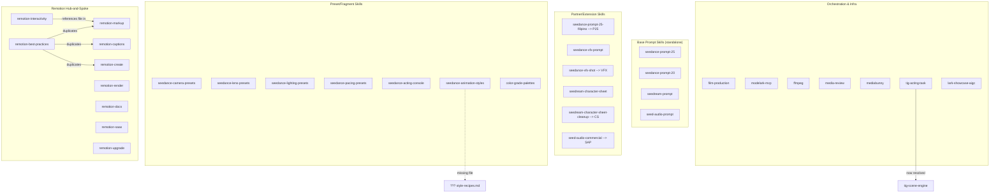

# Skill Audit Report — Standalone-ness & Separation of Concerns

> Audited 38 project-local skills in `.agents/skills/` across 5 parallel sub-agent analyses.
> Date: 2026-08-14

## Executive Summary

| Severity | Count | Summary |
|---|---|---|
| **Critical** | 1 | Missing reference file in animation-styles |
| **Moderate** | 4 | Orphaned skill routing, content duplication, artificial thin skills |
| **Low** | 6 | Minor implicit coupling, stale links, back-reference anti-pattern |
| **Clean** | 25 | Standalone or intentionally coupled with sharp boundaries |

---

## Critical Findings

### ~~C1: `seedance-footage-vfx` and `seedance-vfx-prompt` are ~60% near-duplicate~~ — RESOLVED

Merged `seedance-footage-vfx` into `seedance-vfx-prompt`. Ported the compact `@source`/`@creature` declaration format, compact specs line, plain-text output rules, structure patterns quick-reference, and Seedance 2.0 input limits table. Deleted `seedance-footage-vfx`. Updated `film-production` routing table, `SEEDANCE_25_LIMITATIONS.md`, `PLAN_SEEDANCE_25_ANIMATION_STYLES_SKILL.md`, and `PLAN_SKILL_VERSION_AUDIT.md` to remove references.

Also fixed M1 (convention misattribution): `seedance-vfx-prompt` was referencing `seedance-prompt-25` for heading conventions but actually uses `seedance-prompt-20` conventions. All four references corrected to `seedance-prompt-20`.

### ~~C2: `tig-acting-task` dangling dependency~~ — RESOLVED

`tig-scene-engine` is now available at `/Users/bytedance/.agents/skills/tig-scene-engine/`.

**Remaining issue (downgraded to Moderate):** `tig-acting-task` is still not registered in AGENTS.md's routing table — the acting/emotion axis is assigned to `seedance-acting-console`. The two skills overlap (both cover acting direction for Seedance prompts) but use fundamentally different approaches (director's method: goal/motive/tactic vs. emotion encoding: 6 emotions x 3 intensities).

See M6 below for the updated recommendation.

### C3: `seedance-animation-styles` references missing `references/style-recipes.md`

The skill lists 10 animation medium recipes but the file containing them does not exist. The skill cannot fulfill its purpose without it.

**Recommendation:** Create the file with the 10 style recipes, or inline them into SKILL.md.

---

## Moderate Findings

### ~~M1: `seedance-vfx-prompt` misattributes conventions to `seedance-prompt-25`~~ — RESOLVED

Fixed all convention attributions from `seedance-prompt-25` to `seedance-prompt-20` (four references in the Asset preparation, Subject definitions, and prompt structure sections).

### M2: `seed-audio-commercial` duplicates `seed-audio-prompt` content while declaring it "mandatory"

Declares `seed-audio-prompt` as a mandatory dependency, then duplicates nearly all of its shared content (prompt template, voice profile format, onomatopoeia guidance, timestamp control, quick reference card, best practices). The dependency declaration and duplication contradict each other.

**Recommendation:** Remove duplicated content from `seed-audio-commercial`. Keep only commercial-specific content (five-act story arc, SFX patterns, Taglish guidance, cost management, project structure, examples). Make the dependency real.

### M3: Audio-first alignment contract duplicated across 3 skills + AGENTS.md

The full audio-first pipeline and alignment contract is restated in:
- `seedance-acting-console` (7-step pipeline + 5-point contract)
- `seedance-pacing-presets` (shorter version)
- `AGENTS.md` (canonical version)

If AGENTS.md updates the contract, both skills drift.

**Recommendation:** Define the contract once in AGENTS.md. Have both skills reference it by name instead of restating it.

### M4: `remotion-best-practices` is a pure router with full duplicate copies of spoke skills

Zero domain knowledge — just links to 8 other Remotion skills. Worse, it contains full byte-for-byte duplicate copies of each spoke skill under `remotion-best-practices/<spoke>/REFERENCE.md`. Dual maintenance burden.

**Recommendation:** Remove the duplicate subdirectories. Reduce to a lightweight index or eliminate entirely — the system prompt's skill list already handles routing.

### M5: `remotion-interactivity` (23 lines) is an artificial subset of `remotion-markup`

Core advice (avoid object spreads, `<Interactive.Div>`, inline values) is already in `remotion-markup`. The interactivity skill adds almost nothing. References a sub-file that lives in markup's directory.

**Recommendation:** Merge into `remotion-markup` as an "Interactivity" section. Delete the separate skill.

### M6: `tig-acting-task` not registered in AGENTS.md routing table

`tig-scene-engine` is now available, so the dangling dependency is resolved. However, `tig-acting-task` is still not registered in AGENTS.md's axis routing table — the acting/emotion axis is assigned to `seedance-acting-console`. The two skills overlap but use fundamentally different approaches (director's method: goal/motive/tactic vs. emotion encoding: 6 emotions x 3 intensities). An agent following AGENTS.md will never route to `tig-acting-task`.

**Recommendation:** Either register `tig-acting-task` alongside `seedance-acting-console` with a sharp boundary (e.g., "`tig-acting-task` for scene-level directing method, `seedance-acting-console` for per-character emotion x intensity encoding"), or merge into `seedance-acting-console` as an alternative mode.

---

## Low-Severity Findings

### L1: `remotion-render` is too thin (28 lines) to justify independence

Two CLI commands + one sub-file about transparent videos. Could be a section in `remotion-markup`.

**Recommendation:** Merge into `remotion-markup` or expand with real depth (Lambda, Cloud Run, batch rendering, codec control).

### L2: "Go back to best-practices" back-references in Remotion spoke skills

`remotion-create`, `remotion-docs`, and `remotion-markup` all open with "If this is not relevant, load best-practices." Creates bidirectional coupling and undermines standalone-ness.

**Recommendation:** Remove all back-references. Each skill should assume it was correctly routed.

### L3: `seedance-camera-presets` and `seedance-pacing-presets` overlap on bullet-time, slow-motion, one-take

Both include canonical templates for bullet time and slow motion. Camera calls it "one-take," pacing calls it "Single Shot." No composition rule for when both are loaded.

**Recommendation:** Make bullet-time canonical in `seedance-camera-presets` (it's primarily a camera technique). Remove duplicates from pacing. Standardize terminology.

### L4: No Visual Style slot composition order for preset skills

`seedance-lens-presets`, `seedance-lighting-presets`, and `color-grade-palettes` all produce text for the Visual Style slot with no merge rule.

**Recommendation:** Add an explicit slot composition order to `seedance-prompt-25` or AGENTS.md (e.g., lighting -> lens character -> grade -> sensor).

### L5: `seedance-acting-console` paradoxically restates `seedance-prompt-25` templates

Claims to defer to `seedance-prompt-25` for single-transition and multi-stage templates, then provides them inline. Maps its 6-emotion bank to `seedance-prompt-25`'s 5-emotion table.

**Recommendation:** Either own the templates (remove the "from prompt-25" claim) or truly defer (remove the template text and reference the other skill).

### L6: `ffmpeg` has stale external reference to `github.com/digitalsamba/claude-code-video-toolkit`

**Recommendation:** Update or remove the attribution/contribution section.

---

## Clean Skills (No Action Needed)

| Skill | Status |
|---|---|
| `seedance-prompt-25` | Standalone. Base skill with advisory routing. |
| `seedance-prompt-20` | Standalone. Clean version boundary. |
| `seedance-prompt-25-filipino` | Intentional partner skill. Explicit "do not use alone" + clear composition contract. |
| `seedance-vfx-shot` | Intentional pipeline skill. Sharp boundary with `seedance-vfx-prompt`. |
| `seedance-camera-presets` | Standalone. Produces Camera block fragments. |
| `seedance-lens-presets` | Standalone. Produces optics sub-phrases. |
| `seedance-lighting-presets` | Standalone. Dual-output (Seedream + Seedance). |
| `seedance-pacing-presets` | Standalone (except for duplicated audio-first contract). |
| `seedance-acting-console` | Standalone (except for paradoxical template coupling). |
| `seedream-prompt` | Standalone. Base skill with advisory routing. |
| `seedream-character-sheet` | Standalone. Minor convention re-derivation. |
| `seedream-character-sheet-cleanup` | Intentional post-processing skill. |
| `seedream-location-asset` | Standalone. Cleanest specialized skill. |
| `seedream-edit` | Standalone. Tool-operation layer. |
| `seedream-storyboard` | Standalone. Most comprehensive standalone skill. |
| `seed-audio-prompt` | Standalone. Base audio skill. |
| `audio-dubbing` | Standalone pipeline skill. |
| `film-production` | Orchestrator by design. References are a routing table, not imports. |
| `modelark-mcp` | Standalone. 1294-line API reference. |
| `media-review` | Standalone. Single-purpose. |
| `color-grade-palettes` | Standalone. Prompt-composition fragment skill. Correct layering pattern. |
| `ffmpeg` | Standalone. Command cookbook. |
| `mediabunny` | Standalone. Different runtime from ffmpeg (browser/Node vs CLI). |
| `lark-showcase-aigc` | Partial — hard dependency on `lark-demo-doc-builder` is defensible layering. |
| `remotion-captions` | Standalone. Zero coupling. |
| `remotion-docs` | Standalone (remove back-ref). |
| `remotion-saas` | Standalone. Clean separation. |
| `remotion-upgrade` | Standalone. |

---

## Full Dependency Matrix

---

## Recommended Action Plan

### Immediate (critical fixes)

1. ~~**Merge `seedance-footage-vfx` into `seedance-vfx-prompt`**~~ — DONE. Compact format, structure patterns, and input limits ported. Skill deleted. References updated.
2. **Create `references/style-recipes.md`** for `seedance-animation-styles` — skill is currently broken without it

### Short-term (moderate fixes)

3. **Register `tig-acting-task` in AGENTS.md** or merge into `seedance-acting-console` — `tig-scene-engine` dependency is resolved, but the skill is still unreachable via routing
4. ~~Fix convention attribution in `seedance-vfx-prompt`~~ — DONE. All references corrected from `seedance-prompt-25` to `seedance-prompt-20`.
5. Remove duplicated content from `seed-audio-commercial`; make `seed-audio-prompt` dependency real
6. Remove duplicated audio-first contract from `seedance-acting-console` and `seedance-pacing-presets`; reference AGENTS.md as single source
7. Eliminate duplicate subdirectories in `remotion-best-practices`; reduce to index or remove
8. Merge `remotion-interactivity` into `remotion-markup`

### Long-term (low priority)

9. Merge `remotion-render` into `remotion-markup` or expand it
10. Remove "go back to best-practices" back-references from Remotion spoke skills
11. Resolve bullet-time/slow-motion duplication between camera-presets and pacing-presets
12. Add Visual Style slot composition order to `seedance-prompt-25` or AGENTS.md
13. Fix paradoxical template ownership in `seedance-acting-console`
14. Clean up stale external reference in `ffmpeg`
