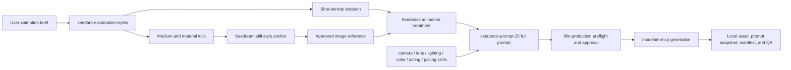

# PLAN — Seedance 2.5 Animation Styles Skill

> Implementation plan for a project-local agent skill that converts an animation brief into a material-coherent Seedream style anchor and a production-grade Seedance 2.5 animation treatment.

**Proposed skill:** `seedance-animation-styles`  
**Status:** researched and ready for implementation  
**Created:** 2026-08-13  
**Primary inspiration:** [Magnific — Seedance 2.5 animation prompts: the ultimate guide to 10 styles](https://www.magnific.com/blog/seedance-2-5-animation-prompts/)  
**Capability authority:** the official Seedance 2.5 sources already cited by `.agents/skills/seedance-prompt-25/SKILL.md`

## 1. Outcome

Create a prompt-composition skill that helps an agent direct stylized animation without duplicating the broad `seedance-prompt-25` grammar or the existing camera, lighting, lens, acting, color, and pacing skills.

The skill will:

1. choose and lock one animation medium;
2. translate that medium into construction, surface, motion-cadence, deformation, and imperfection cues;
3. create a matching still-image style anchor for Seedream when a usable anchor does not already exist;
4. build a duration-aware numbered shot or stage treatment for Seedance 2.5;
5. add a compact, style-specific closing seal and exclusions;
6. route camera, lighting, color, acting, pacing, storyboard, and generation work to the existing specialist skills;
7. keep generation parameters outside the prompt and preserve the repository's approval, provenance, and manifest contracts.

The skill will not call MCP tools or generate media by itself. When the user asks to generate, it will compose with `seedream-prompt`, `seedream-storyboard`, `seedance-prompt-25`, `modelark-mcp`, and `film-production` as appropriate.

## 2. Research findings

### 2.1 Transferable pattern from the Magnific guide

The guide publishes ten long animation treatments and then identifies five repeated moves:

1. name the physical or visual medium before the story;
2. write an ordered shot list instead of one paragraph of atmosphere;
3. describe intentional imperfections that make the medium believable;
4. direct emotional tone because tone changes animation timing;
5. close with a dense style summary plus relevant exclusions.

It also recommends establishing the look with a still image before animation. That maps cleanly to this repository's Seedream-to-Seedance handoff, provided the still is treated as an approved style/composition anchor rather than a replacement for canonical Elements.

### 2.2 Source hierarchy

The new skill must distinguish creative advice from model contracts:

| Authority | Use |
|---|---|
| Official Seedance 2.5 guide, launch material, and ModelArk docs | Model capabilities, reference roles, duration, timestamp grammar, staging, audio, and limitations |
| Repository `AGENTS.md` and `seedance-prompt-25` | Production gates, natural-duration scenes, Elements, prompt snapshots, manifests, and partner-skill routing |
| Magnific article | Animation-medium taxonomy, material-first treatment pattern, handcrafted-imperfection vocabulary, and example-inspired creative heuristics |

If a Magnific example conflicts with official or repository constraints, the official/repository contract wins.

### 2.3 Required adaptation

The article's examples often place six to nine shots inside one unspecified clip. Copying that structure literally would encourage overcrowded generations. The skill therefore needs a **shot-density gate**:

- one primary state change per shot or stage;
- a clear visible end state for every shot or stage;
- enough time for each action to read;
- split the treatment into separate natural-duration clips when the requested beats exceed the time budget;
- use scene chaining or post assembly rather than compressing every idea into one generation;
- reserve a continuous one-take treatment for a story that genuinely requires seamless motion.

The article's second category also mixes a puppet description with a clay construction recipe. The new bank must not reproduce that ambiguity: `wood-puppet-stop-motion` and `plasticine-claymation` will be separate, internally coherent presets.

## 3. Fit with the existing skill system

`seedance-prompt-25` remains the canonical full-prompt grammar. The new skill owns only the animation-medium layer and its still-to-motion handoff.



### 3.1 Ownership boundaries

| Concern | Owning skill |
|---|---|
| Animation medium, construction, surface behavior, material physics, handmade imperfections | `seedance-animation-styles` |
| Full six-part prompt, references, staging, timestamps, editing, extension, audio syntax | `seedance-prompt-25` |
| Camera movement | `seedance-camera-presets` |
| Cut rhythm and speed ramps | `seedance-pacing-presets` |
| Emotional performance cues | `seedance-acting-console` |
| Lighting and grade | `seedance-lighting-presets`, `color-grade-palettes` |
| Optics | `seedance-lens-presets` |
| Still prompt | `seedream-prompt` |
| Multi-panel previsualization | `seedream-storyboard` |
| Generation and persistence | `modelark-mcp`, managed by `film-production` for productions |

## 4. Proposed file structure

```text
.agents/skills/seedance-animation-styles/
├── SKILL.md
├── agents/
│   └── openai.yaml
├── evals/
│   └── evals.json
└── references/
    └── style-recipes.md
```

No script is needed in the first version. The work is semantic prompt composition, and a script would add machinery without improving fidelity. Add a validator only if the recipe bank later moves to structured YAML or JSON.

## 5. `SKILL.md` contract

### 5.1 Frontmatter

Use this initial trigger definition, then optimize it with trigger evals after the output behavior is stable:

```yaml
---
name: seedance-animation-styles
description: >
  Turn an animation brief into a material-coherent style anchor and Seedance
  2.5 animation treatment for claymation, needle felt, wood puppets, toy
  miniatures, vintage rubber hose, painterly 2D, cubist ink, stylized 3D,
  silicone creatures, wax crayon, or a custom handcrafted medium. Use whenever
  the user asks to animate a still, direct a stylized animated short, preserve
  handmade texture in motion, choose an animation medium, or write a shot-based
  Seedance animation prompt. Compose with seedance-prompt-25 for the full prompt
  and with seedream-prompt when a still style anchor is needed.
---
```

Near-misses that should not trigger by default:

- ordinary live-action Seedance prompts with no stylized-animation requirement;
- video-to-video VFX/restyling, which belongs to `seedance-vfx-prompt` or `seedance-vfx-shot`;
- generic camera, grade, lighting, lens, acting, or pacing requests with no animation-medium decision;
- image-only character sheets that do not need animation planning.

### 5.2 Skill body sections

Keep `SKILL.md` below 500 lines by storing the detailed ten-style bank in `references/style-recipes.md`.

1. **Purpose and boundary** — prompt composition only; no API calls.
2. **Source authority** — official sources first, Magnific as creative inspiration, access date.
3. **When to load the recipe bank** — read `references/style-recipes.md` only after detecting a named or custom animation medium.
4. **Animation style contract** — medium, construction, surface, cadence, deformation, imperfections, tone, exclusions.
5. **Still-first decision** — reuse an approved reference or produce a Seedream anchor block.
6. **Shot-density gate** — fit, split, or one-take decision.
7. **Prompt assembly** — medium first, reference roles, generation goal, ordered shots/stages, material-continuity block, style seal.
8. **Partner-skill routing** — explicit routing table matching section 3.1.
9. **Revision contract** — preserve locked creative choices and change one requested axis at a time.
10. **Self-check** — objective preflight before handoff.

## 6. Input and output data contracts

### 6.1 Input schema

The skill should infer optional values when safe and expose missing creative locks without blocking ordinary prompt drafting.

```text
medium              required: named preset or custom material
subject             required: character, creature, object, or abstract form
story_event         required: primary action or transformation
duration            optional: 4-30 seconds; infer a natural duration if absent
shot_beats          optional: ordered actions or desired shots
tone                optional: emotional and comedic/dramatic timing
style_reference     optional: approved still or canonical Element reference
palette             optional: route to color-grade-palettes
lighting            optional: route to seedance-lighting-presets
camera              optional: route to seedance-camera-presets
pacing              optional: route to seedance-pacing-presets
audio               optional: ambience, music, effects, or dialogue
output_mode         optional: style-contract | animation-block | full-prompt
```

Default `output_mode` is `full-prompt` when the user asks to “write a prompt”; otherwise return the smallest useful animation block.

### 6.2 Animation-style contract

Before writing prose, resolve this internal structure:

```text
style_id             canonical recipe id
medium_lock          what the world is visibly made from
construction         how characters, props, and sets are built
surface_behavior     fibers, fingerprints, grain, brush marks, joints, seams, etc.
motion_cadence       fluid, stepped, jittered, line-boil, elastic, restrained, etc.
deformation_rules    squash/stretch, rigid joints, fabric compression, redraw/morph, etc.
environment_rules    how waves, smoke, fire, weather, and architecture inherit the medium
tone_and_timing      observable emotional timing, not mood words alone
imperfection_cues    two to four deliberate craft artifacts
style_seal           compact closing phrase for the Visual Style slot
exclusions           only contradictions relevant to this medium
```

### 6.3 Output grammar

When a full prompt is requested, emit:

```text
[Reference Roles]                     only when references exist
@Image 1 defines <style, identity, composition, or material role>.

[Animation Medium]
<Medium-first sentence naming construction, surface, and motion cadence.>

[Generation Goal]
<Subject + primary action/event + environment + tone.>

[Shot or Stage Plan]
Shot 1 (<time budget>): <one primary event, camera handoff, visible end state>.
Shot 2 (<time budget>): <one primary event, camera handoff, visible end state>.
Final Shot (<time budget>): <closing event and final visible state>.

[Material Continuity]
Keep <characters, props, effects, environment, and transformations> visibly made
from <medium>; preserve <imperfections and construction details> through motion.

[Style Seal]
<Compact material, cadence, tone, lighting/grade handoff, and relevant exclusions.>

[Generation Parameters — outside submitted prompt]
duration: <4-30>
resolution: <supported value>
watermark: false
```

Do not insert duration, resolution, aspect ratio, or watermark into the submitted prompt. The parameter block is a handoff artifact.

When a still anchor is needed, prepend a separate Seedream block:

```text
[Seedream Style Anchor]
Subject: <stable subject design and pose>
Setting: <single readable environment>
Style: <medium, construction, surface, palette, and imperfections>
Lighting: <resolved lighting recipe>
Composition: <opening composition suitable for animation>
Exclude: <medium-specific contradictions, text, logos, duplicate subjects>
```

The still is not automatically approved. Save it as a candidate, review it, and promote it to a video input only after explicit selection.

## 7. Style recipe bank

`references/style-recipes.md` will contain one normalized recipe per style. It must paraphrase and generalize the guide rather than copying its long sample prompts.

| Recipe id | Core medium lock | Characteristic motion/imperfection cues |
|---|---|---|
| `cubist-ink-paint` | painted ink and brushwork with angular/cubist construction | visible brush texture, shifting perspective, controlled painterly redraw |
| `wood-puppet-stop-motion` | carved wood, cloth costume, visible joints and practical miniature sets | stepped puppet timing, joint constraints, tool marks, slight frame jitter |
| `toy-miniature` | articulated plastic or block toys in a practical miniature world | visible joints, plastic reflections, rigid toy physics, scale reveal |
| `needle-felt-stop-motion` | felted wool, stitched fabric, embroidery, practical miniature materials | fibers, seams, compressed wool, stepped motion, handcrafted foam/effects |
| `plasticine-claymation` | sculpted plasticine characters, props, fire/smoke, and sets | fingerprints, thumbed surfaces, squash-and-stretch, replacement-animation cadence |
| `vintage-rubber-hose` | monochrome ink/cel animation with period backgrounds | elastic limbs, ink wobble, exposure flicker, dust/scratches, multiplane feel |
| `stylized-handcrafted-3d` | simplified 3D forms with tactile, authored surfaces | expressive facial rigs, controlled squash/stretch, subtle crafted irregularity |
| `painterly-2d` | layered painted 2D frames with strong perspective and graphic color | brush-edge movement, smear frames, fluid choreography, controlled line variation |
| `pearlescent-silicone` | translucent silicone-like organic forms and soft pearlescent surfaces | slow elastic compression, subsurface glow, restrained creature acting |
| `wax-crayon-redraw` | wax crayon and colored pencil on visible paper | line boil, pigment buildup, paper grain, constantly redrawn morphing environments |

Each recipe entry will use the same fields:

```markdown
## <Display name>

- ID:
- Aliases:
- Medium lock:
- Construction:
- Surface behavior:
- Motion cadence:
- Deformation rules:
- Environment inheritance:
- Imperfection cues:
- Compatible tones:
- Seedream style-anchor sentence:
- Seedance style-seal sentence:
- Relevant exclusions:
- Common failure modes:
```

### 7.1 Exclusion policy

Do not attach `no CGI` to every style. It is appropriate for practical felt, wood, clay, or crayon looks, but contradicts `stylized-handcrafted-3d`. Exclusions must block only likely leakage or medium-breaking artifacts.

Do not rely on “no text” when readable typography is a required story element. If exact text is essential, route it to a prepared reference or post-production per the existing Seedance limitations.

## 8. Shot-density algorithm

Use the following deterministic planning heuristic before composing the treatment:

1. Parse the requested beats and count primary state changes.
2. Classify each beat:
   - reaction/detail: budget roughly 2–3 seconds;
   - simple action: budget roughly 3–5 seconds;
   - complex action, transformation, or location transition: budget roughly 4–6 seconds.
3. Add the budgets and compare them with the requested duration.
4. If they fit, create consecutive non-overlapping shot or stage ranges.
5. If they do not fit, preserve the story order and split at a stable end state into multiple clips.
6. Use a one-take only when continuous motion or morphing is the creative requirement; otherwise allow explicit cuts.
7. Keep at most two camera moves per clip and delegate exact phrasing to `seedance-camera-presets`.

These are planning heuristics, not claimed model guarantees. The prompt must still describe timestamps as time budgets rather than frame-accurate edit points.

## 9. Still-to-animation handoff

The skill must choose one of three paths:

| Situation | Path |
|---|---|
| Approved opening still already exists | Use it as `first_frame` when exact opening composition is the priority |
| Approved still plus canonical Elements must remain independently addressable | Use R2V with explicit role mapping for the panel and smallest sufficient Element bundle |
| No still exists and style fidelity matters | Emit a Seedream anchor prompt; generate and review the still before video submission |

For every handoff, record:

- reference role;
- local asset path and SHA-256;
- approval status;
- which style properties the image controls;
- which visible content must not leak;
- whether the image is an Element, derivative storyboard/keyframe, or style-only reference.

The style anchor never supersedes canonical character, location, or prop Elements.

## 10. Repository integration changes

Implementation should touch only these files:

1. Create `.agents/skills/seedance-animation-styles/SKILL.md`.
2. Create `.agents/skills/seedance-animation-styles/references/style-recipes.md`.
3. Create `.agents/skills/seedance-animation-styles/evals/evals.json`.
4. Create `.agents/skills/seedance-animation-styles/agents/openai.yaml`.
5. Add an “Animation medium and handcrafted style” row to the preset-skill table in `AGENTS.md`.
6. Add one concise partner-skill routing note to `.agents/skills/seedance-prompt-25/SKILL.md`; do not copy the recipe bank into the already-large base skill.
7. Optionally add a matching routing note to `.agents/skills/seedream-prompt/SKILL.md` if implementation confirms there is no existing animation-anchor subsection.

Do not change ModelArk MCP code or add dependencies. Do not modify generated assets or anything under `projects/` while implementing this prompt-only skill.

## 11. Evaluation design

Create `.agents/skills/seedance-animation-styles/evals/evals.json` using the existing schema. Start with these six cases:

| Eval | What it tests | Objective assertions |
|---|---|---|
| Needle-felt kraken scene | Material inheritance under violent motion | medium named first; waves/clouds/effects inherit felt; 2–4 imperfection cues; ordered shots; final visible state |
| Wax-crayon continuous morph | One-take material transformation | explicitly no cuts; line boil/paper grain/pigment cues; environments redraw rather than switch materials; continuous camera path |
| Toy-scale noir reveal | Scale, joint, and material consistency | toy construction and visible joints; miniature depth/scale; reverse reveal preserves the same toys; no flesh/real-human drift |
| Wood puppet at a door | Ambiguous-medium protection | wood and cloth construction stays coherent; no clay/fingerprint vocabulary; restrained facial/body acting; deliberate stop-motion cadence |
| Stylized 3D office comedy | Exclusion correctness | handcrafted 3D cues present; does not emit `no CGI`; acting routed through observable cues; style seal is compact |
| No anchor image supplied | Still-first handoff | separate Seedream anchor and Seedance treatment; image is candidate/review state; generation parameters outside prompt; no claim of generated media |

Add two qualitative review dimensions that should not be reduced to brittle string assertions:

- Does the treatment feel like the requested medium rather than a generic story with style adjectives?
- Is the shot plan directable and readable within the proposed duration?

### 11.1 Skill-creator iteration

When implementation begins:

1. write the draft skill and eval prompts;
2. run every eval with the skill and against a no-skill baseline;
3. grade objective assertions and capture timing/token data;
4. generate the standard skill-creator review viewer;
5. collect human feedback on material fidelity, shot density, and usefulness;
6. revise the bank without overfitting to the six examples;
7. after output quality stabilizes, run trigger-description optimization with near-miss queries.

Generation smoke tests are a separate, explicitly authorized phase because they consume credits. A later live test should use one low-cost still and one low-cost video candidate, save both locally, and verify prompt snapshot, hashes, manifest linkage, media properties, and review state.

## 12. Self-check checklist for the implemented skill

The skill output passes when:

1. one coherent animation medium is named before the story action;
2. characters, props, environment, and effects obey the same material system;
3. two to four intentional imperfection cues make the craft legible;
4. motion cadence and deformation match the chosen medium;
5. each shot or stage has one primary change and a visible end state;
6. the shot plan fits the duration or is split into multiple natural-duration clips;
7. tone is expressed through timing and observable behavior, not only abstract adjectives;
8. camera, lighting, lens, grade, acting, and pacing wording does not duplicate partner-skill banks;
9. the style seal is compact and its exclusions do not contradict the chosen medium;
10. references have explicit roles and approval state;
11. parameters remain outside the submitted prompt;
12. no media is claimed as generated unless it exists locally and has been inspected.

## 13. Acceptance criteria

Implementation is complete when:

- the four new skill files exist and follow repository naming conventions;
- `SKILL.md` remains below 500 lines and points to the recipe bank through progressive disclosure;
- all ten recipes use the same schema and are internally material-coherent;
- the skill emits both a still-anchor path and a direct-reference path;
- the density gate splits overloaded treatments instead of silently compressing them;
- all six initial evals pass their objective assertions;
- the human review confirms that at least the felt, crayon, puppet, and 3D outputs are visibly distinct;
- trigger testing distinguishes animation-medium requests from adjacent camera, VFX, image-only, and live-action requests;
- markdown lint and `git diff --check` pass;
- no generation, project asset mutation, commit, or push occurs without separate user authorization.

## 14. Risks and mitigations

| Risk | Mitigation |
|---|---|
| Style vocabulary overwhelms action | Keep the medium lock and style seal concise; spend the middle of the prompt on observable events and end states |
| Long guide examples encourage too many cuts | Enforce the density gate and split at stable states |
| Material cues drift across effects/backgrounds | Require environment inheritance for weather, fire, smoke, water, architecture, and props |
| Exclusion boilerplate contradicts the medium | Store exclusions per recipe; never apply `no CGI` globally |
| Still reference overrides canonical identity | Bind style/composition separately from character and prop Elements; use the smallest sufficient bundle |
| New skill competes with existing presets | Keep ownership narrow and route other axes explicitly |
| Third-party creative advice is mistaken for an official limit | Label Magnific as inspiration and retain official Seedance sources as capability authority |
| Prompt recipes become copies of published examples | Paraphrase principles, create original templates, and do not reproduce the article's long prompts |

## 15. Default decisions

Unless Arthur changes them during implementation:

- use the name `seedance-animation-styles`;
- make it prompt-composition only;
- support the ten normalized recipes plus a custom-medium path;
- emit a Seedream anchor only when no approved visual anchor exists or when the user explicitly asks for one;
- use numbered shots for edited sequences and stages for continuous state changes;
- prefer multiple natural-duration clips over a crowded 30-second treatment;
- keep the Magnific guide as a cited creative source, not a model-contract authority;
- defer live media generation until separately requested.
