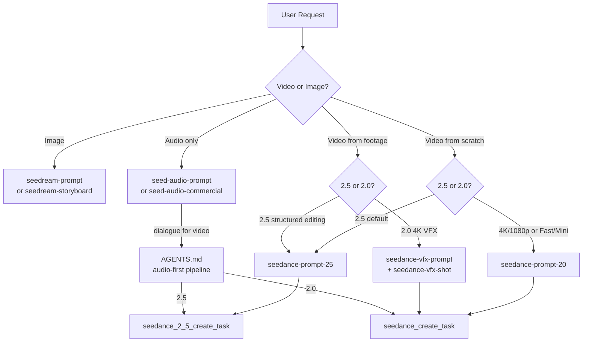

# Seedance 2.0 / 2.5 Version Audit & Fixes

> Audit and fix pass across all agent skills to ensure both Seedance versions are properly documented, cross-referenced, and routed.

## Summary

Audited **16 files** (11 skills + AGENTS.md + 4 sub-agent audit groups) for Seedance 2.0 and 2.5 version awareness. Found and fixed **critical gaps** in the MCP tool reference, the 2.5 prompt skill, the VFX pipeline skill, and multiple cross-cutting skills.

## Files Modified

| # | File | Changes |
|---|---|---|
| 1 | `.agents/skills/seedance-prompt-20/` (folder rename) | Renamed from `seedance-prompt-2/` to match the declared skill name `seedance-prompt-20` used in all cross-references |
| 2 | `.agents/skills/modelark-mcp/SKILL.md` | Added full 2.5 tool documentation: `seedance_2_5_create_task`, `seedance_2_5_create_task_variations`, `seedance_2_5_get_task`; 2.5 capability comparison table; 2.5 model ID `dreamina-seedance-2-5-260628` in capability registry; version-aware references in async workflow, error handling, best practices, and parallel variations |
| 3 | `.agents/skills/seedance-prompt-25/SKILL.md` | Fixed stale "TBD" model ID → `dreamina-seedance-2-5-260628`; removed "coming soon" blockquote; added 2.0 fallback for 4K/1080p and Fast/Mini; added MCP tool names to quick reference card; added "When to use 2.0 instead" section; added resolution limitation note |
| 4 | `.agents/skills/seedance-prompt-25-filipino/SKILL.md` | Fixed MCP tool name `Seedance create_task` → `seedance_2_5_create_task`; added 2.0 fallback section with model ID; added model ID to quick reference card; added 2.0 fallback to frontmatter description; fixed pipeline checklist step 7 |
| 5 | `.agents/skills/seedance-vfx-shot/SKILL.md` | Added version-routing blockquote; added 2.5 routing to frontmatter description; made model ID configurable in 4 places (JSON, YAML, prose, reproduction); added 2.5 resolution guard (4K/1080p invalid on 2.5); updated duration limits (2.5: 30s + native extension); fixed stale 4000-char limit → 32,000; added 2.5 cost comparison |
| 6 | `.agents/skills/seedance-footage-vfx/SKILL.md` | Fixed dangling `seedance-prompter-v2` reference → `seedance-prompt-20`; added 2.5 limits note (30 imgs / 10 vids / 10 audios / 30s); added version routing to frontmatter description |
| 7 | `.agents/skills/seedance-vfx-prompt/SKILL.md` | Added 2.5 resolution guard warning (4K face-protection is 2.0-only); added 2.5 routing to frontmatter description; added 2.5 native extension alternative to chaining section |
| 8 | `AGENTS.md` | Fixed audio-first pipeline to reference both `seedance_2_5_create_task` (2.5) and `seedance_create_task` (2.0); fixed `resolution: "2K"` → `"720p"` (invalid for 2.5 model); added Seedance prompt-skill routing to handoff section; made duration example version-aware; added version-selection guidance to costs section; added 2.5 prompt guide (Lark) to references |
| 9 | `.agents/skills/seed-audio-prompt/SKILL.md` | Added Seedance version awareness with routing to `seedance-prompt-25`/`seedance-prompt-20`; added audio-first pipeline pointer to AGENTS.md alignment contract |
| 10 | `.agents/skills/seed-audio-commercial/SKILL.md` | Added audio-first pipeline pointer for dialogue-to-Seedance workflows |
| 11 | `.agents/skills/seedream-storyboard/SKILL.md` | Added version-dependent R2V budget note (2.0: ≤9 images; 2.5: ≤30); added `target_seedance_version` and `reference_budget` to `video_handoff` manifest record |
| 12 | `.agents/skills/seedream-prompt/SKILL.md` | Added canonical model IDs to trust-ecosystem note (2.5 and 2.0 with full IDs) |

## Issues Found & Fixed by Priority

### Critical (P0)

1. **`modelark-mcp` had zero 2.5 coverage** — the MCP skill documented only 2.0 tools despite the server exposing `seedance_2_5_create_task`, `seedance_2_5_get_task`, and `seedance_2_5_create_task_variations`. Fixed by adding full 2.5 tool reference sections, capability comparison table, and version-aware references throughout.

2. **`seedance-prompt-25` had stale "TBD" model ID** — the 2.5 model ID `dreamina-seedance-2-5-260628` is live but the skill said "TBD — check the Model list when API access launches" and "coming soon as of 2026-07-31". Fixed with the actual live model ID.

3. **`seedance-vfx-shot` had zero 2.5 awareness** — the only skill that actually submits MCP tasks and persists manifests was hardcoded to 2.0 in 4 places (model ID, resolution `4k`, 15s duration, 4000-char limit). Fixed with configurable model, resolution guard, duration update, and char limit fix.

4. **Folder name mismatch** — `seedance-prompt-2/` folder didn't match the declared skill name `seedance-prompt-20` used in all cross-references. Fixed by renaming the folder.

### High (P1)

5. **`seedance-prompt-25` lacked 2.0 fallback** — no mention that 2.5 is limited to 480p/720p, or that 2.0 is needed for 4K/1080p or Fast/Mini variants. Fixed with "When to use 2.0 instead" section.

6. **`seedance-prompt-25-filipino` had zero 2.0 awareness** — wrong MCP tool name (`Seedance create_task` instead of `seedance_2_5_create_task`), no model ID, no 2.0 fallback. All fixed.

7. **`AGENTS.md` audio-first pipeline referenced only 2.0 tool** — `seedance_create_task` with no 2.5 alternative. Fixed to reference both tools with version-specific limits.

8. **`AGENTS.md` shot.md sample had invalid resolution** — `resolution: "2K"` with `model: seedance-2-5` when 2.5 only supports 480p/720p. Fixed to `"720p"`.

9. **`seedance-footage-vfx` had dangling reference** — `seedance-prompter-v2` cited as a grammar authority but no such skill exists. Fixed to `seedance-prompt-20`. (Skill later merged into `seedance-vfx-prompt` — see audit report.)

### Medium (P2)

10. **`seed-audio-prompt` had zero Seedance version awareness** — the canonical audio skill never mentioned that generated audio feeds Seedance as `reference_audio`, or that the audio-reference budget differs by version (3 vs 10). Fixed with version-aware routing and pipeline pointer.

11. **`seedance-vfx-prompt` didn't warn about 4K loss on 2.5** — the version note routes to 2.5 for structured editing but never warns that 2.5 caps at 720p, defeating the 4K face-protection methodology. Fixed with resolution guard warning.

12. **`seedream-storyboard` had no version field in `video_handoff`** — the handoff record didn't record the target Seedance version, so downstream agents didn't know which caps apply (9 vs 30 images). Fixed by adding `target_seedance_version` and `reference_budget` fields.

### Low (P3)

13. **`seedream-prompt` trust-ecosystem note lacked model IDs** — listed version labels (2.5, 2.0, Fast, Mini) without canonical IDs. Fixed with full model IDs.

14. **`seed-audio-commercial` lacked audio-first pipeline pointer** — mentioned Seedance skills but not the AGENTS.md alignment contract. Fixed with pipeline pointer.

## Architecture: Version Routing Map

## Key Differences Documented

| Capability | Seedance 2.0 | Seedance 2.5 |
|---|---|---|
| Model ID | `dreamina-seedance-2-0-260128` | `dreamina-seedance-2-5-260628` |
| Max duration | 15s | 30s |
| Max images | 9 | 30 |
| Max videos | 3 | 10 |
| Max audios | 3 | 10 |
| Resolution | 480p, 720p, 1080p, 4K | 480p, 720p only |
| Fast/Mini variants | Yes | No |
| Structured editing | No | Subject replacement, background replacement, audio editing |
| Forward/backward extension | Manual `return_last_frame` chaining | Native |
| Keyframe sequences | No | Yes |
| MCP create tool | `seedance_create_task` | `seedance_2_5_create_task` |
| MCP get tool | `seedance_get_task` | `seedance_2_5_get_task` |
| MCP variations | `seedance_create_task_variations` | `seedance_2_5_create_task_variations` |
| Shared tools | `seedance_list_tasks`, `seedance_cancel_or_delete_task` | same |
| Prompt skill | `seedance-prompt-20` | `seedance-prompt-25` |
| VFX skills | `seedance-vfx-prompt`, `seedance-vfx-shot` | Use `seedance-prompt-25` for structured editing |
