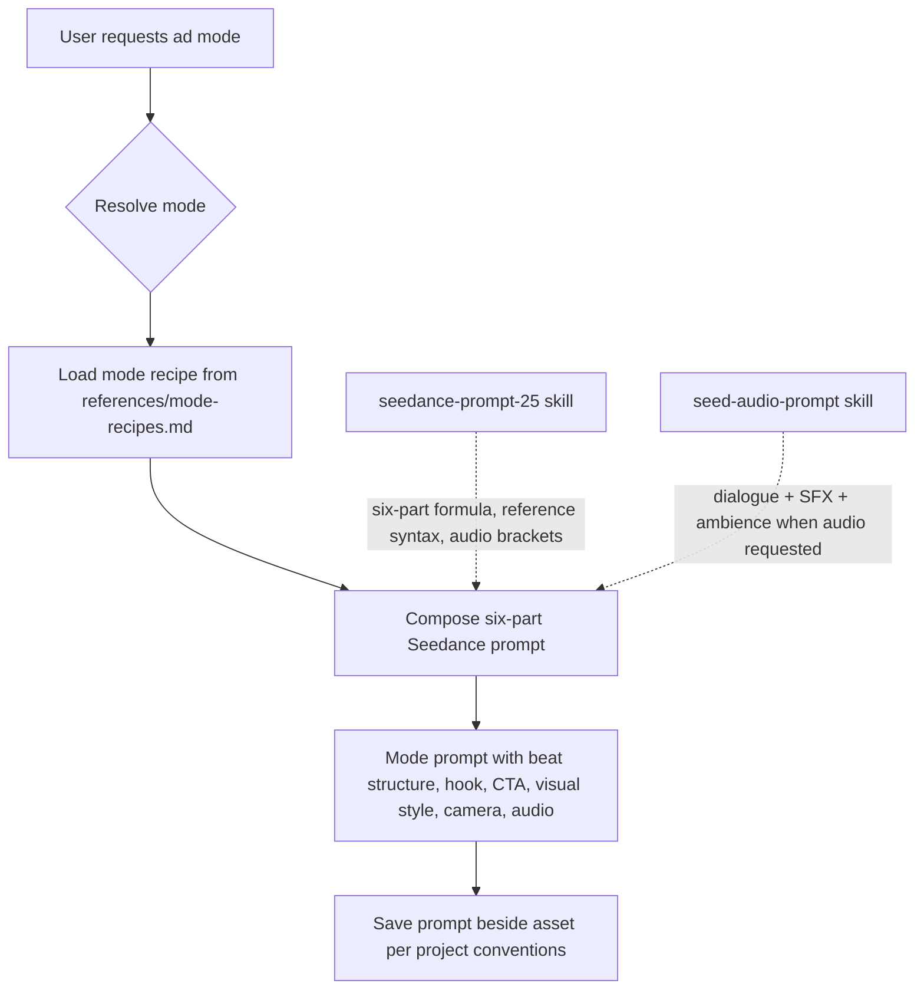

# Plan: UGC Ad Modes Skill

> A single agent skill that writes production-grade Seedance 2.5 video prompts
> for 9 ad modes — UGC, UGC How-To, UGC Unboxing, Product Showcase, Product
> Review, TV Spot, Wild Card, UGC Virtual Try-On, and Pro Virtual Try-On —
> adapted from Higgsfield's Marketing Studio mode taxonomy for the BytePlus
> Seedance 2.5 + Seed Audio ecosystem.

## Architecture overview



The skill is a **prompt-composition skill** — it writes ready-to-use Seedance 2.5
prompts. It does not call the API itself. It partners with `seedance-prompt-25`
(which owns the six-part formula, reference syntax, and audio brackets) and
optionally `seed-audio-prompt` (when the user requests lip-synced dialogue
audio). This mirrors how `seedance-animation-styles` partners with
`seedance-prompt-25` for animation medium phrasing.

## Structural model

Follows the `seedance-animation-styles` skill exactly:

| File | Purpose |
|---|---|
| `SKILL.md` | Main skill: mode bank, core principle, prompting workflow, output formats, self-check |
| `references/mode-recipes.md` | Detailed recipe per mode (ID, aliases, visual texture, narrative beats, camera, audio, hook formulas, CTA patterns, failure modes) |
| `agents/openai.yaml` | Agent interface config |
| `evals/evals.json` | Test scenarios covering mode resolution, beat structure, and prompt quality |

## Skill name and description

**Name:** `ugc-ad-modes`

**Description:**

```
Write production-grade Seedance 2.5 video prompts for 9 ad modes: UGC,
UGC How-To, UGC Unboxing, Product Showcase, Product Review, TV Spot, Wild
Card, UGC Virtual Try-On, and Pro Virtual Try-On. Each mode encodes its
own visual texture, narrative beat structure, hook formula, camera style,
audio direction, and CTA pattern. Use whenever the user asks to create a
UGC video ad, unboxing ad, product tutorial ad, product showcase,
product review ad, TV commercial, virtual try-on, or any branded video
ad. Partners with seedance-prompt-25 (six-part formula) and
seed-audio-prompt (dialogue audio). Does not call the API itself.
```

## Mode bank (9 modes)

Adapted from Higgsfield Marketing Studio's mode taxonomy. Each mode maps
to a recipe in `references/mode-recipes.md`.

| ID | Aliases | Hook/Setting | Best for |
|---|---|---|---|
| `ugc` | organic ugc, casual creator, phone-shot | Yes | Default. Casual, organic-feel content from a presenter. Direct-response, paid social. |
| `ugc-how-to` | tutorial, explainer, how-to | Yes | "Here's how to use this." Tutorial / explainer. Products needing demonstration. |
| `ugc-unboxing` | unboxing, reveal | Yes | "Just got this in the mail." Unboxing reveal. New launches, premium products. |
| `product-showcase` | showcase, product hero, product film | No | Clean product highlight, polished. Product-as-hero, no presenter. |
| `product-review` | review, testimonial, opinion | Yes | Presenter giving an opinion on the product. Trust-building. |
| `tv-spot` | broadcast, commercial, tv ad | No | Broadcast-style commercial. Higher production value. Brand building. |
| `wild-card` | experimental, surprise | No | Experimental, model picks the vibe. Creative exploration. |
| `ugc-virtual-try-on` | try-on ugc, fitting ugc | Yes | Person trying on clothing/accessories — UGC vibe. Fashion, apparel. |
| `virtual-try-on` | try-on pro, fitting pro, editorial try-on | No | Same but more polished, model-driven. Premium fashion, editorial. |

## Core principle

**The mode governs the entire world — visual texture, narrative structure,
hook, CTA, and audio.** A UGC ad shot with TV-spot lighting and polished
transitions stops reading as UGC. A product showcase with a talking head
stops reading as a product showcase. The mode is the physical law of the
ad, just as the medium is the physical law of an animation scene.

For every prompt, define:

```text
mode                the ad format that governs visual texture and structure
visual texture       what the footage looks like (phone-shot, studio, broadcast)
narrative beats     the timed structure (hook → problem → demo → payoff → CTA)
hook formula         the opening 0-3s pattern that stops the scroll
creator performance  how the presenter acts, speaks, and engages
camera style         angles, movement, framing discipline
audio direction      voice style, ambience, SFX, music approach
CTA pattern         how the ad closes (soft, hard, visual, spoken)
failure modes        what kills authenticity or conversion for this mode
```

## Prompting workflow

### 1. Resolve the requested mode

Map the user's language to the closest recipe:

- "Looks like a real person filmed on phone" → `ugc` family
  (`ugc`, `ugc-unboxing`, `ugc-virtual-try-on`, `ugc-how-to`)
- "Polished broadcast commercial" → `tv-spot`
- "Show the product itself, less presenter" → `product-showcase`
- "Presenter giving an opinion" → `product-review`
- "Try clothing on someone" → `virtual-try-on` (polished) or
  `ugc-virtual-try-on` (organic feel)
- "Surprise me / something different" → `wild-card`

**Default when the user doesn't specify:** `ugc`.

Keep modes materially separate. Do not mix UGC phone-shot texture with
broadcast studio lighting. If the user asks for a hybrid, choose one
dominant visual texture and state how the secondary influence appears.

### 2. Establish the mode before the story

Open with one sentence that names:

- the ad mode and its visual texture;
- the camera style;
- the dominant authenticity or production signal;
- the narrative beat structure.

Example pattern (UGC mode):

```text
A casual UGC creator-style video shot on a phone in vertical 9:16, with
handheld micro-shake, natural window lighting, a real-environment
background, and a 5-beat structure: hook, problem, demo, payoff, soft CTA.
```

### 3. Translate the entire scene into the mode

Apply the mode's visual texture to every visible category:

- camera style (handheld phone vs tripod vs gimbal vs studio rig);
- lighting (natural window vs 3-point studio vs broadcast-grade);
- framing (medium-close selfie vs full-body vs product-hero macro);
- background (real environment vs minimalist sweep vs styled set);
- editing (jump cuts vs clean transitions vs dynamic multi-shot cutting);
- imperfections (refocus hunting, slight overexposure, verbal fillers for
  UGC; none for polished modes).

### 4. Structure the narrative beats

Every mode has a beat structure with timestamps. Use numbered shots or
stages, each with one primary event and a visible end state.

The universal 5-beat spine (applies to most UGC and review modes):

```text
Beat 1 — Hook (0-2s):    Pattern-interrupt + pre-qualify the viewer
Beat 2 — Problem (2-7s):  Name the pain in the viewer's language
Beat 3 — Demo (7-22s):    Show the product working — proof, not claim
Beat 4 — Payoff (22-27s): Specific, measurable outcome
Beat 5 — CTA (27-30s):   One clear action, spoken and on-screen
```

**Only the demo beat scales with duration.** For 15s, compress demo to
8s and combine payoff + CTA into 3-4s. Do not add a second hook, second
problem, or extra CTAs.

Mode-specific beat structures are defined in each recipe in
`references/mode-recipes.md`.

### 5. Write the hook

The hook is the single highest-leverage element. Write 3-5 hook variants
per concept. The first frame matters as much as the first line — brief
the AI to open mid-action, already using the product, mid-sentence, in a
real environment.

Hook formula bank (10 patterns):

1. **Contrarian claim** — "Stop buying [category] until you've seen this."
2. **Specific number** — "I replaced 14 products with one."
3. **Cost compare** — "Why I stopped paying $180 for this."
4. **Identity call-out** — "If you're a [role] over 30, watch this."
5. **Mistake confession** — "I wasted two years doing X the wrong way."
6. **Problem callout** — "I stopped buying X because..."
7. **Curiosity / open loop** — "I almost returned this until day four."
8. **Visual surprise** — Show the product doing something unexpected in frame one.
9. **Social proof** — "I didn't believe the reviews until..."
10. **Native mimicry** — Open like an organic post (GRWM, haul, reaction).

### 6. Direct the creator performance

The presenter's behavior must match the mode:

- **UGC modes**: conversational, like a friend recommending. Contractions,
  filler words, imperfect pacing. Lock hook and CTA verbatim; leave the
  middle as beats. Mention one honest drawback or learning curve.
- **Product Review**: skeptic-to-convert structure ("I was skeptical
  but...") outperforms straight praise. One honest con makes every pro
  more believable.
- **Product Showcase**: no presenter. The product speaks through motion,
  material, and light.
- **TV Spot**: professional delivery. Testimonial format outperforms
  announcer-voice. The viewer is the protagonist; the brand is the guide.

### 7. Specify camera style per mode

Each mode has a camera discipline. Encode the camera style explicitly:

| Mode | Camera style | Key discipline |
|---|---|---|
| UGC family | Handheld phone, 9:16, eye-level, slight micro-shake | Lock exposure and focus; no digital zoom; rear camera |
| UGC Unboxing | 3 angles: overhead, 45-degree, close-up macro | Product visible by 0:03; reveal in layers |
| UGC How-To | Medium shot showing hand + product in real context | Cut every 2-4s; product fills 50%+ of frame |
| Product Showcase | Tripod/gimbal, 16:9 or 1:1, low-angle hero | One camera move per beat; cap rotation 10-15°; protect text/logos |
| Product Review | Handheld phone or casual tripod, 9:16 | Show, don't tell — product in use, not on shelf |
| TV Spot | Professional cinematography, 16:9, multi-shot | 4-8 scenes for 30s; dynamic cutting; title-safe framing |
| Virtual Try-On (UGC) | Phone, waist-level, 9:16, 2-2.5m distance | Full-body + 3/4 + side + back; always include movement (turn, walk) |
| Virtual Try-On (Pro) | Tripod or gimbal, controlled lighting | 3-point studio lighting; 85-135mm equivalent; editorial framing |
| Wild Card | User-defined or model-selected | State the dominant texture explicitly |

### 8. Direct audio

Audio direction depends on the mode and whether the user requests
lip-synced dialogue:

- **UGC modes**: natural voice with room echo, ambient background noise
  mixed in, no background music during speech. Captions burned in with
  platform-native fonts. 85% of social video is watched on mute — design
  for sound-off, reward sound-on.
- **Product Showcase**: typically no voiceover. Product speaks through
  motion and material. When audio is requested, use Seed Audio for
  sensory SFX (pour, click, sparkle) + subtle music bed.
- **TV Spot**: professional voiceover or testimonial-style delivery.
  Licensed music bed. Sound design with SFX. Broadcast loudness spec
  (-24 LKFS for TV, -14 LUFS for streaming).
- **Product Review**: voice is mandatory — silent videos engage at 0.90x
  vs 1.09x with voice. Voice wins in every category.

When the user requests lip-synced dialogue audio, use the audio-first
pipeline: generate Seed Audio dialogue first, then pass it as
`reference_audio` to Seedance. See the [Audio-video alignment](#audio-video-alignment)
section.

### 9. Close with the CTA

Each mode has a CTA pattern:

- **UGC family**: soft CTA — permission, not pressure. "If you've been on
  the fence, the link is below." One action, one destination. Never bolt
  on a second CTA.
- **Product Review**: single action, single destination. Soft not pushy.
  Map CTA to the metric being billed against.
- **Product Showcase**: no spoken CTA. End on the product, not the logo.
  Visual space for price/claim overlay.
- **TV Spot**: brand lock-in in final 3-5 seconds. Brand name, URL, visual
  identity. Spoken CTA with on-screen text.
- **UGC How-To**: harder CTA than other UGC — viewers have been educated,
  so the ask can be more direct. "Tap to shop." Include brand name.

### 10. End with a mode seal

Close with one compact sentence that reinforces:

- the ad mode;
- the visual texture;
- the camera style;
- the audio direction;
- relevant exclusions (positive phrasing only).

Example (UGC mode):

```text
Casual UGC creator-style video with handheld phone texture, natural
lighting, real-environment background, conversational delivery with
ambient room sound, jump-cut editing, and soft CTA. Keep all printed
text and product labels rigid and undeformed.
```

## Output formats

### Mode block

Use when the user only wants ad-mode wording:

```text
[Ad Mode]
<Mode-first sentence naming visual texture, camera style, and beat structure.>

[Narrative Beats]
Beat 1 (<time range>): <hook event and visible end state>.
Beat 2 (<time range>): <problem/demo event and visible end state>.
...
Beat N (<time range>): <CTA event and visible end state>.

[Mode Seal]
<Compact closing mode sentence and relevant exclusions.>
```

### Full ad prompt

Use when the user asks for a complete Seedance 2.5 prompt:

```text
[Ad Mode]
<Mode-first sentence naming visual texture, camera style, and beat structure.>

[Subject]
<Presenter definition, product definition, or both. Reference @Image N / @Audio N
as needed. Define each material's role explicitly.>

[Scene and Environment]
<Location, lighting, background, surface, and observable tone.>

[Visual Style]
<Mode-specific visual texture: handheld vs studio, natural vs controlled
lighting, real environment vs minimalist sweep, editing style.>

[Shot Plan]
Shot 1 — Hook (<time range>): <one event and visible end state>.
Shot 2 — Problem (<time range>): <one event and visible end state>.
Shot 3 — Demo (<time range>): <one event and visible end state>.
Shot 4 — Payoff (<time range>): <one event and visible end state>.
Shot 5 — CTA (<time range>): <closing event and final visible state>.

[Camera]
<Camera style, angles, movement discipline, framing, safe zones.>

[Audio]
<Voice style, ambience, SFX, music approach. Dialogue in {curly braces}
for lip-sync when audio is requested.>

[Mode Seal]
<Compact mode, texture, camera, audio, tone, and exclusions.>
```

Return the prompt directly. Do not add production workflow, tool
selection, asset management, approval gates, or generation instructions
unless the user explicitly asks for them.

## Mode recipe template (for references/mode-recipes.md)

Each mode recipe in `references/mode-recipes.md` follows this structure,
mirroring the animation-styles recipe pattern:

```markdown
## <Mode Name>

- **ID:** `kebab-case-id`
- **Aliases:** user language and close synonyms
- **Visual texture:** What the footage looks like (phone-shot, studio, broadcast)
- **Camera style:** Angles, movement, framing discipline
- **Lighting:** Natural, studio, or broadcast-grade; direction and quality
- **Narrative structure:** The beat-by-beat spine with timing
- **Hook formula:** 3-5 hook patterns that work for this mode
- **Creator performance:** How the presenter acts, speaks, and engages
- **Product interaction:** How the product appears and is handled
- **Audio direction:** Voice style, ambience, SFX, music
- **CTA pattern:** How the ad closes
- **Aspect ratio:** 9:16, 16:9, 1:1, 4:5 — and why
- **Duration sweet spot:** Recommended range and why
- **Prompt opening:** One concise mode-first sentence
- **Mode seal:** One concise closing mode sentence
- **Relevant exclusions:** Only likely contradictions (positive phrasing)
- **Common failure modes:** How the mode might drift or become generic
```

## Per-mode recipe summaries

### 1. UGC (`ugc`)

- **Visual texture:** Phone-shot, handheld micro-shake, natural window
  light, real-environment background, jump cuts, slight imperfections
  (refocus, overexposure moments). Ring-light catchlight acceptable.
- **Camera:** 9:16 vertical, eye-level or slightly above, medium-close
  framing (head and shoulders or chest-up), 1-1.5m distance, rear camera.
  Eyes in upper third. Center 70% safe zone.
- **Narrative:** 5-beat spine (hook 0-2s, problem 2-7s, demo 7-22s,
  payoff 22-27s, CTA 27-30s). Only demo scales with duration.
- **Hook:** 3-5 variants. Contrarian claim, specific number, problem
  callout, curiosity gap, native mimicry. First frame mid-action.
- **Creator:** Conversational, like a friend. Contractions, filler words
  ("um", "like"), casual numbers ("after like two weeks"). Lock hook +
  CTA verbatim; leave middle as beats. One honest drawback.
- **Product:** Casual reveal — appears naturally mid-sentence, not
  product-forward from frame one. Show in use, not on shelf.
- **Audio:** Natural voice with room echo, ambient background noise
  mixed in. No music during speech. Captions burned in.
- **CTA:** Soft — permission, not pressure. One action, one destination.
- **Duration:** 15-30s (TikTok 15-25s, Reels 15-30s, Meta 15-30s).
- **Prompt opening:** `Casual UGC creator-style video shot on a phone in vertical 9:16, with handheld micro-shake, natural window lighting, a real-environment background, and a 5-beat structure: hook, problem, demo, payoff, soft CTA.`
- **Failure modes:** Word-for-word scripting, starting with product name,
  marketing language, over-editing, heavy branding, no hook, perfectly
  lit product shots in casual content, single hook variant.

### 2. UGC How-To (`ugc-how-to`)

- **Visual texture:** Phone-shot UGC but with more structured
  step-by-step framing. Product in real context (kitchen counter, desk,
  bathroom). Medium shot showing hand + product.
- **Narrative:** Problem → Agitation → Solution intro → Step-by-step demo
  → Result + CTA. For 15s: hook (0-2s), problem (2-5s), demo/steps
  (5-12s), payoff (12-14s), CTA (14-15s).
- **Hook:** Problem-led. "If your [problem] looks like this, stop
  scrolling." Negative claim: "Most people use these wrong."
- **Creator:** Calm explainer tone — clear, step-by-step, confident but
  not corporate. Slightly more information-dense than casual UGC.
- **Product:** Product fills 50%+ of frame. Show in-use moments: cable
  plugging in, case snapping on, product applied to skin. Slow-mo for
  satisfying moments.
- **Audio:** Conversational voiceover. Burn-in captions (28px+, bottom
  20%, white with black stroke). Cut every 2-4s.
- **CTA:** Harder than other UGC — viewers have been educated. Direct:
  "Tap to shop." Include brand name. 3-5 seconds on screen.
- **Duration:** 15-30s. Core message must land within 15s.
- **Failure modes:** Information overload, unclear steps, too long,
  starting with product name, feature-listing instead of demonstrating.

### 3. UGC Unboxing (`ugc-unboxing`)

- **Visual texture:** Phone-shot, 3 angles (overhead, 45-degree,
  close-up). Natural light. Real surface (kitchen counter, desk). Tactile
  detail is the differentiator.
- **Narrative:** Anticipation → Revelation → Application. For 15s:
  hook (0-3s, sealed box visible), setup (3-8s), reveal (8-11s, one
  layer at a time), first impression (11-13s), CTA (13-15s).
- **Hook:** Reaction hook (excited face before box opens), contrast hook
  (show result then cut back), social proof hook ("4,000 five-star
  reviews — let's see").
- **Creator:** Genuine first reaction. Eyes widen, breath catch, honest
  "oh" moment. Turn product in hands, feel texture, tilt to light.
- **Product:** Reveal in beats — tissue paper, box, product, accessories.
  Don't show full product too early. Show product in use after unboxing.
- **Audio:** ASMR-adjacent: tape peeling, cardboard, click of lid.
  Natural voice reactions. Captions.
- **CTA:** Quick verdict + brand CTA or code.
- **Duration:** 15-30s. Product visible by 0:03.
- **Failure modes:** Over-produced aesthetic, warped branding, unnatural
  hands, no hook, showing full product too early, burying product, too
  long, boring packaging, forgetting to end with product in context.

### 4. Product Showcase (`product-showcase`)

- **Visual texture:** Studio-quality, product-as-hero. No presenter.
  Clean, polished. Product fills 50%+ of frame. Visible within first 2s.
- **Camera:** Tripod or gimbal, 16:9 or 1:1. Low-angle hero, 3-quarter
  (45°), macro detail, overhead, symmetrical front. One camera move per
  beat. Cap rotation 10-15° to protect text/logos. "Object stays rigid:
  only camera moves."
- **Lighting:** 45° hard key + soft fill for hero. Raking/grazing light
  for macro texture. Diffusion tent for reflective surfaces. Lock
  exposure and white balance.
- **Narrative:** 1-2-1 for 6s (establishing → 2 detail/action → brand
  identity). 4-beat for 15s (hero → detail → context → offer).
  3-5 distinct moments of product in motion.
- **Background:** Minimalist (white/gray sweep) for pure product-as-hero.
  Styled surface (marble, wood, concrete) for premium positioning.
- **Audio:** Typically no voiceover. Sensory SFX (pour, click, sparkle)
  + subtle music bed. Design for sound-off, reward sound-on.
- **CTA:** No spoken CTA. End on product, not logo. Visual space for
  price/claim overlay.
- **Duration:** 5-15s for single-beat loops; 10-15s for multi-beat film.
- **Failure modes:** Cluttered backgrounds, weak product focus, generic
  stock feel, opening with logo animation, overhead-only lighting, too
  many features equally featured, no proof/result, beautiful but unclear,
  single angle throughout, text/logo deformation.

### 5. Product Review (`product-review`)

- **Visual texture:** UGC-adjacent — real environments, unscripted talk,
  slight imperfections (shaky camera, natural lighting). But more
  structured than pure UGC. Product in use, not on shelf.
- **Narrative:** 5-beat spine (hook 0-2s, problem 2-7s, demo 7-22s,
  payoff 22-27s, soft CTA 27-30s). For 15s: compress demo to 8s.
- **Hook:** Skeptic-to-convert ("I was skeptical but..."), timeframe-
  anchored ("Day 14 of this..."), specific number ("I lost 14 pounds
  in 6 weeks").
- **Creator:** Authentic opinion, not scripted endorsement. Real
  environments. "Ums" are good. One honest con boosts credibility 2.1x.
- **Product:** Hands-on demonstration during review. Before/after,
  in-action, comparison. Product fills 50%+ of frame. Show proof of
  claims visually.
- **Audio:** Voice is mandatory (1.09x vs 0.90x silent). Natural voice
  with room echo. No music during speech.
- **CTA:** Single action, single destination. Soft not pushy. Map to
  metric being billed against. Last 2-3 seconds.
- **Duration:** 15-30s (TikTok 15-25s, Reels 20s). Quick-clips (<7s)
  are the worst duration (0.76x).
- **Failure modes:** Overly positive (no cons), no real testing, too
  polished, generic claims, too short (<7s), spec dumps, multiple CTAs,
  no demographic matching, cinematic production (0.64x worst), silent
  video, ending on logo fade with no CTA.

### 6. TV Spot (`tv-spot`)

- **Visual texture:** Broadcast-grade. Professional cinematography.
  Multi-shot, dynamic cutting. Color-graded to Rec. 709. Title-safe
  framing.
- **Camera:** 16:9, professional rig. 4-8 scenes for 30s, each 3-8s.
  2-3 establishing/problem (0-12s), 2-3 solution/brand (12-22s), 1
  brand reveal + CTA (22-30s). Dynamic cutting.
- **Narrative:** Choose PAS (Problem-Agitate-Solve), BAB (Before-After-
  Bridge), or HSO (Hook-Story-Offer). 0-5-22-30 structure: hook (0-5s),
  message (5-22s), CTA (22-30s). Viewer is protagonist, brand is guide.
- **Hook:** Start mid-scene in relatable situation. Emotion first, not
  information. Brand in first 3s for pre-roll. Multiple emotional peaks,
  not one grand finale.
- **Brand integration:** Brand name in first 3s (pre-roll) or first
  10-15s (linear TV). Intersperse brand cues throughout. Brand lock-in
  final 3-5s with name, URL, visual identity.
- **Product:** In context, in use, in a moment that makes the viewer
  want it. Product on white background fails on TV. Sensory grammar:
  1-2s micro-moments (fork through pastry, sparkle on gemstone).
- **Audio:** Professional voiceover or testimonial format. Licensed
  music bed. Sound design with SFX. Broadcast loudness: -24 LKFS
  (CALM Act) for TV, -14 LUFS for streaming.
- **CTA:** Brand lock-in final 3-5s. Spoken + on-screen. Specific,
  simple, memorable.
- **Duration:** 15-30s. 30s is standard for broadcast.
- **Failure modes:** Overstuffed narrative, weak hook, poor brand recall,
  product reveal too early, corporate language, no specific antagonist,
  skipping transformation, leading with product not problem, burying hook,
  vague social proof, weak CTA, too many claims, slow-burn on YouTube.

### 7. Wild Card (`wild-card`)

- **Visual texture:** User-defined or model-selected. State the dominant
  texture explicitly — do not leave it ambiguous.
- **Narrative:** User-defined or experimental. If the user doesn't
  specify, suggest one of the other 8 modes as a starting point and
  then introduce one creative deviation.
- **Failure modes:** Vague brief, no dominant texture, mixing incompatible
  modes without explaining which governs each element.

### 8. UGC Virtual Try-On (`ugc-virtual-try-on`)

- **Visual texture:** Phone-shot UGC. Real environments (bedroom, closet,
  dressing room, sidewalk). Deliberately unpolished — authenticity is the
  signal. Don't color-grade, overlay logos, or add typography.
- **Camera:** 9:16, waist-level camera (golden rule — prevents 15-20%
  distortion), 2-2.5m distance, phone perpendicular to floor. Full-body
  + 3/4 left + 3/4 right + side profile. Always include movement: turn,
  walk, sit. Detail close-ups for premium pieces.
- **Narrative:** Hook (0-2s, before/after or visual promise) →
  Transformation (garment going on) → Multiple angles (walking, sitting,
  close fabric) → Styling moment → CTA.
- **Hook:** "Watch how this dress fits on different body types." Try-on
  transformation drives 18-32% higher add-to-cart rates.
- **Creator:** Spontaneous reactions. Initial fabric reaction, first
  try-on reaction (surprise, delight), movement reaction, final verdict.
  One honest limitation: "Runs slightly large — size down."
- **Product:** Show fit, drape, movement. Walk to show hem swing. Stretch
  test for knits. State height and size. Note true-to-size. Two body
  types side-by-side kills returns.
- **Lighting:** Frontal natural daylight (face the window). CRI >90.
  3000-4000K. Single directional source for fabric depth.
- **Audio:** Conversational voiceover. Trending sounds.
- **CTA:** "Tap to see sizes" or "Limited stock — add to cart."
- **Duration:** 9-21s (TikTok), 15-30s (Reels).
- **Failure modes:** Top-down camera angle, slouching, crossed arms,
  all-black clothing, over-polishing, no movement, only one body type,
  cluttered background, shooting too wide, asking AI to both preserve
  garment AND create editorial look in one step.

### 9. Pro Virtual Try-On (`virtual-try-on`)

- **Visual texture:** Polished, model-driven, editorial quality.
  Controlled studio or curated location. Color-graded. Professional
  production value.
- **Camera:** Tripod or gimbal, 85-135mm equivalent, 3-point studio
  lighting. Full-body, centered, professionally composed. Same multi-
  angle coverage as UGC but with studio discipline.
- **Narrative:** Hero → Detail → Context → Offer (4-beat). More
  aspirational than problem-solution.
- **Lighting:** Soft 3-point: key softbox at 45° above camera height,
  fill reflector opposite, backlight/rim light for separation.
- **Audio:** Professional voiceover. Licensed music.
- **CTA:** Brand-forward. "Shop the collection."
- **Duration:** 20-30s. Longer for editorial.
- **Failure modes:** Same camera mistakes as UGC (top-down, crossed
  arms). Over-polishing UGC content breaks authenticity illusion —
  this mode is intentionally polished, so the failure is using UGC
  texture here or vice versa.

## Audio-video alignment (dialogue scenes)

When the user requests lip-synced dialogue audio for any UGC or review
mode, follow the audio-first pipeline from the project's AGENTS.md:

1. **Generate Seed Audio dialogue first** — use `seed-audio-prompt` to
   write the audio prompt, then generate via `seed_audio_generate`.
2. **Verify audio duration ≤ video duration.**
3. **Pass the audio as `reference_audio`** to the Seedance 2.5 task.
4. **Use `{curly brace}` syntax** in the Seedance prompt for dialogue
   lines that should be lip-synced.
5. **Adjust shot timestamps** in the prompt to match actual audio timing.

This is opt-in. When the user does not request lip-synced audio,
generate video directly and let Seedance's native audio handle dialogue.

## Hook variant generation

By default, when the user asks for a UGC ad mode prompt, generate
**3-5 hook variants** for the first 0-3 seconds. This is the single
highest-leverage element. Present each variant as a separate prompt or
as labeled alternatives within the Shot 1 section:

```text
Shot 1 — Hook (0-2s) [Variant A]: <contrarian claim hook>
Shot 1 — Hook (0-2s) [Variant B]: <specific number hook>
Shot 1 — Hook (0-2s) [Variant C]: <curiosity gap hook>
```

Treat hooks as separate ads — test 4 hooks × 1 mode before testing 1
hook × 4 modes.

## Integration with existing skills

| Partner skill | What it owns | What this skill provides |
|---|---|---|
| `seedance-prompt-25` | Six-part formula, reference syntax, audio brackets, scene staging, timestamps | Mode-specific phrasing that drops into the formula's slots |
| `seed-audio-prompt` | Seed Audio 1.0 prompt structure (dialogue, music, SFX, ambience) | Mode-specific audio direction (voice style, ambience approach, music) |
| `seedance-camera-presets` | Camera moves and MoveSet styles | Mode-specific camera discipline (handheld phone vs gimbal vs studio rig) |
| `seedance-lighting-presets` | Lighting recipes (causal lighting for elements and video) | Mode-specific lighting approach (natural window vs 3-point studio vs broadcast) |
| `seedance-acting-console` | Per-character emotion cues | Mode-specific creator performance direction (conversational vs professional vs testimonial) |
| `seedance-pacing-presets` | Speed ramps and montage pacing | Mode-specific beat timing (5-beat spine, 1-2-1, 0-5-22-30) |

Load a partner skill only when the user names a specific axis ("dolly
in", "golden hour lighting", "rage at medium intensity"). For ordinary
ad mode prompts without such direction, this skill alone is sufficient.

## File structure

```
.agents/skills/ugc-ad-modes/
  SKILL.md                        # Main skill file
  references/
    mode-recipes.md               # Detailed recipe per mode (9 recipes + custom template)
  agents/
    openai.yaml                   # Agent interface config
  evals/
    evals.json                    # Test scenarios (6-8 evals)
```

## Implementation tasks

### Task 1: Create skill directory structure
- Create `.agents/skills/ugc-ad-modes/`
- Create `references/`, `agents/`, `evals/` subdirectories

### Task 2: Write `references/mode-recipes.md`
- Write all 9 mode recipes following the recipe template
- Include the custom-mode template at the end
- Each recipe: ID, aliases, visual texture, camera style, lighting,
  narrative structure, hook formula, creator performance, product
  interaction, audio direction, CTA pattern, aspect ratio, duration
  sweet spot, prompt opening, mode seal, exclusions, failure modes
- Source from the 4 research files:
  - `specs/SPEC_UGC_AD_FORMATS_RESEARCH.md` (unboxing + how-to)
  - `specs/RESEARCH_VIDEO_AD_FORMATS_TRYON_REVIEW.md` (try-on + review)
  - `docs/ad-format-research-polished-video.md` (showcase + TV spot)
  - Sub-agent 1 output (UGC organic — in conversation context)

### Task 3: Write `SKILL.md`
- YAML frontmatter (name, description)
- Mode bank (9 modes with aliases)
- Core principle (mode governs the entire world)
- Prompting workflow (10 steps as outlined above)
- Output formats (mode block + full ad prompt)
- Hook formula bank (10 patterns)
- Audio-video alignment section
- Hook variant generation section
- Integration with existing skills table
- Exclusion rules (positive phrasing only)
- Self-check (10 items)

### Task 4: Write `agents/openai.yaml`
```yaml
interface:
  display_name: "UGC Ad Modes"
  short_description: "Write Seedance prompts for 9 ad modes"
  default_prompt: "Use $ugc-ad-modes to write a mode-specific Seedance 2.5 video ad prompt in the requested ad format."
```

### Task 5: Write `evals/evals.json`
- 6-8 test scenarios covering:
  1. UGC mode: 15s skincare ad with hook variants
  2. UGC Unboxing: 15s product reveal with 3 angles
  3. UGC How-To: 15s tutorial with step clarity
  4. Product Showcase: 6s product-as-hero with 1-2-1 structure
  5. Product Review: 15s skeptic-to-convert review
  6. TV Spot: 30s broadcast commercial with PAS framework
  7. UGC Virtual Try-On: 15s try-on with waist-level camera
  8. Wild Card: custom mode with explicit texture

### Task 6: Clean up research files
- The 3 research files in `specs/` and `docs/` were created by sub-agents
  during research. They contain valuable reference material.
- Decision: move them to `docs/research/` as reference docs, or leave
  them where they are. They are not part of the skill itself.
- CLAYGO: if the user doesn't want them, remove them.

### Task 7: Verify skill loads and triggers correctly
- Test that the skill description triggers on relevant phrases
- Test mode resolution for ambiguous requests
- Verify the skill does not conflict with `seedance-prompt-25`

## Self-check (for the skill itself)

Before returning any prompt, verify:

1. The mode appears before the story action.
2. Visual texture, camera style, and lighting are mode-appropriate.
3. The narrative beat structure matches the mode's recipe.
4. The hook formula is specific, not generic.
5. Creator performance direction matches the mode.
6. Product interaction is visible and mode-appropriate.
7. Audio direction matches the mode and the user's audio preference.
8. The CTA pattern matches the mode.
9. The duration is right-sized for the mode and platform.
10. The mode seal is compact and does not contradict the mode.
11. Text/logo protection directives are included when relevant.
12. The response contains the prompt, not an unrelated production workflow.

## Key design decisions

1. **One skill, 9 modes** — mirrors `seedance-animation-styles` (one skill,
   10 styles). The mode bank is the index; the recipe file has the detail.

2. **Prompt-composition only** — the skill does not call the API. It writes
   Seedance 2.5 prompts that drop into the `seedance-prompt-25` six-part
   formula. This is the same pattern as `seedance-animation-styles`.

3. **Positive phrasing throughout** — following the "say what you want,
   not what you avoid" directing principle. Exclusions are stated as
   positive instructions: "preserve all printed text and logo integrity:
   rigid, sharp, undeformed" instead of "no logo deformation."

4. **Hook variants by default** — the research consistently shows hooks
   are the highest-leverage element and creative fatigue is fast (5-14
   days on TikTok). The skill defaults to generating 3-5 hook variants.

5. **Mode-specific beat structures** — not all modes use the 5-beat spine.
   Product Showcase uses 1-2-1 or 4-beat. TV Spot uses 0-5-22-30. The
   recipe defines the structure; the skill enforces it.

6. **Audio-first pipeline is opt-in** — the skill references the
   audio-video alignment section from AGENTS.md but does not enforce
   it. When the user requests lip-synced dialogue, the skill directs
   them to `seed-audio-prompt` and the audio-first pipeline.

7. **No Higgsfield dependency** — the modes are inspired by Higgsfield's
   Marketing Studio taxonomy but fully adapted for the BytePlus
   Seedance 2.5 + Seed Audio ecosystem. No Higgsfield MCP server, CLI,
   or account is required.

8. **Research-backed** — every mode recipe is sourced from 100+ web
   sources across the 4 sub-agent research passes. Sources are cited in
   the research files under `specs/` and `docs/`.

## Research sources

The following research files were created during this planning phase:

| File | Content | Sources |
|---|---|---|
| `specs/SPEC_UGC_AD_FORMATS_RESEARCH.md` | UGC Unboxing + How-To Tutorial | 46 sources |
| `specs/RESEARCH_VIDEO_AD_FORMATS_TRYON_REVIEW.md` | Virtual Try-On + Product Review | 30+ sources |
| `docs/ad-format-research-polished-video.md` | Product Showcase + TV Spot | 34 sources |
| Sub-agent 1 output (in conversation) | UGC Organic/Casual | 20+ sources |

These files remain as reference documentation. They are not part of the
skill itself but serve as the evidence base for the mode recipes.
